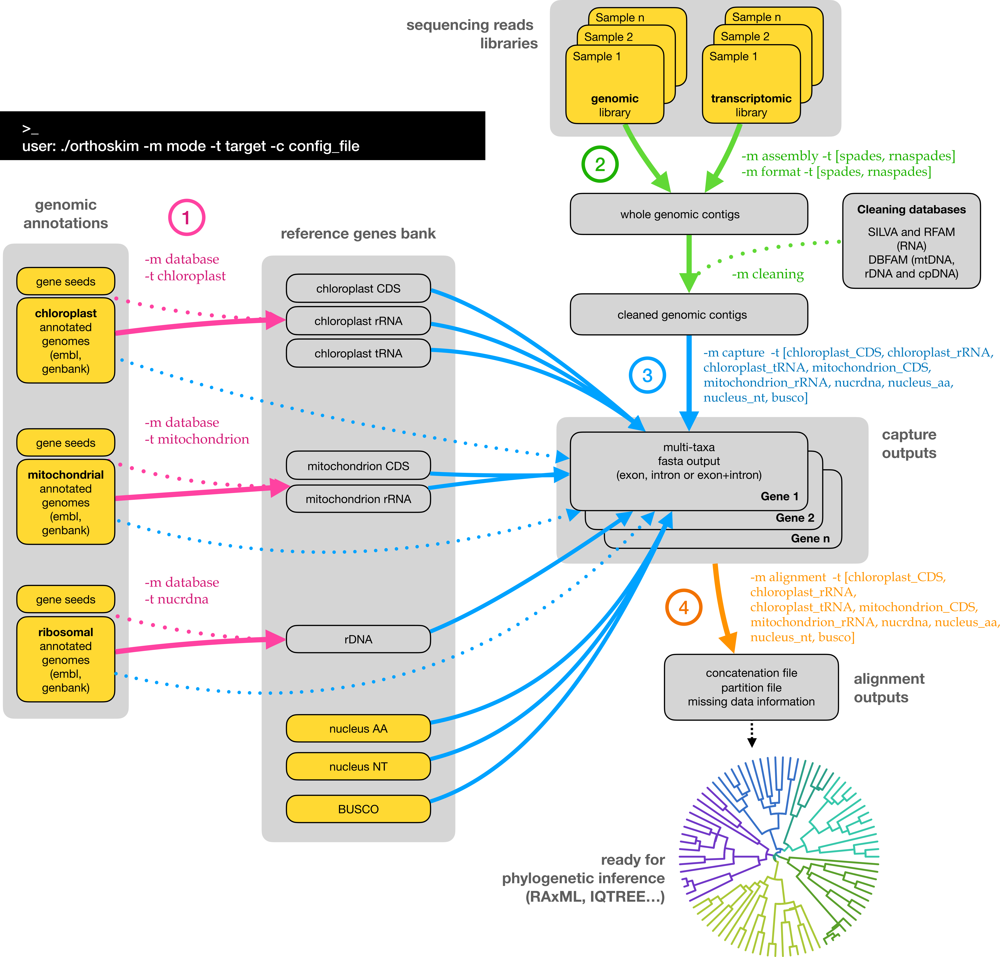

# ORTHOSKIM: *in silico* sequence capture from genomic and transcriptomic libraries

ORTHOSKIM is a pipeline providing different tools to  capture targeted sequences from genomic and transcriptomic libraries, and to produce phylogenetic matrices for these sequences.

This software was developed under the [PhyloAlps project](https://www.france-genomique.org/projet/phyloalps/).


 ORTHOSKIM is a command-line program, that needs to be run from a terminal/console, by calling different tasks, called 'modes', along with an other parameter corresponding to specific 'targets' (see Figure 1). ORTHOSKIM can be parameterized in order to:
 1. produce the sequence references databases (purple arrrows in Figure 1)
 2. perform the contigs assemblies and cleaning from whole sequencing reads (green arrows)
 3. capture the targeted sequences from the closed reference (step 3, blue arrows)
 4. get multiple alignment of these sequences across taxa suitable for phylogenetic inferences (orange arrows).

<b>ORTHOSKIM flowchart</b>

>**Fig. 1. ORTHOSKIM workflow**. Yellow boxes represents data that needs to be provided by users. To capture any of the chloroplast, ribosomal or mitochondrial sequences, users have to provide each of the three/two annotation genome files if plant/non-plant models are analyzed (see Pipeline description section).

**Applications:** ORTHOSKIM can be run on genomes skimming libraries to capture chloroplast (cpDNA) and mitochondrial (mtDNA) genes as ribosomal (rDNA) clusters (RNA genes and intergenic spacers sequences). This pipeline can also be run to capture nuclear and single copy orthologs markers ([BUSCO](https://busco.ezlab.org)), in genome skimming libraries if the sequencing depth is large enough or in transcriptomic or target sequences capture libraries.


**Citation:**
<br/>Pouchon et al. *in prep.* ORTHOSKIM: in silico sequence capture from genomic and transcriptomic libraries for phylogenomic and barcoding applications.</font>  


License: GPL https://www.gnu.org/licenses/gpl-3.0.html

## Table of contents

+ [Installation](#1-installation)
+ [Input files](#2-input-files)
 + [Configuration file](#21-configuration-file)
 + [Dependencies](#22-dependencies)
 + [Sample file](#23-sample-file)
 + [References files (database)](#24-references-files-database)
+ [Pipeline description](#3-pipeline-description)
  + [Database (optional)](#31-database-optional)
  + [Global assemblies and cleaning](#32-global-assemblies-and-cleaning)
   + [genomic/transcriptomic assembly](#321-genomictranscriptomic-assembly)
   + [assemblies cleaning](#322-assemblies-cleaning)
  + [sequence capture](#33-sequence-capture)
   + [Selection](#331-selection)
     + [reference selection](#331a-reference-selection)
     + [contig selection](#331b-contig-selection)
   + [Exon/intron sequence prediction](#332-exonintron-sequence-prediction)
   + [sequence extraction](#333-sequence-extraction)
  + [Summary statistics](#34-summary-statistics)
  + [Alignment of taxa](#35-alignment-of-taxa)
+ [Running ORTHOSKIM](#4-running-orthoskim)
 + [ORTHOSKIM arguments](#41-orthoskim-arguments)
 + [ORTHOSKIM tutorials](#42-orthoskim-tutorials)
  + [databases](#421-databases)
  + [assemblies and filtering](#422-assemblies-and-filtering)
  + [sequence capture](#423-sequence-capture)
  + [alignments](#424-alignments)
+ [Additional modes for PhyloDB users](#5-additional-modes-for-Phylodb-users)
  + [Sample file](#51-sample-file)
  + [List of genes files](#52-list-of-genes-files)
  + [phyloDB database of references](#53-phylodb-database-of-references)
  + [phyloDB extraction from annotations](#54-phylodb-extraction-from-annotations)
+ [Funding](#6-funding)  
+ [Support](#7-support)


<!-- toc -->

## 1. Installation

ORTHOSKIM is tested on Unix environment and requires:
+ [EXONERATE](https://www.ebi.ac.uk/about/vertebrate-genomics/software/EXONERATE)
+ [SPADES](http://cab.spbu.ru/software/spades/)
+ [DIAMOND](https://github.com/bbuchfink/DIAMOND)
+ [BLAST](https://BLAST.ncbi.nlm.nih.gov/BLAST.cgi?PAGE_TYPE=BLASTDocs&DOC_TYPE=Download)
+ [MAFFT](https://MAFFT.cbrc.jp/alignment/software/)
+ [TRIMAL](http://TRIMAL.cgenomics.org/)
+ Needs Awk, Python

Some python libraries are also required, and can be installed via [conda](https://docs.conda.io/projects/conda/en/latest/commands/install.html)  *install*:
+ ete3==3.0.0b35
+ joblib==0.16.0
+ numpy==1.19.1
+ Bio==0.3.0

ORTHOSKIM is installed from the source code:

```
wget https://github.com/cpouchon/ORTHOSKIM/archive/master.zip
unzip master.zip
cd OrthoSkim-master/
```


## 2. Input files

ORTHOSKIM required a sample file, a config file, and references sequences for targeted regions.


### 2.1. Configuration file


Users have to modify the *config_orthoskim.txt* file provided before running the pipeline. Default values are set for filtering and assembly steps. Indications about the parameters are given for each respective parts in the section 3.

```
nano config_orthoskim.txt
```
```
# ORTHOSKIM (v.1.0) config file
# Global parameters ---------------------------------------------------------------------------------------------------------------------------------------------------------------------------------------------------------------------------------------------------------------------------------------------------------------------
TOOLS=~/OrthoSkim-master/tools.sh                                                    ## [1] path to file with differebt tools aliases
RES=~/run_orthoskim                                                                  ## [2] output directory for all ORTHOSKIM outputs
EVALUE=0.00001                                                                       ## [3] evalue threshold for mapping steps
THREADS=15                                                                           ## [4] number of threads to use for multithreading steps
VERBOSE=0                                                                            ## [5] set verbose to TRUE (1) or FALSE (0)
PLANT_MODEL=yes                                                                      ## [6] plants analyzed (yes/no)

# preprocessing the data ----------------------------------------------------------------------------------------------------------------------------------------------------------------------------------------------------------------------------------------------------------------------------------------------------------------
LIST_FILES=~/OrthoSkim-master/ressources/listSamples.tab                             ## [7] samples table. Specific format required:  (1) sample name with Genus_species_(subsp)_taxid_attributes; (2) path to forward reads; (3) path to reverse reads; (4) [additional for phyloskims users] chloroplast annotations

# [assembly] mode ----------------------------------------------------------------------------------------------------------------------------------------------------------------------------------------------------------------------------------------------------------------------------------------------------------------
MEMORY=30                                                                            ## [8] max memory used in assembly
KMER=55                                                                              ## [9] Kmer size used in assembly, single (here 55) or range values (as 21,33,55). Note: less than 128

# [filtering] mode: Filtering for contaminants in assemblies
SIMILARITY_CONTA_THSLD=65                                                            ## [10] similarity threshold (%) used to check contaminants in blast run. We recommend to keep a low threshold as sequence are filtered according to their taxid (e.g. 65, meaning that only hits with a least 65% of similarity are used).
MAPPING_CONTA_LENGTH=50                                                              ## [11] minimal value of mapping. As for the threshold, we recommend to keep a low value (e.g. 50).
TAXONOMIC_PHYLUM_EXPECTED=Embryophyta                                                ## [12] taxonomic phylum expected during mapping of contigs into rRNA databases (e.g. "Embryophyta","Viridiplantae" for plants, otherwise "Eumetazoa","Arthropoda","Annelida","Mollusca" etc); Note: "Animalia" is not allowed. Please check the taxonomy provided in the ~/OrthoSkim-master/ressources/rRNA_database_taxonomy.txt file.

# [database] mode: sequences of reference -----------------------------------------------------------------------------------------------------------------------------------------------------------------------------------------------------------------------------------------------------------------------------------------------
MITO_ANNOTATIONS=~/OrthoSkim-master/data/mitochondrion_viridiplantae.gb              ## [13] file with mitochondrial annotations (in .gb or .embl)
NRDNA_ANNOTATIONS=~/OrthoSkim-master/data/nucrdna_viridiplantae.gb                   ## [14] file with nucrdna annotations (in .gb or .embl)
CHLORO_ANNOTATIONS=~/OrthoSkim-master/data/chloroplast_viridiplantae.gb              ## [15] file with chloroplast annotations (in .gb or .embl)
MITO_DB_FMT=genbank                                                                  ## [16] database format: genbank,embl
NRDNA_DB_FMT=genbank                                                                 ## [17] database format: genbank,embl
CHLORO_DB_FMT=genbank                                                                ## [18] database format: genbank,embl
MITO_SIZE_MIN=200000                                                                 ## [19] minimal size of mitochondrial genomes considered in mapping to assemblies during the contig selection
MITO_SIZE_MAX=1000000                                                                ## [20] maximal size of mitochondrial genomes considered in mapping to assemblies during the contig selection
NRDNA_SIZE_MIN=2000                                                                  ## [21] minimal size of nuclear ribosomal complex considered in mapping to assemblies during the contig selection
NRDNA_SIZE_MAX=9000                                                                  ## [22] maximal size of nuclear ribosomal complex considered in mapping to assemblies during the contig selection
CHLORO_SIZE_MIN=140000                                                               ## [23] minimal size of chloroplast genomes considered in mapping to assemblies during the contig selection
CHLORO_SIZE_MAX=200000                                                               ## [24] maximal size of chloroplast genomes considered in mapping to assemblies during the contig selection
SEEDS_THRESHOLD=0.8                                                                  ## [25] minimal percent of seed coverage to keep genes in references. For example, if rrn28S in seeds is 3375bp longer, only rrn28S genes with length >= 0.8*3375bp will be considered in the final references list.

# [capture] mode: extraction steps from mapping assemblies into a reference ------------------------------------------------------------------------------------------------------------------------------------------------------------------------------------------------------------------------------------------------------------------
MINLENGTH=90                                                                         ## [26] minimal length of alignment allowed during the mapping on reference
REFPCT=0.4                                                                           ## [27] minimal fraction of the reference exon(s) to cover (e.g. 0.4 means that at least 40% of reference exon(s) has to be captured in targeted organism).
COVERAGE=3                                                                           ## [28] minimal contig coverage (in kmer coverage) allowed for genomic scan of targeted regions
MINCONTLENGTH=500                                                                    ## [29] minimal contigs length allowed for genomic scan of targeted regions
EXO_SCORE=50                                                                         ## [30] minimal score of mapping in EXONERATE.
COVCUTOFF=on                                                                         ## [31] coverage cut-off ption for organelles (i.e. cpDNA, mtDNA) - cut-off performs according to standard deviations from the mean contig coverage, weighted by the reconstructed size [on/off]
ORFCOV=0.8                                                                           ## [32] minimal fraction of captured genes that must be covered by the longest open reading frame (ORF). For example, 0.8 means that 80% of the captured sequence has to be covered by an ORF.

#---------  [busco] target --------------------------------------------------------------------------------------------------------------------------------------------------------------------------------------------------------------------------------------------------------------------------------------------------------------
BUSCO_REF=~/OrthoSkim-master/data/BUSCO_viridiplantae.fa                             ## [33] BUSCO sequences (ancestral variants) in a fasta file.
BUSCO_TYPE=exon                                                                      ## [34] type of sequence captured: [exon,intron,all]

#---------  [nuclear] target ------------------------------------------------------------------------------------------------------------------------------------------------------------------------------------------------------------------------------------------------------------------------------------------------------------
NUC_NT_REF=~/OrthoSkim-master/data/nucleusNT_unaligned.fa                            ## [35] nuclear genes of reference in nucleotidic sequence. Gene name (header) has to be written following name_other-arguments (e.g. LFY_3702,LFY_3811 for LFY gene).
NUC_AA_REF=~/OrthoSkim-master/data/nucleusAA_unaligned.fa                            ## [36] nuclear genes of reference in  proteic sequence. Gene name (header) has to be written following name_other-arguments (e.g. LFY_3702,LFY_3811 for LFY gene).
NUC_TYPE=exon                                                                        ## [37] type of sequence captured: [exon,intron,all]

#---------  [mitochondrion] target -------------------------------------------------------------------------------------------------------------------------------------------------------------------------------------------------------------------------------------------------------------------------------------------------------
SEEDS_MITO_CDS=~/OrthoSkim-master/ressources/mitoCDS.seeds                           ## [38] mitochondrial CDS seeds sequences. Only one sequence by gene, proteic sequences required. Same restriction above the header name.
SEEDS_MITO_rRNA=~/OrthoSkim-master/ressources/mitorRNA.seeds                         ## [39] mitochondrial rRNA seeds sequences. Only one sequence by gene, nucleotidic sequence required. Same restriction above the header name.
MITO_REF_CDS=~/OrthoSkim-master/data/mit_CDS_unaligned.fa                            ## [40] mitochondrial coding (CDS) gene reference sequences (file name/location). Proteic sequences required. Gene name (header) has to be written following name_other-arguments (e.g. cox1_3702_Genus_species,cox1_3811_Genus_species for cox1 gene).
MITO_REF_rRNA=~/OrthoSkim-master/data/mit_rRNA_unaligned.fa                          ## [41] mitochondrial rRNA non-coding gene reference sequences (file name/location). Nucleotidic sequences required. Gene name (header) has to be written following name_other-arguments (e.g. rrn18S_3702_Genus_species,rrn18S_3811_Genus_species for rrn18S gene).
MITO_TYPE=exon                                                                       ## [42] type of structure extracted from the gff: [exon,intron,all]

#--------- [chloroplast] target ----------------------------------------------------------------------------------------------------------------------------------------------------------------------------------------------------------------------------------------------------------------------------------------------------------
SEEDS_CHLORO_CDS=~/OrthoSkim-master/ressources/chloroCDS.seeds                       ## [43] chloroplast CDS seeds sequences. Only one sequence by gene; proteic sequences required. Same restriction above the header name.
SEEDS_CHLORO_rRNA=~/OrthoSkim-master/ressources/chlororRNA.seeds                     ## [44] chloroplast rRNA seeds sequences. Only one sequence by gene; nucleotidic sequence required. Same restriction above the header name.
SEEDS_CHLORO_tRNA=~/OrthoSkim-master/ressources/chlorotRNA.seeds                     ## [45] chloroplast tRNA seeds sequences. Only one sequence by gene; nucleotidic sequence required. Same restriction above the header name, with the anticodon name (e.g. trnL-UAA_taxid_genus_species)
CHLORO_REF_CDS=~/OrthoSkim-master/data/chloro_CDS_unaligned.fa                       ## [46] chloroplast coding gene reference sequences (file name/location). Proteic sequence required. Gene name (header) has to be written following name_other-arguments (e.g. matK_3702_Genus_species,matK_3811_Genus_species for matK gene).
CHLORO_REF_rRNA=~/OrthoSkim-master/data/chloro_rRNA_unaligned.fa                     ## [47] chloroplast rRNA gene reference sequences (file name/location). Nucleotidic sequence required. Gene name (header) has to be written following name_other-arguments.
CHLORO_REF_tRNA=~/OrthoSkim-master/data/chloro_tRNA_unaligned.fa                     ## [48] chloroplast tRNA gene reference sequences (file name/location). Nucleotidic sequence required. Gene name (header) has to be written following name_other-arguments.
CHLORO_TYPE=exon                                                                     ## [49] type of sequence captured: [exon,intron,all]

#--------- [nucrdna] target --------------------------------------------------------------------------------------------------------------------------------------------------------------------------------------------------------------------------------------------------------------------------------------------------------------
NRDNA_REF=~/OrthoSkim-master/data/nucrdna_rRNA_unaligned.fa                          ## [5O] ribosomal rRNA gene reference sequences (file name/location).  Nucleotidic sequence required. Gene name (header) has to be written following name_other-arguments.
SEEDS_NRDNA=~/OrthoSkim-master/ressources/nucrdna.seeds                              ## [51] ribosomal rRNA seeds sequences. Only one sequence by gene; nucleotidic sequence required. Same restriction above the header name.
NRDNA_TYPE=exon                                                                      ## [52] type of sequence captured: [exon,intron,all]

# [alignment] mode -----------------------------------------------------------------------------------------------------------------------------------------------------------------------------------------------------------------------------------------------------------------------------------------------------------------------
SELECTION=on                                                                         ## [53] selection of taxa option before alignment: [on/off]
TAXALIST=~/OrthoSkim-master/ressources/selTaxa_Primulaceae.tab                       ## [54] list of taxa to select if selection on (tab format, with each line corresponding to one taxon)
TRIMMING=on                                                                          ## [55] alignment trimming option using trimAl: [on/off]
MISSING_RATIO=1.0                                                                    ## [56] maximal threshold of missing data allowed in the final matrix (e.g. 0.5 meaning that final sequence has fewer than 0.5 of missing data). Taxa that not passed this threshold are removed.
GENES_TO_CONCAT=~/OrthoSkim-master/ressources/listGenes_To_Concat.tab                ## [57] list of genes which are concatenated (tab format, with each line corresponding to one gene)

# [checking] mode -----------------------------------------------------------------------------------------------------------------------------------------------------------------------------------------------------------------------------------------------------------------------------------------------------------------------
BARCODES=( matK rbcL )                                                               ## [58] list of genes used for taxonomic checking. Users have to respect format and spaces. If only one gene, set BARCODES=( matK ). We recommend to use genes well represented in NCBI database (e.g. traditional barcodes as matK, rbcL, ITS1..)
BARCODES_TYPE=chloroplast_CDS                                                        ## [59] gene location subdirectory in $RES/Extraction/ outpath, corresponding to the orthoskim targets [chloroplast_CDS, chloroplast_rRNA, chloroplast_tRNA, mitochondrion_CDS, mitochondrion_rRNA, nuleus_aa, nucleus_nt, busco, nucrdna]
DB_LOCAL=off                                                                         ## [60] option to perform a blast locally by using the NCBI nt database, wich has previously to be downloaded (set path in BLAST_NT_DB l. 61): [on/off]. Otherwise, NCBI server will be used.
BLAST_NT_DB=~/path_to_ntdb/nt                                                        ## [61] location of local NCBI nt database if DB_LOCAL=on
BLAST_NT_ACCESSION_TAXID=/bettik/pouchon/blastDB/nucl_gb.accession2taxid             ## [62] list of matches between NCBI accessions and taxids. Need to download the nucl_gb.accession2taxid file on the NCBI.
TAXALIST=~/OrthoSkim-master/ressources/selTaxa_Primulaceae.tab                       ## [63] list of taxa for which taxonomic checking will be processed (tab format, with taxa in lines)
FAMILIES_LOCAL=off                                                                   ## [64] option to directely use a families list, when query taxids are not yet included in the NBCI taxonomy (on/off). If option used, CORRESPONDING_FAMILIES in l.65 need to be set.
CORRESPONDING_FAMILIES=ecofind_out.tab                                               ## [65] table with query taxid and corresponding family (with space separator)

# only for phyloskims users --------------------------------------------------------------------------------------------------------------------------------------------------------------------------------------------------------------------------------------------------------------------------------------------------------------
CHLORO_GENES=~/OrthoSkim-master/ressources/listGenes.chloro                          ## [66] list of chloroplast genes. Table format: $1=type (CDS,rRNA,tRNA), $2=genename. This file can be modified by adding/removing specific lines.
MITO_GENES=~/OrthoSkim-master/ressources/listGenes.mito                              ## [67] list of mitochondrial genes. Table format: $1=type (CDS,rRNA,tRNA), $2=genename. This file can be modified by adding/removing specific lines.
NRDNA_GENES=~/OrthoSkim-master/ressources/listGenes.rdna                             ## [68] list of rdna nuclear genes. Table format: $1=type (rRNA,misc_RNA), $2=genename. This file can be modified by adding/removing specific lines.

```

### 2.2. Dependencies

The path to all dependencies which are required in ORTHOSKIM must be supplied in the *tools.sh* file, using following command:

```
nano tools.sh
```
```
#!/bin/bash

SPADES=/Users/pouchonc/PhyloAlps/OrthoSkim/TOOLS/SPAdes-3.13.0-Darwin/bin/spades.py
DIAMOND=/Users/pouchonc/miniconda2/bin/DIAMOND
EXONERATE=/usr/local/bin/EXONERATE
BLASTDB=/Users/pouchonc/miniconda2/bin/makeBLASTdb
BLASTN=/Users/pouchonc/miniconda2/bin/BLASTn
MAFFT=/path/to/MAFFT
TRIMAL=/path/to/TRIMAL
```

### 2.3. Sample file


A sample file must be supplied in the <font size="2">**$LIST_FILES**</font> tab file (line 7 in *config_orthoskim.txt*).
This tab must contain for each library the following columns :
+ the sample name of the library following *Genus_species_taxid_sampleid_otherids*
+ the file-path to forward reads
+ the file-path reverse reads


```
head ~/OrthoSkim/ressources/listSamples.tab

Veronica_crassifolia_996476_CAR009639_BGN_NFI   /Users/pouchonc/PhyloAlps/CDS/Veronica_crassifolia:996476/BGN_NFIOSW_4_1_CA559ACXX.IND44_clean.fastq.gz /Users/pouchonc/PhyloAlps/CDS/Veronica_crassifolia:996476/BGN_NFIOSW_4_2_CA559ACXX.IND44_clean.fastq.gz
Androsace_helvetica_199610_CLA000520_BGN_ETA    /Users/pouchonc/PhyloAlps/CDS/Androsace_helvetica:199610/BGN_ETAOSW_2_1_C8MR2ACXX.IND13_clean.fastq.gz  /Users/pouchonc/PhyloAlps/CDS/Androsace_helvetica:199610/BGN_ETAOSW_2_2_C8MR2ACXX.IND13_clean.fastq.gz
```

### 2.4. References files (database)

ORTHOSKIM uses a multi-taxa bank of reference sequences to capture targeted markers into assemblies (see *3. Pipeline description* below part).

This bank can be built in ORTHOSKIM for the *nucrdna*, *chloroplast* and *mitochondrion* targets (purple arrows in Fig. 1), directly from genomic annotations collected by users for each genomic compartment (genbank or embl format required, a single file is set in the config file at lines 13-15). These annotations can be collected directly from the [NCBI](https://www.ncbi.nlm.nih.gov/genbank/) for example. To achieve this, seeds are required for each type of genes (e.g. CDS or rRNA) to correctly identify each targeted genes with a standard name (header) as following: `>genename_taxid_Genus_species_other-arguments"` (*e.g.* *>cox1_3702_Arabidopsis_thaliana* for cox1 gene). Seeds can include all CDS, rRNA and trnL-UAA (in tRNA seeds) for the cpDNA, all CDS and rRNA genes for the mtDNA, and the three rRNA genes (*i.e.* rrn18S, rrn5.8S and rrn26S) for the rDNA. Moreover, ORTHOSKIM provides probes for the internal transcribed spacer (ITS) regions ITS1 and ITS2 that are designed on these rRNA genes for the seeds and for the references, allowing to also capture these two regions. Location of seeds is given in lines 38-39, 43-45 and 51 of the config file.

ORTHOSKIM creates a multi-fasta file for each type of gene (*i.e.* CDS, rRNA or tRNA) with protein sequences for the coding regions  and nucleotidic sequences for the non-coding regions. Location of these output files are set in the *config_orthoskim.txt* file at lines 40-41, 46-48 and 50.

> **NOTE:** As a selection on assemblies is done (see *3.3.1.b.* section), users have to collect all three annotations for the mitochondrion, chloroplast and nucrdna genomic regions before to run ORTHOSKIM if plant models are analyzed (l.6), or both mitochondrion and nucrdna annotations for other models. All seeds are also required for these corresponding regions. Moreover, as a taxonomic selection is done according to the query taxon, we recommend to include as many divergent taxa as possible in the annotations.

Here, an output example of CDS bank generated from the mitonchondrial annotations (*i.e.* using the mode `-m database` and the target `-t mitochondrion`).
```
head ~/OrthoSkim/data/mit_CDS_unaligned.fa

>cox2_103999_Codonopsis_lanceolata
MRELEKKNTHDFILPAPADAAEPWQLGFQDGATPIMQGIIDLHHDIFFFLIMILVLVLWILVRALWLFSSKRNPIPQRIVHGTTIEILRTIFPSIILMFIAIPSFALLYSMDEVVVDPAITIKAIGHQWYWTYEYSDYNSSDEESLTFDSYMIPEDDLELGQLRLLEVDNRVVVPANCHLRLIVTSADVPHSWAVPSLGVKCDAVPGRLNQVSISVLREGVYYGQCSEICGTNHAFMPIVVEAVSMKDYASRVSNQLIPQTGH
>cox2_104537_Roya_obtusa
MILKSLFQVVYCDAAEPWQLGFQDAATPMMQGIIDLHHDIMFFITIIITFVLWMLVRVLWHFHYKKNPIPQRFVHGTTIEIIWTIIPSIILMFIAIPSFALLYSMDEVVDPAITIKAIGHQWYWSYEYSDYSTSDEESLAFDSYMIPEDDLELGQLRLLEVDNRVVVPAKTHLRFIITSADVLHSWAVPSLGVKCDAVPGRLNQTSIFIKREGVYYGQCSEICGTNHAFMPIVVEAVSLDDYVSWVSNKME
>cox2_111617_Ulva_fasciata
MKNFSFSYCILITLFNISVISSCDAPLSATSAMLDRFGFQEPASPLMEGLIALHSDIWAIMLFVAGFVLYMMCAILYNFSASSSEISYKVHHHSLIEIVWTTIPALILCVIAIPSFTLLYSLDEVIEPSLTIKAIGRQWYWSYEYGDYEVHDGLITNGITFDSNVLQDDDLEQGQLRLLDVDNRLVLPVNRHIRLLTSGGDVIHSFAVPSLGVKLDAIPGRLNQTMVFIKRQGVFYGQCSELCGSSHGMMPIALEAVREQDYVDWVNIKLQEM
>cox1_112509_Hordeum_vulgare_subsp._vulgare
MTNLVRWLFSTNHKDIGTLYFIFGAIAGVMGTCFSVLIRMELARPGDQILGGNHQLYNVLITAHAFLMIFFMVMPAMIGGFGNWFVPILIGAPDMAFPRLNNISFWLLPPSLLLLLSSALVEVGSGTGWTVYPPLSGITSHSGGAVDLAIFSLHLSGISSILGSINFITTIFNMRGPGMTMHRLPLFVWSVLVTAFLLLLSLPVLAGAITMLLTDRNFNTTFFDPAGGGDPILYQHLFWFFGHPEVYILILPGFGIISHIVSTFSRKPVFGYLGMVYAMISIGVLGFLVWAHHMFTVGLDVDTRAYFTAATMIIAVPTGIKIFSWIATMWGGSIQYKTPMLFAVGFIFLFTIGGLTGIVLANSGLDIALHDTYYVVAHFHYVLSMGAVFALFAGFYYWVGKIFGRTYPETLGQIHFWITFFGVNLTFFPMHFLGLSGMPRRIPDYPDAYAGWNALSSFGSYISVVGIRRFFVVVAITSSSGKNKKCAESPWAVEQNPTTLEWLVQSPPAFHTFGELPAVKETKNLS
>nad1_119543_Anomodon_attenuatus
MRLYIIGILAKILGIIIPLLLGVAFLVLAERKIMASMQRRKGPNVVGLFGLLQPLADGLKLMIKEPILPSSANLFIFLMAPVMTFMLSLVAWAVIPFDYGMVLSDLNVGILYLFAISSLGVYGIITAGWSSNSKYAFLGALRSAAQMVSYEVSIGLIIITVLICVGSRNFSEIVIAQKQIWFAAPLFPVFIMFFISCLAETNRAPFDLPEAEAESVAGYNVEYSSMGFALFFLGEYANMILMSSLCTLLFLGGWLPILDIPIFYVIPGSIRFSIKVLFFLFVYIWVRAAFPRYRYDQLMRLGWKVFLPLSLAWVVFVSGVLVAFDWLP
```

If nuclear markers are targeted (*i.e.* using the *nucleus_aa* and *nucleus_nt* targets), the user has to provide the multi-fasta files of reference sequences with their associated protein sequences (*nucleus_aa*) or nucleotidic sequences (*nucleus_nt*). The user has also to set their location in the config file to the corresponding sections (lines 35-36 of the config file). The gene name restrictions have to be respected.
For the *busco* target, ORTHOSKIM uses the [BUSCO](https://busco.ezlab.org) dataset of amino acid ancestral sequences variants, called *ancestral_variants* in the BUSCO sets. The location of the reference busco sequences has to be set in the line 33 of the config file.


Here, an overview of the busco sequences needed:
```
head ~/OrthoSkim/data/BUSCO_viridiplantae.fa

>10018_0
IASVVSEIGLGSEPAFKVPEYDFRSPVDKLQKATGIPKAVFPVLGGLAVGLIALAYPEVLYWGFENVDILLESRPKGLSADLLLQLVAVKIVATSLCRASGLVGGYYAPSLFIGAATGMAYGKLILAEADPLLHLSILEVASPQAYGLVGMAATLAGVCQVPLTAVLLLFELTQDYRIVLPLLGAVGLSSWITSGQTKKELCKLESSLCLEDILVSEAMRTRYVTVLMSTLLVEAVSLMLAEKQSCALIVDEDNLLIGLLTLEDIQEFSKTVTPDMDLLSAEKIMGLSQLPVVVGLLDRECISL
>10018_1
VASVVSEIGLGSEPAFKVPEYDFRSAVDSLKKTLGLPKAVLPALGGLIVGLIALAYPEVLYWGFENVDILLESRPRGLSAELLLQLVAVKVVATSLCRASGLVGGYYAPSLFIGAATGMAYGKLIIAKADSLFDLEILEVASPQAYGLVGMAATLAGVCQVPLTAVLLLFELTQDYRIVLPLLGAVGLSSWISSKKTSKELCQLESSLCLKDVLVAEAMRTRYVTVLVTTSLAEALSLMLVEKQSLAVIVDEEDSLIGLLTLSDIQEYSKTVTPQLDLTKAEAIMELDRLAVVVGVLDRESIAL
...
```


By default, ORTHOSKIM is supplied with sequences for plants containing the BUSCO plant set ([viridiplantaeae_odb10](https://busco-archive.ezlab.org/v3/datasets/prerelease/viridiplantae_odb10.tar.gz)), 353 UCE designed for angiosperms ([Johnson et al., 2018](https://doi.org/10.5061/dryad.s3h9r6j)) and a subset of annotations for chloroplast, mitochondrion and nucrdna genomes (in *data/* directory). More annotations can be downloaded as shown in the *4.2 ORTHOSKIM tutorials* section.
Users can easily adapted the files for other models by respecting the recommendations (see documentation).


## 3. Pipeline description

The sequence capture is driven on genomic or transcriptomic global (or untargeted) assemblies. This allowed to capture from a single assembly dataset different targeted sequences (*e.g.* cpDNA, mtDNA and rDNA genes).

ORTHOSKIM pipeline uses different modes to compute the databases, capture the targeted sequences and align them between taxa (see Figure 1).

> **NOTE**: A *mode_done.log* file is created during the pipeline containing the list of sample libraries that were correctly processed, whereas unprocessed libraries were added into *mode_error.log* file. This file could be used to remove processed libraries from the initial sample file if the script has to be re-run. Command lines are also print if users want to re-run specific commands on some libraries.


### 3.1. Database (optional)

ORTHOSKIM provides a mode to create gene database for the mitochondrial, chloroplast and ribosomal regions with `-m database` mode along with `-t mitochondrion, chloroplast, nucrdna` targets (purple arrows in Fig. 1). To do this, genomic annotations for these compartments has to be collected across taxa in a single file and set into the config file.

ORTHOSKIM will then extract all CDS, rRNA and tRNA genes from these annotations and align them into the given seeds thanks to *EXONERATE* to keep a standard gene name and  to correctly identify the extracted genes. Output files (l. 40-41, 46-48 and 50) are generated containing a bank of reference genes. Only genes given in the seeds will be included on the reference sequences.

> **NOTE**: Users have to collect all three genomic annotations and corresponding seeds to run ORTHOSKIM (or two for non plant model), as a selection is done on contigs from these different genomic regions (see 3.3.1.b. section). If users want to capture nuclear or busco markers, this step is skipped. In such case, users have to collected reference sequences for these markers into the *config_orthoskim.txt* file, by following instructions for the sequence header.

We also supplied with ORTHOSKIM a function, *SortDB.py*, to reduce the reference sequences datasets or the genomic annotations by specific family. This script can be used in order to reduce the computational time of capture if too much sequences of reference were collected (see section 4.2.1).  


### 3.2. Global assemblies and cleaning

#### 3.2.1. genomic/transcriptomic assembly

Global assemblies are performed for each library given in the sample file (l.7) by using [SPAdes](http://cab.spbu.ru/software/spades/). The user has to use the `-m assembly -t spades` or `-m assembly -t rnaspades` commands to run the assemblies according to the type of library (green arrows in Fig. 1). [SPAdes](http://cab.spbu.ru/software/spades/) is run by using the assembly options (<font size="2">**$THREADS**</font>,<font size="2">**$MEMORY**</font>,<font size="2">**$KMER**</font>) specified in the config file (l. 4, 8-9).

ORTHOSKIM then generates an output a *samplename/* subdirectory into the <font size="2">**${RES}/Assembly/SPADES/**</font> or <font size="2">**${RES}/Assembly/RNASPADES/**</font> given per library included in the sample file.  


After [SPAdes](http://cab.spbu.ru/software/spades/) runs, ORTHOSKIM has to preprocess SPAdes scaffolding contigs by formating the output files according to the library names provided in sample file, and ordering them into <font size="2">**${RES}/Assembly/Samples/unfiltered/**</font> directory.
To do this, the user has to run the `-m format` mode with `-t spades` or `-t rnaspades` targets according to the type of library that were processed.


#### 3.2.2. assemblies cleaning

The sequence capture will be run only on cleaned assemblies after running the `-m cleaning` mode. This step allows identifying and removing of potential contaminants contigs in the final assemblies.

To do this, all contigs are aligned with [BLAST](https://BLAST.ncbi.nlm.nih.gov/BLAST.cgi?PAGE_TYPE=BLASTDocs&DOC_TYPE=Download) on the SILVA and RFAM databases supplied in the *data/* section of the [sortmerna](https://github.com/biocore/sortmerna) software (v.4.2.0). These database are composed of the 5S, 5.8S, 16S, 23S, 18S and 28S genes for bacteria, archaea and eukarya. Moreover, contigs are also mapped against to own databases (called DBFAM) including a subset of chloroplast, mitochondria and ribosomal genomic regions for eukarya.
The taxonomic level of the best hits are next identified for each contigs, and compared onto the expected taxonomy. The expected taxonomic level is set by the user at the line 12 (<font size="2">**$TAXONOMIC_PHYLUM_EXPECTED**</font>).

> **NOTE:** Please check the taxonomy provided in the ~/OrthoSkim-master/ressources/rRNA_database_taxonomy.txt file to set a correct phylum (*e.g.* "Embryophyta", "Eumetazoa","Arthropoda","Annelida" etc). We also recommend to keep low values for parameters of <font size="2">**$SIMILARITY_CONTA_THSLD**</font> and <font size="2">**$MAPPING_CONTA_LENGTH**</font> (l. 10-11) as a taxonomic comparison is done between entries in the database.  


### 3.3. Sequence capture

The capture of targeted genomic sequence is made using the `-m capture` mode (blue arrows in Fig. 1), according to three steps:

#### 3.3.1. Selection

#### 3.3.1.a. reference selection

 For all targeted sequences (with the exception of BUSCO), ORTHOSKIM will first select the closest reference for each library from the given references database.

   To achieve this, the selection is made according to the NCBI taxonomy thanks to the taxid number given in the library name. If the taxid is not valid, ORTHOSKIM will use all given seeds as reference for the *chloroplast*, *mitochondrion* and *nucrdna* targets, or the longest sequences for other targets.

   For the BUSCO, this step is skipped as ancestral variants sequences (already aligned) are used as references.   

   After this, a [DIAMOND](https://github.com/bbuchfink/DIAMOND) database is created for the selected protein sequences. Otherwise, a [BLAST](https://BLAST.ncbi.nlm.nih.gov/BLAST.cgi?PAGE_TYPE=BLASTDocs&DOC_TYPE=Download) database (*makeBLASTdb* program) is formatted.

#### 3.3.1.b. contig selection


Cleaned contigs are selected to reduce the computational time of the following alignments and to correctly identify the right genomic origin of the targeted sequences.

To achieve this, if cpDNA, mtDNA or rDNA sequences are targeted, we align each contig with [BLAST](https://BLAST.ncbi.nlm.nih.gov/BLAST.cgi?PAGE_TYPE=BLASTDocs&DOC_TYPE=Download) directly on the five closest genomes from the provided annotations for all three genomic regions in plant models (or both mtDNA and rDNA genomes for others). Only genomic regions of provided annotations with a minimal/maximal size, given in <font size="2">**$[MITO,CHLORO,NRDNA]_SIZE**</font> arguments, will be considered (lines 19-24 of the config file).
This step is crucial to take into account transfers of genetic materials from the plastid genome into the mitochondrial genome (called MTPTs), corresponding to approximately 35% of the plastid genome ([Park et al., 2020](https://www.nature.com/articles/s41598-020-63233-y)). This allows, for example, to avoid capturing a mitochondrial copy of a targeted chloroplast gene when its homologous sequence is absent from the assemblies, which can lead to taxonomic mis-positioning.

For the other targeted sequences, the selection is performed by mapping the contigs on the selected references by using [DIAMOND](https://github.com/bbuchfink/DIAMOND) or [BLAST](https://BLAST.ncbi.nlm.nih.gov/BLAST.cgi?PAGE_TYPE=BLASTDocs&DOC_TYPE=Download) according to the sequence type (*i.e.* protein or nucleotid sequences). A threshold on the kmer coverage (<font size="2">**$COVERAGE**</font>), the contig length (<font size="2">**$MINCONTLENGTH**</font>) and the minimal evalue (<font size="2">**$EVALUE**</font>) is set by users to exclude all contigs below these values for the following step.


#### 3.3.2. Exon/intron sequence prediction

The entire exonic structure of the targeted sequence is predicted from alignment of the selected contigs on the closest selected references by using [EXONERATE](https://www.ebi.ac.uk/about/vertebrate-genomics/software/EXONERATE), incorporating all the appropriate gaps and frameshifts.  The *protein2genome* mode or the *genome2genome* mode is used according to the type of the reference sequence (*i.e.* protein or nucleotid sequences). A *gff* output table is generated in <font size="2">**${RES}/Mapping/[nucleus,mitochondrion,chloroplast]/**</font> folder for each library. Only sequences with a mapping score above the <font size="2">**$EXO_SCORE**</font> value are kept (l. 30 of the config file).
By default we set this score at 50. We recommend to not set too high values (if the targeted sequence length is short), as a selection for alignment scores is next performed. Otherwise short genes could be skipped.

> **Note:** Concerning plant models, a second control is performed during the capture step to ensure the correct origin of reconstructed organelle genes. To do so, the extracted sequences are aligned against the seeds from both mitochondrion and chloroplast, thereby allowing to filtering out chimeric organelle contigs that could have been assembled due to MTPTS regions and thus wrongly passed the previous selection and extractions steps. Seeds of both mitochondrion and chloroplast genes have consequently to be collected by users even if only chloroplast genes will be captured.     


#### 3.3.3. sequence extraction

   Targeted sequences are next extracted from the *gff* table by identifying the best alignment for each reference, and stored in a fasta file (*e.g.* ycf1.fa). Users can choose to extract exonic, intronic or both regions (specified in the config file). A first control is performed by checking that the longest open reading frame (ORF) from the extracted exons of each gene covers at least a minimal fraction of the capture sequence set by users (l. 32 of the contig file; *e.g.* ORFCOV=0.8, meaning that the ORF must cover 80% of the extracted sequence). This step allows taking into account for variations or errors in gene predictions like alternative start codon in protein sequence of the reference. If such condition is not filled (*e.g.* due to pseudogenes or prediction errors), the sequence is tagged as a gene-like sequence (*e.g.* ycf1-like), and stored apart (*e.g.* ycf1-like.fa file). A coverage cut-off option is also implemented to remove all possible organelle contaminant contigs during the capture step (*e.g.* alien sequenced DNA resulting in plant-plant contamination), by using a weighted mean standard deviations approach for the contigs coverage adjusted by the reconstructed sizes. We recommend using this option only for genomic libraries and organelle targeted sequences. For the rDNA (*i.e.* *'nucrdna'* target), ITS1 and ITS2 barcodes are extracted from the intronic regions of rRNA probes designed during the database step.


   Output sequence files are generated in the <font size="2">**${RES}/Extraction/[mitochondrion,chloroplast]_[CDS,tRNA,rRNA]/**</font> or <font size="2">**${RES}/Extraction/[nucleus_aa,nucleus_nt,nucrdna,busco,uce]/**</font> as following:

   ```
ls -l ~/RES/Extraction/busco/

-rw-r--r--  1 pouchonc  staff  1758  5 jui 11:11 10104.fa
-rw-r--r--  1 pouchonc  staff  1964  5 jui 11:11 10521.fa
-rw-r--r--  1 pouchonc  staff  5071  5 jui 11:11 10785.fa
-rw-r--r--  1 pouchonc  staff  1400  5 jui 11:11 11487.fa
-rw-r--r--  1 pouchonc  staff  2040  5 jui 11:11 11505.fa
-rw-r--r--  1 pouchonc  staff  1778  5 jui 11:11 1504.fa
```

We also generate the list of contigs for which targeted sequences were extracted in case the user prefers to use the contig sequences directly, in the <font size="2">**${RES}/Mapping/**</font> directory (*e.g.* *library_name.cont_mtdna.log* in the <font size="2">**${RES}/Mapping/mitochondrion/**</font> subdirectory).

> **Note:** Once sequence were captured, users can use the *checking* mode (-m) on some sequences to check the family rank found for the capture sequences for each library. A BLAST is processed on NCBI database, and a taxonomic comparison is made according to the given taxid of the library. Please see required parameters on the config file.
Users have to download and unzip the corresponding file between accesions and taxids as following:
```
wget ftp://ftp.ncbi.nlm.nih.gov/pub/taxonomy/accession2taxid//nucl_gb.accession2taxid.gz
```
A subdirectory is created <font size="2">**${RES}/Errors/**</font> with a *ValidationSamples.out* file. This file indicates for each library and for each sequence analyzed (*e.g.* matK and rbcL genes) if the taxonomic checking is TRUE, FALSE or NA (*i.e.* missing), as following:
```
Abies_alba_45372_PHA000002_RSZ_RSZAXPI000687-79	TRUE	TRUE
Abies_balsamea_90345_TROM_V_43901_CDM_AOZ	TRUE	TRUE
Abies_sibirica_97169_TROM_V_97238_CDM_AVE	TRUE	TRUE
```
> If users want to combine chloroplast_tRNA (*e.g.* trnL-UAA) and CDS genes (*e.g.* matK and rbcL), a new directory must be created in the <font size="2">**${RES}/Extraction/**</font> subdirectory with gene files inside; users have next to set the name of this directory in the config file (l. 56).

We also recommend to investigate as well as the reconstructed size and the number of contigs for which targeted genes were extracted to identify spurious taxa (see following section 3.4.b).


### 3.4. Summary statistics

**a. on assemblies**

ORTHOSKIM allows to output summary statistic on cleaned assemblies by using the `-m statistic_assembly` mode.

The output *assemblies_statistics.txt* tab is generated in <font size="2">**${RES}/Statistics/**</font> folder, giving details on the assembly over:
+ the library name
+ the number of cleaned contigs
+ the total reconstructed size
+ the N50 (*i.e.* the sequence length of the shortest contig at 50% of the total genome length)
+ the L50 (*i.e.* the smallest number of contigs whose length sum makes up half of genome size)
+ the GC content


```
head ~/RES/Statistics/assemblies_statistics.txt
Actinidia_sp_1927898_FAM000131_BGN_MGF  14691   4768612 600.0   14691   38.05
Adenophora_liliifolia_361368_PHA000132_BGN_NR   106586  17274304        231.0   106586  41.05
Agrostis_canina_218142_TROM_V_92449_BXA_ASB     672     197898  2941.0  672     44.07
Agrostis_vinealis_247443_TROM_V_47532_BXA_ARG   24475   6458884 278.0   24475   36.29

```

Moreover, statistics over contaminants in assemblies are given in the *contaminant_full_statistics.txt* file with the name of the libray, the database name used, the total reconstructed size of corresponding contigs that are removed and the taxonomy found for these contigs.

```
head ~/RES/Statistics/contaminant_full_statistics.txt
Anagallis_arvensis_4337_PHA000447_BGN_NS	SILVA	232	root,eukaryota,fungi,ascomycota
Anagallis_arvensis_4337_PHA000447_BGN_NS	SILVA	208	root,eukaryota,eumetazoa,arthropoda
Anagallis_arvensis_4337_PHA000447_BGN_NS	DBFAM_chloroplast	1603	root,eukaryota,chlorophyta,hydrodictyaceae
Anagallis_arvensis_4337_PHA000447_BGN_NS	DBFAM_chloroplast	546	root,eukaryota,rhodophyta,ceramiales
Anagallis_arvensis_4337_PHA000447_BGN_NS	DBFAM_mitochondrion	1294	root,eukaryota,oomycetes,peronosporales
Anagallis_arvensis_4337_PHA000447_BGN_NS	DBFAM_mitochondrion	786	root,eukaryota,oomycetes,peronosporales
Anagallis_arvensis_4337_PHA000447_BGN_NS	DBFAM_mitochondrion	227	root,eukaryota,fungi,ascomycota

```


**b. on capture**

ORTHOSKIM allows to get statistic from the sequence captured by using the `-m statistic_capture` mode for the different targets (multiple targets can be supplied, *e.g.* `-t mitochondrion_CDS`). The pipeline generates an output table (*report.tab*) into <font size="2">**${RES}/Statistics/**</font> containing:
+ the targeted sequence name (gene_name)
+ the library coverage, given by the number of library having the targeted sequence (taxa)
+ the mean length of the sequence (mean)
+ the minimal length of sequence found across libraries (minlen)
+ the maximal length of sequence found across libraries (maxlen)
+ the standard deviation (std)
+ the 25th percentil (pct25)
+ the 50th percentil (pct50)
+ the 75th percentil (pct75)

```
head ~/RES/Statistics/chloroplast_CDS_report.log
gene	taxa  mean  min   max   std   pct25   pct50   pct75
rpoC2	7	3316  1831  4152  880   2743	3561	4093
rps19	7	280   273   309   11	276     276     276
ycf1	 6	2026  378   5607  1769  820     1346	2462
rpoC1	7	1842  945   2121  413   1795	2058	2092
psbA	 7	1059  1059  1059  0     1059	1059	1059
atpI	 7	741   741   744   1     741     741     741
rpl2	 7	763   483   828   115   792     801     825
ndhH	 7	1179  1179  1179  0     1179	1179	1179
rbcL	 7	1425  1425  1425  0     1425	1425	1425
```
<br>

> **Note**: The full summary statistics of sequence capture, as shown in our paper, can be obtained by using the *FullStat.py* function provided in the src/ directory as following:
```
~/OrthoSkim-master/src/FullStat.py -pfind -p Extraction/chloroplast_CDS/ -t chloroplast_CDS_done.log > stat_cp.txt
```  
with -p: path where genes are extracted and -t: list of taxa to compute statistics

<br>


Moreover, when analyzing genome skimming libraries (*i.e.* by targeting chloroplast, mitochondrion or ribosomal sequences in the genomic libraries), we also strongly recommend to investigate the summary statistics of the contigs for which sequences were captured once the capture is done, by using the function *StatContigs.py* as following:
```
StatContigs.py --path ${RES}/Mapping/ --taxa taxalist --mode [all,chloroplast,mitochondrion,nucrdna] > statistics_captured_contigs.log
```
This function generates a table with, for each library and each genomic compartment (according to the `--mode`), the number of contigs assembled, along with the total reconstructed size and the mean coverage. By using the `--mode all`, the first three columns of the output table correspond to the chloroplast, the next three to the mitochondrion and the last three to the nucrdna.

```
head statistics_captured_contigs.log
Primula_acaulis_175104_PHA007169_RSZ_RSZAXPI000864-106	26	141628	614.67
Primula_integrifolia_175074_PHA007216_BGN_LG	6	125017	125.8
Primula_kitaibeliana_184184_CLA007221_BGN_MQI	6	126871	309.78
Primula_kitaibeliana_184184_CLA007222_BGN_NND	5	126339	117.18
Primula_latifolia_152139_PHA007223_BGN_LS	5	125006	139.46
Primula_magellanica_175079_CLA010550_GWM_1236	5	126155	172.52
Primula_marginata_175080_PHA007227_BGN_ID	5	124986	192.91
```

This can provide an indication about contaminant that can not be identified during the assembly cleaning (*e.g.* plant-plant contaminant,host-parasite DNA contaminant, chimeric contigs). Indeed, for a 150kb chloroplast genome, we except to have a reconstructed size over 125Kb (*i.e.* with only one inverted repeat) as following. In the above example, `Primula_acaulis_175104_PHA007169_RSZ_RSZAXPI000864-106` is doutbut as it shows an higher reconstructed size and number of chloroplast contigs thant expected. In such case, user can check all genes captured for this sample before to include it on the alignment procedure if chloroplast sequences from an other organism were captured, or if it can correspond to a chimeric contig. In such a case, this will not be problematic as we implemented a filtering approach of chimeric contigs during the capture.


### 3.5. Alignment of taxa

ORTHOSKIM provides a mode to align each captured sequences across the libraries by using the `-m alignment` mode. We use [MAFFT](https://MAFFT.cbrc.jp/alignment/software/) to align each sequence individually with the ‘--adjustdirectionaccurately’ option. This alignment can be filtered using [TRIMAL](http://TRIMAL.cgenomics.org/) with the heuristic ‘automated1’ method if the option is chosen by users (*on/off* at line 55 of the config file).  
In addition, users can choose which libraries will be aligned according to the selection option (*on/off* at line 53 of the config file). In such case, a corresponding library list has to be given (list stated in l. 54 of the config file).

ORTHOSKIM will output the concatenated alignment of sequences along with a partition file under a RAxML-style format suitable for phylogenetic inferences. For such needs, users have to choose which sequences will be concatenated from a given list (list stated in l. 57 of the config file). A tab with information about gappy or missing data is also produced by library included.


```
-rw-r--r--    1 pouchonc  staff        1341  5 mai 10:41 concatenated.fa
-rw-r--r--    1 pouchonc  staff          21  5 mai 10:41 concatenated.info
-rw-r--r--    1 pouchonc  staff         101  5 mai 10:41 concatenated.missingdata
-rw-r--r--    1 pouchonc  staff          19  5 mai 10:41 concatenated.partitions
```


```
head ~/PATH/concatenated.fa
>Carex_elongata_240685_PHA001842_BGN_MAS
CTTACTATAAATTTCATTGTTGTCGATATTGACATGTAGAAT-GGACTCTCTCTTTATTCTCGTTTGATTTATCA-TCATTTTTTCAATCTAACAAACTCTAAAATGAATAAAATAAATAGAATAAATGGATTATTCAAAATTGAGTTTTTTCTCATTAAATTTCATATTTAAATCAATTCACCAAAAATAATTCATAATTTATGGAATTCATCGAAATTCCTGAATTTGCTATTCCATAATCATTATTAATTTATTTATTGACATGAATAAT-ATGATTTGATTGTTATTATGATTAATAATTTAATCAATTATTATATATACGTACGTCTTTGTTTGGTATAAAGCGCTATCCTTTCTCTTATTTCGATAGAGAAATTTTAGTATTGCAACATAATAAATTCTATTCGTTAGAAAAGCTTCCATCGAGTCTCTGCACCTATCTTTAATATTAGATAAGAAATATTATTCTTTCTTATCTGAAATAAGAAATATTTTCTATATTTCTTTTTCTCAAAAAGAAGATTTGGCTCAGGATTGCCCATTT---TTAATTCCAGGGTTTCTCTGAATTTGGAAGTTAACACTTAGCAAGTTTCCATACCAAGGCTCAATCCAATGCAAG
>Dipsacus_fullonum_183561_TROM_V_159792_CDM_BFO
CTTACTAAAAATTTCATTGTTGCCGGTATTGACATGTAGAATGGGACTCTATCTTTATTCTCGTCCGATTAATCAGTTCTTCAAAAGATCTATCAGACTATGGAGT--------------GAATGATTTGATCAATGAGTATTCGATTCTTTC---------TTCAATATAGAATCACTTCACAA---------------------------------------------CCATTCTCCCATTTTGATATATATCAATATAGATTCGGGTCGTCATTAATCATTTGGTAGAGTATATAGTATTTCAATACCTATCTCTATGGTTATAGGTTTATCCTT--------------TCTTTTCTGAAGTTTCTATAGAAGGATTCT-TTCTACCAACACAGTCAACCCCATTTGTTAGAACAGCTTCCATTGAGTCTCTGCACCTATCCTTTTTTTTGA--------------TTTTAGCTTTCTGAA---------------CCCTTGTTTGTTTTCGGAAAACTGGATTTGGCTCAGGATTGCCCGTTTTTATTAATTCCGGGGTTTCTCTGAATTTGAAAGTTCTCACTTAGTAGGTTTCCATACCAAGGCTCAATCCAAT-TAAG
```
```
head ~/PATH/concatenated.info
1	625	trnL-UAA	part1
```
```
head ~/PATH/concatenated.missingdata
Carex_elongata_240685_PHA001842_BGN_MAS	0.0096
Dipsacus_fullonum_183561_TROM_V_159792_CDM_BFO	0.1808
```
```
head ~/PATH/concatenated.partition
DNA, part1 = 1-625
```

>**NOTE**: we recommend visualising gene alignments to be sure that homolog regions were well captured, in particular for plant mtDNA for which some genes have divergent copies. Additional software, such as [PREQUAL](https://github.com/simonwhelan/prequal) or [SPRUCEUP](https://github.com/marekborowiec/spruceup), can be used directly by users to check for correct homology assignment of captured genes.


## 4. Running ORTHOSKIM

ORTHOSKIM uses a command line interface (CLI) that can be accessed through a terminal. Please use the -help (-h) flag to see a description of the main arguments.

```
./orthoskim -h
```


ORTHOSKIM is called step by step. Recommendations about each steps are given in the previous description (section 3). After edition of the *tools.sh* and *config_orthoskim.txt* files (with all required files and formats), ORTHOSKIM is called by using the different modes along with their specific targets.

Here, we provide detail instructions through the description of arguments and the tutorials below.


### 4.1. ORTHOSKIM arguments

**-c (config file):** config file edited by users. See instructions above.

**-m (mode):** different modes encoded in ORTHOSKIM.
> * **alignment:**: Give taxa alignment of selected genes. Each gene are aligned individually with MAFFT and then concatenated. Multiple targets (-t) can be set. A selection of taxa can be performed to decide to which taxa will be align. Alignments can also be trimmed or not.
A concatenation and a partition file are generated.

> * **database:** compute the reference bank of sequences (database) for the chloroplast, mitochondrion and nucrdna targets.
Annotation needs to be collected in a single file in genbank/embl format. Seeds are required from one organism for each targeted genes using a standard gene name. CDS genes are given in protein sequences and others in nucleotid sequences.

> * **capture:** Capture of sequences from targeted markers. A selection of the closest reference is made for each targeted sequences of the database according to the taxonomy. If errors occurred during this step, ORTHOSKIM will use seeds as reference (exception for busco and nuclear targets). Users has to collected seeds for the targeted sequences. Users choose to capture exonic, intronic or both regions.

> * **checking:** Taxonomic checking of the family rank found for the captured sequences for a given sequence with BLAST alignments into the NCBI database.

> * **cleaning:** Cleaning of contigs according BLAST mapping into RNA databases and DBFAM databases, and taxonomic comparison. An expected taxonomic level is required to consider as "good" contigs for which the best-hit of alignments corresponds to this level.

> * **assembly:** Perform global assembly using SPADES assembler. Specificities for assembly are given in the config file (Kmer, memory, threads).

> * **format:** Extract and format the scaffold fasta file for each taxa. A *Samples/* subdirectory is generated containing all contig files for each libraries.

> * **statistic_assembly:** Compute summary statistics of cleaned assemblies. Informations over the contigs number, the contigs size, the GC content, the N50 value are generated. Informations about the cleaning step are also generated.

> * **statistic_capture:** Compute summary statistics of sequence extraction. A file (target_report.log) is generated including the library recovery, the mean size and the range size by targeted sequence. Multiple targets (-t) can be set.


**-t (targets):** targeted regions according to the mode (-m) used.

> For *database* mode:
> * **chloroplast** (creation of chloroplast database containing CDS, rRNA, trnL-UAA genes)
> * **mitochondrion** (creation of mitochondrial database containing CDS and rRNA genes)
> * **nucrdna** (creation of ribosomal database containing rRNA genes and probes for internal spacer regions)

> For *alignment*, *capture* and *stat_capture* modes:
> * **busco** (BUSCO markers)
> * **chloroplast_CDS** (coding sequence of chloroplast)
> * **chloroplast_rRNA** (non coding chloroplast rRNA genes)
> * **chloroplast_tRNA** (only tRNA trnL-UAA gene for now)
> * **mitochondrion_CDS** (coding sequence of mitochondrion)
> * **mitochondrion_rRNA** (non coding mitochondrial rRNA genes)
> * **nucleus_aa** (nuclear markers with proteic sequences in references)
> * **nucleus_nt** (nuclear markers with nucleotidic sequences in references)

> For *assembly* and *format* modes:
> * **spades** (use of SPADES software to compute genomic assemblies)
> * **rnaspades** (use RNA version of SPADES software to compute transcriptomic assemblies)

### 4.2. ORTHOSKIM tutorials

In this section, we describe a tutorial to capture chloroplast, mitochondrial and ribosomal sequences for genome skimming libraries.


#### 4.2.1. databases

To begin, users have to install all dependencies, create a sample file, edit the *config_orthoskim.txt* and the *tools.sh* files and collect annotations for the targeted compartments. By default, subsets of genomic annotations are given for *Viridiplantae* to quickly run the software.

Here, we show an example to collect chloroplast annotations for plants from the [NCBI](https://www.ncbi.nlm.nih.gov/genbank/).

```
wget -m -np -nd 'ftp://ftp.ncbi.nlm.nih.gov/refseq/release/plastid/' -A.genomic.gbff.gz
gunzip *.genomic.gbff.gz
cat *.genomic.gbff >> plastid.genomic.gb
rm *.genomic.gbff
```

We supplied with ORTHOSKIM a function *AnnotFilter.py* to filter annotations according to taxonomy (*e.g.* viridiplantae). Here, we collected all annotations of viridiplantae.

```
~/OrthoSkim-master/src/AnnotFilter.py -i plastid.genomic.gb -f genbank -l viridiplantae -o ~/OrthoSkim-master/data/chloroplast_plants.gb
Filtering annotations on taxonomy
1 level(s) of taxonomy set: viridiplantae
 	 parsing annotations [............................................................] 100 %
4869 / 5201 annotations selected on taxonomy
```

>**NOTE:** the output (given with **-o**) has to be the same which is set in the config file (line 15: <font size="2">**CHLORO_ANNOTATIONS=~/OrthoSkim-master/data/chloroplast_plants.gb**</font>). Morevover, multiple taxonomic levels can be given in -l with a coma separator (*e.g.* -l asteraceae,helianthae).


Once all annotations and respective seeds are collected, we compute the database for the three targets using the `-m database` mode.

```
./orthoskim -m database -t chloroplast -c config_orthoskim.txt
./orthoskim -m database -t mitochondrion -c config_orthoskim.txt
./orthoskim -m database -t nucrdna -c config_orthoskim.txt
```

>**NOTE:** We also supplied with ORTHOSKIM two python functions *SortDB_family.py* and *SortDB_lineages.py*. *SortDB_family.py* allows to select a subset of lineages by family in sequence (named gene) or genomic annotations databases. This allows to reduce the computational time of capture steps by reducing the number of sequences by families and keeping a taxonomic diversity within the database. *SortDB_lineages.py* allows to extract within the reference sequences databases all sequences corresponding to the queried phyllum. These function can be run directly on outputs as following:
```
SortDB_family.py -i chloroplast_CDS.fa -f fasta -l 3 -o selected_chloroplast_CDS.fa -m gene
SortDB_family.py -i chloroplast_ncbi.gb -f genbank -l 5 -o selected_chloroplast_CDS.embl -m genome
SortDB_lineages.py -i chloroplast_CDS.fa --phylum Ericales --rank order
```
with -i input genes/genomes file; -l number of queried lineages by family; -f input file format (embl/ genbank/fasta); -o output name (format fasta for genes or embl for genomes); -m mode (gene/genome)


#### 4.2.2. assemblies and filtering

We next perform global assemblies and format the SPADES outputs. After that, assemblies were cleaned by removing all potential contaminants.

```
./orthoskim -m assembly -t spades -c config_orthoskim.txt
./orthoskim -m format -t spades -c config_orthoskim.txt
./orthoskim -m cleaning -c config_orthoskim.txt
```

> **Note:** For the cleaning step, we set the expected phyllum at "Embryophyta" in the given example (l.12 of the config file).

To get summary statistics over assemblies and cleaning, users can run the following command:

```
./orthoskim -m statistic_assembly -c config_orthoskim.txt
```

#### 4.2.3. sequence capture

The next step consists on capture all targeted sequences into these assemblies. To do this, we run the `-m capture` mode with different targets.

```
./orthoskim -m capture -t chloroplast_CDS -c config_orthoskim.txt
./orthoskim -m capture -t chloroplast_rRNA -c config_orthoskim.txt
./orthoskim -m capture -t chloroplast_tRNA -c config_orthoskim.txt
./orthoskim -m capture -t mitochondrion_CDS -c config_orthoskim.txt
./orthoskim -m capture -t mitochondrion_rRNA -c config_orthoskim.txt
./orthoskim -m capture -t nucrdna -c config_orthoskim.txt
```

>**Note**: in this example for the chloroplast tRNA, we change the CHLORO_TYPE (l.49) from "exon" to "intron", to capture the intron of the trnL-UAA gene.

Summary statistics about the capture can be obtained by using the following mode:

```
./orthoskim -m statistic_capture -t chloroplast_CDS -t chloroplast_rRNA -t chloroplast_tRNA -t mitochondrion_CDS -t mitochondrion_rRNA -t nucrdna -c config_orthoskim.txt
```
> **NOTE:** Here, multiple targets (-t) are given in the command same line.

#### 4.2.4. alignments

Finally, we compute a supermatrix by aligning captured sequences across all libraries (here on chloroplast CDS and rRNA), useful for phylogenetic inferences. To do this, we used the `-m alignment` mode.

```
./orthoskim -m alignment -t chloroplast_CDS -t chloroplast_rRNA -c config_orthoskim
```

> **NOTE:** all outputs are detailed in the previous sections.  


## 5. Additional modes for PhyloDB users

Additional modes were implemented for PhyloDB users (*i.e.* for PHA, PHN, PHC member project) to use ORTHOSKIM along with annotations performed under these projects with [Org.Asm](https://git.metabarcoding.org/org-asm/org-asm) assembler. Users can easily use all modes supplied in ORTHOSKIM in complement.

### 5.1. Sample file

Sample file can be created directly from libraries location into the [GriCAD](https://gricad-doc.univ-grenoble-alpes.fr/hpc/description/) infrastructures on the */bettik/LECA/phyloskims/release/* folder. This tab is produced by the `-m phyloskim_indexing` mode. This allowed to screen each library that will be used for the gene extraction from `-p path/to/seek/files/`. Unwanted libraries can be removed from the generated list before processing other modes.


```
./orthoskim -m indexing -c config_orthoskim.txt -p /bettik/LECA/phyloskims/release/
```

### 5.2. List of genes files

The extraction of orthologous regions and the creation of databases from annotations are based on a given list of genes. This list is supplied in <font size="2">**$CHLORO_GENES**</font>, <font size="2">**$MITO_GENES**</font> and <font size="2">**$NRDNA_GENES**</font> (lines [63-65] of the config file) and must contain:
+ the type of gene (*e.g.* CDS,rRNA,tRNA,misc_RNA)
+ the gene name

```
head ~/OrthoSkim/ressources/listGenes.chloro

tRNA    trnV
tRNA    trnA
tRNA    trnN
rRNA    rrn16S
rRNA    rrn23S
rRNA    rrn4.5S
rRNA    rrn5S
CDS     psbA
CDS     matK
CDS     rps16
CDS     psbK
```

By default, ORTHOSKIM provided a list for tRNA, rRNA and CDS genes in chloroplast (see <font size="2">**$CHLORO_GENES**</font> and <font size="2">**$MITO_GENES**</font>). For the ribosomal complex, the gene type correspond to rRNA (*i.e.* for rrn18S, 5.8S rRNA, rrn28S) and the internal transcribed spacers (*i.e.* ITS1 and ITS2) to misc_RNA (see <font size="2">**$NRDNA_GENES**</font>); as annotated in Org.Asm assembler.


### 5.3. phyloDB database of references

ORTHOSKIM provides a mode to create a database from the all annotations performed within the project by using the `-m phyloskim_database` mode. To do this, all genes found in these annotations files are extracted with the ORTHOSKIM's header restrictions. Output files are created according to the name and the path set in the config file (<font size="2">**$CHLORO_REF_CDS**</font>, <font size="2">**$CHLORO_REF_rRNA**</font>, <font size="2">**$CHLORO_REF_tRNA**</font> and  <font size="2">**$NRDNA_REF**</font> at lines 42-44 and 46 of the config file).

>**Note:** For chloroplast annotations, only genes found in single and circular contig will be extracted to avoid the capture of mitochondrial contigs that can be annotated as chloroplast one.   

### 5.4. phyloDB extraction from annotations

For each library of the sample file, ORTHOSKIM will perform genes extraction directly from annotation with `-m phyloskim_extraction_targeted` mode, according to a list of genes for `-t [chloroplast, nucrdna]` targets.

Results are generated in <font size="2">**RES/**</font> directory by creating subdirectories for each compartment and gene type, including a multifasta file per gene. For example, for chloroplast CDS provided in <font size="2">**$CHLORO_GENES**</font>, ORTHOSKIM will output <font size="2">**RES/chloroplast_CDS/**</font> subdirectory with CDS gene files.

```
ls -l ~/RES/chloroplast_CDS/

-rw-r--r--  1 pouchonc  staff   4874 16 avr 10:40 accD.fa
-rw-r--r--  1 pouchonc  staff   4952 16 avr 10:40 atpA.fa
-rw-r--r--  1 pouchonc  staff   4853 16 avr 10:40 atpB.fa
-rw-r--r--  1 pouchonc  staff   1580 16 avr 10:40 atpE.fa
-rw-r--r--  1 pouchonc  staff   2057 16 avr 10:40 atpF.fa
```


## 6. Funding

The PhyloAlps data collection was largely funded from the European Research Council under the European Community’s Seventh Framework Programme FP7/2007-2013 grant agreement 281422 (TEEMBIO), the Sixth European Framework Programme (GOCE-CT-2007-036866), the Swiss SNF (Grant 31003A_149508/1), the ANR DIVERSITALP Project (ANR-07-BDIV-014), ANR project Origin-Alps (ANR-16-CE93-0004), France Génomique (ANR-10-INBS-09-08) and the NextBarcode project (Institut Français de Bioinformatique).

## 7. Support
For questions and comments, please contact: [contact@orthoskim.org](mailto:contact@orthoskim.org?subject=[GitHub]%20Support)
