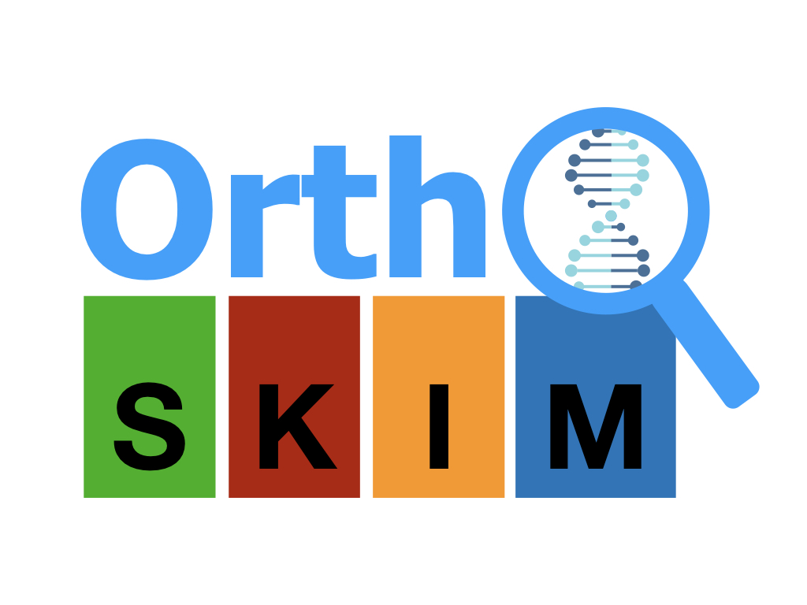
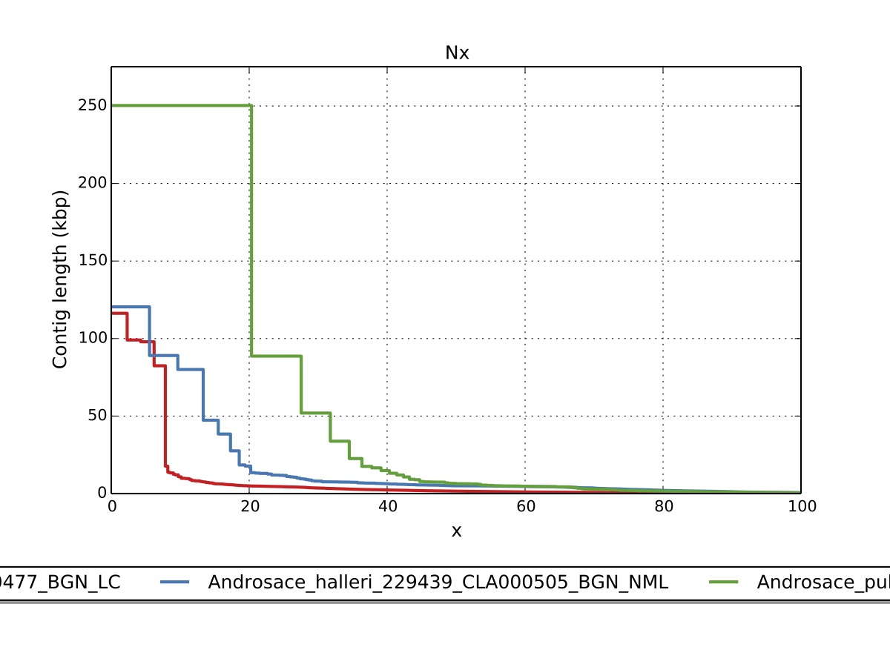
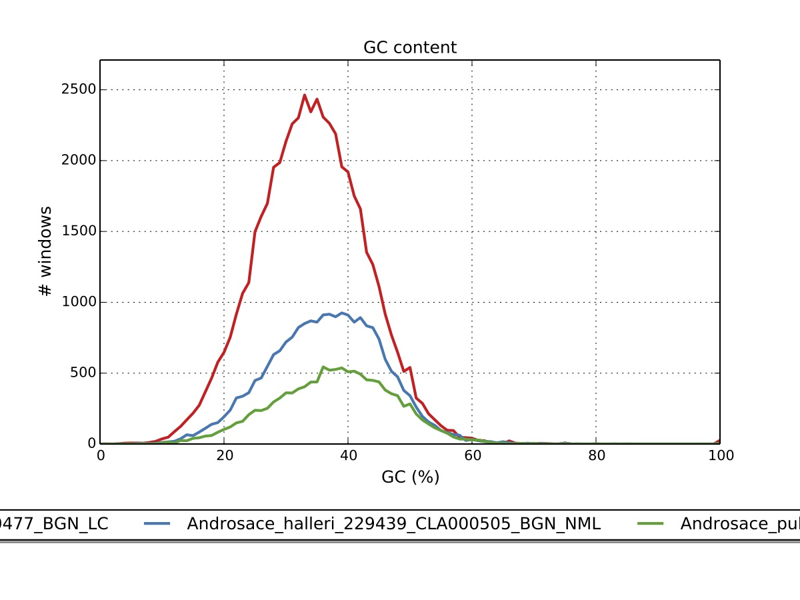
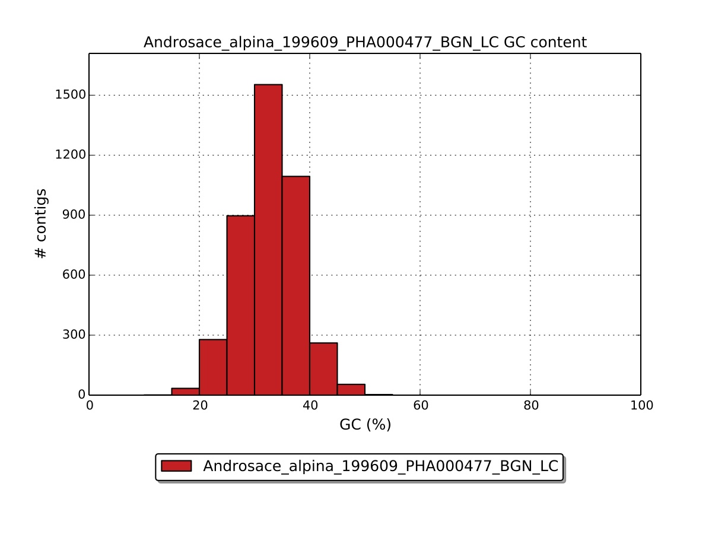
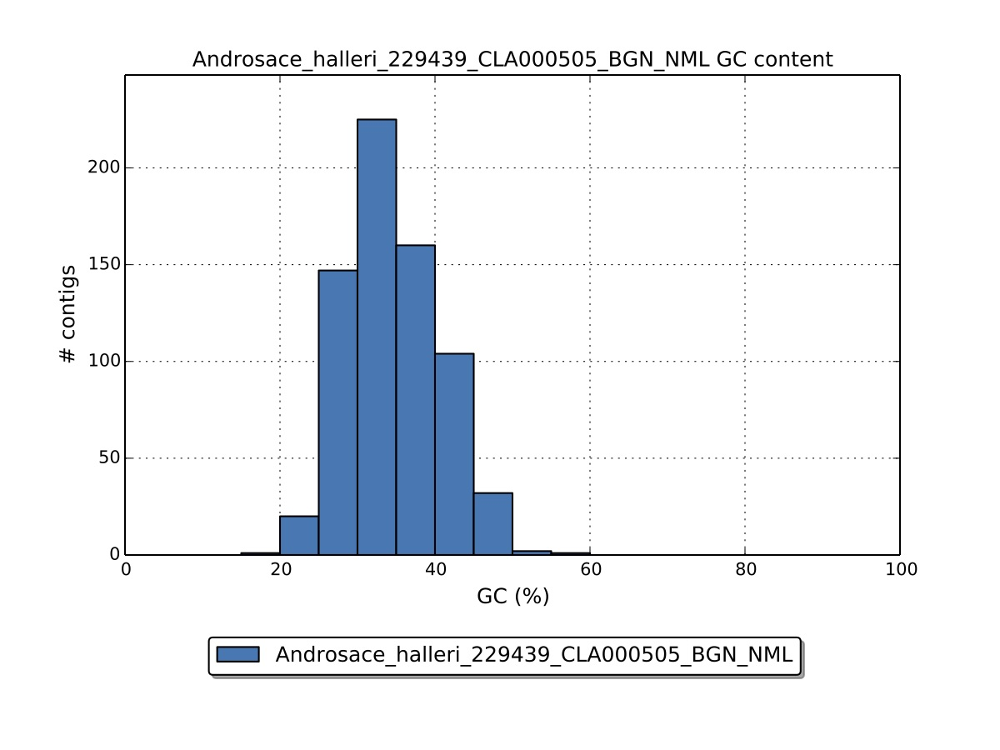
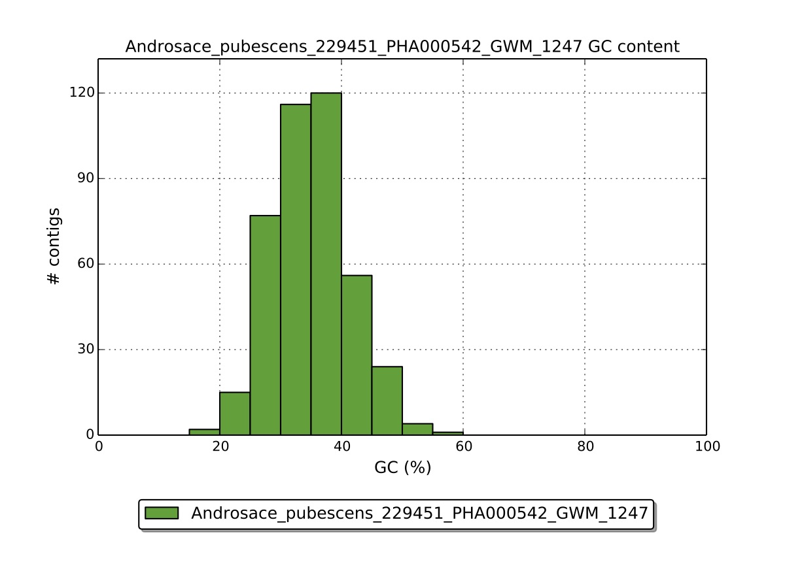
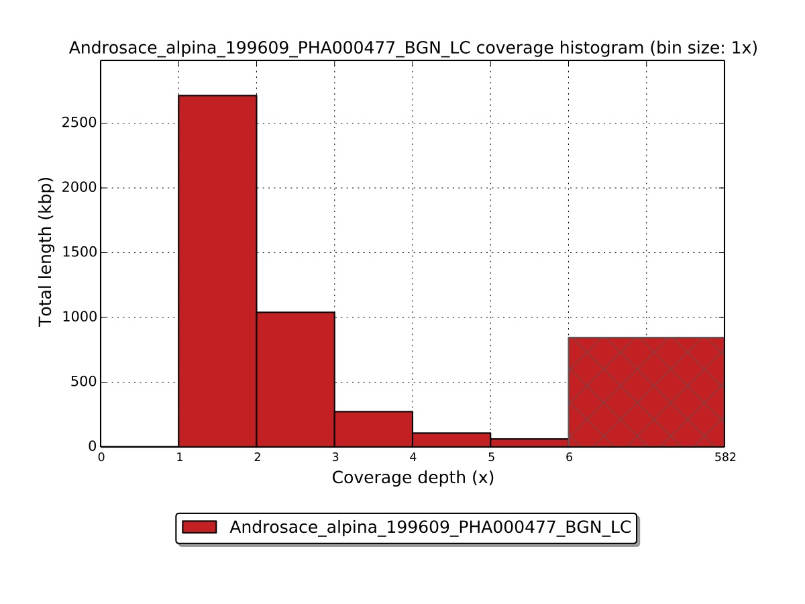
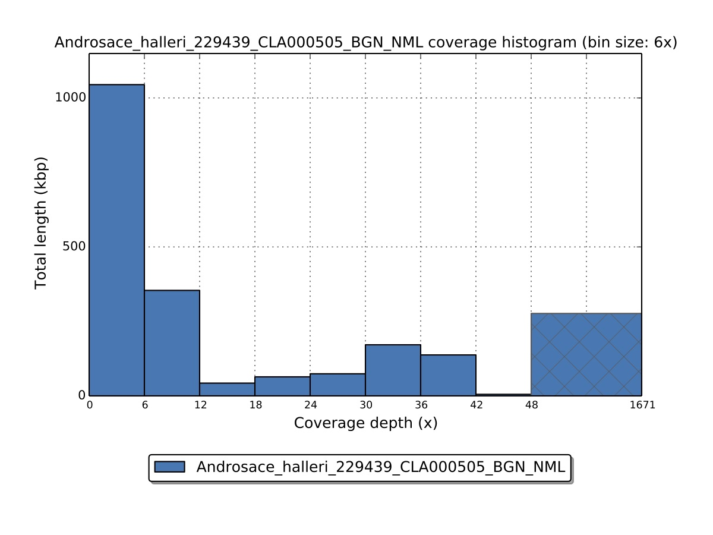
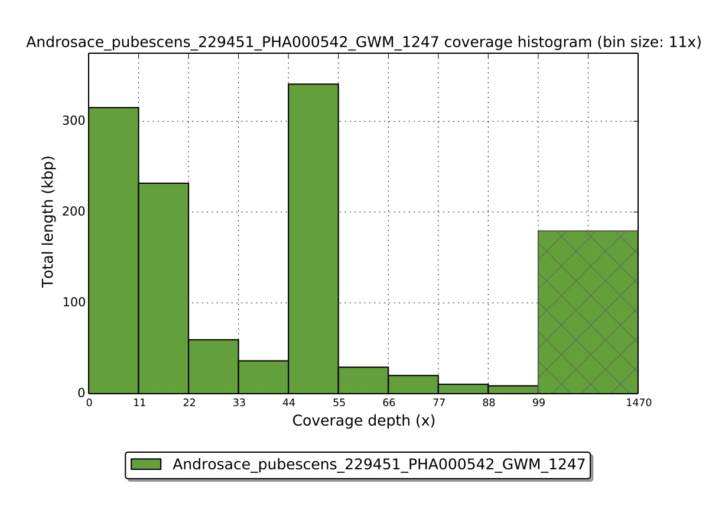

<p align="center">
  <a>
    
  </a>
</p>

OrthoSkim is a pipeline providing different tools to capture *in silico* targeted genes from whole genome shotgun sequencing libraries for chloroplastic, ribosomal and mitochondrial compartments. Nuclear genes can also be captured in high covered libraries (>3x).

This software was developed under the PhyloAlps project (https://www.france-genomique.org/projet/phyloalps/).


> **Note:** [Berger et al. 2017](https://bsapubs.onlinelibrary.wiley.com/doi/full/10.3732/apps.1700042) have shown that some nuclear genes can be identified partially in genome skims (with a coverage >2.5X) by using transcriptomic assembler on genomic data over genomic assembler. Users can choose in OrthoSkim the RNA version of SPAdes during assembly (rnaspades). However, we do not guarantee the capture of nuclear genes (excluding ribosomal regions) in genome skims, and we recommend using the genomic version (spades) for the capture of mitonchondrial, chloroplastic and ribosomal compartments.


**OrthoSkim citations:**
+ <font size="2">Inger Greve Alsos, Sebastien Lavergne, Marie Kristine Føreid Merkel, Marti Boleda, Youri Lammers, Adriana Alberti, Charles Pouchon, France Denoeud, Iva Pitelkova, Mihai Pușcaș, Cristina Roquet, Bogdan-Iuliu Hurdu, Wilfried Thuiller, Niklaus E. Zimmermann, Peter M. Hollingsworth, Eric Coissac, The Treasure Vault Can be Opened: Large-Scale Genome Skimming Works Well Using Herbarium and Silica Gel Dried Material, Plants, 10.3390/plants9040432, 9, 4, (432), (2020).</font>

### 1 . Installation
--------------------

OrthoSkim is tested on Unix environment and requires:
+ [Exonerate](https://www.ebi.ac.uk/about/vertebrate-genomics/software/exonerate)
+ [SPAdes](http://cab.spbu.ru/software/spades/)
+ [QUAST](https://github.com/ablab/quast)
+ [Diamond](https://github.com/bbuchfink/diamond)
+ [Blast](https://blast.ncbi.nlm.nih.gov/Blast.cgi?PAGE_TYPE=BlastDocs&DOC_TYPE=Download)
+ [MAFFT](https://mafft.cbrc.jp/alignment/software/)
+ [trimAl](http://trimal.cgenomics.org/)
+ Needs Awk, Python

Some python libraries are also required, and can be installed via [conda](https://docs.conda.io/projects/conda/en/latest/commands/install.html)  *install*:
+ Bio==0.1.0
+ joblib==0.13.2
+ pandas==0.24.2
+ ete2==2.3.10
+ numpy==1.16.2

OrthoSkim is installed from the source code:

```
wget https://github.com/cpouchon/OrthoSkim/archive/master.zip
unzip master.zip
cd OrthoSkim-master/
```


### 2. Input files
------------------

OrthoSkim required a sample file, a config file, and references sequences for targeted regions to be run.


#### 2.1 - Configuration (config_orthoskim.txt) file


The following section describes the config file required for OrthoSkim. This file tells OrthoSkim where to find files and the relevant information. Users have to modify the *config_orthoskim.txt* file provided before running the pipeline. Default values are set for filtering and assembly steps.

```
nano config_orthoskim.txt
```

```
# ORTHOSKIM (v.1.0) config file
# Global parameters ---------------------------------------------------------------------------------------------------------------------------------------------------------------------------------------------------------------------------------------------------------------------------------------------------------------------
TOOLS=~/OrthoSkim-master/tools.sh                                                    ## [1] path to file with tools aliases
RES=~/run_orthoskim                                                                  ## [2] output directory for orthoskim outputs
EVALUE=0.00001                                                                       ## [3] evalue threshold for mapping steps
THREADS=15                                                                           ## [4] Number of threads which will be used for multithreading steps
VERBOSE=0                                                                            ## [5] Set verbose to TRUE (1) or FALSE (0)
PLANT_MODEL=yes                                                                      ## [6] plants analyzed (yes/no)

# preprocessing the data ----------------------------------------------------------------------------------------------------------------------------------------------------------------------------------------------------------------------------------------------------------------------------------------------------------------
LIST_FILES=~/OrthoSkim-master/ressources/listSamples.tab                             ## [7] Samples table. Specific format required:  (1) sample name with Genus_species_taxid_attributes; (2) path to forward reads; (3) path reverse reads; (4) [additional for phyloskims users] chloroplast annotations

# [assembly] mode ----------------------------------------------------------------------------------------------------------------------------------------------------------------------------------------------------------------------------------------------------------------------------------------------------------------
MEMORY=30                                                                            ## [8] Number of memory which will be used
KMER=55                                                                              ## [9] Kmer size used in assembly, single (here 55) or range values (as 21,33,55). Note: less than 128

# [contaminant_filtering] mode: Filtering for contaminants in assemblies
SIMILARITY_CONTA_THSLD=65                                                            ## [10] Similarity threshold (%) used to check contaminants in blast run. We recommend to keep a low threshold as sequence are filtered according to their taxid.
MAPPING_CONTA_LENGTH=50                                                              ## [11] Minimal value of mapping. As for the threshold we recommand to keep a low value.
TAXONOMIC_PHYLUM_EXPECTED=Embryophyta                                                ## [12] Taxonomic Phylum expected when blast contigs into rRNA databases (e.g. "Embryophyta","Viridiplantae" for plants, otherwise "Eumetazoa","Arthropoda","Annelida","Mollusca" etc); Note: "Animalia" is not allowed. Please check the taxonomy provided in the ~/OrthoSkim-master/ressources/rRNA_database_taxonomy.txt file.

# [database] mode: sequences of reference -----------------------------------------------------------------------------------------------------------------------------------------------------------------------------------------------------------------------------------------------------------------------------------------------
MITO_ANNOTATIONS=~/OrthoSkim-master/data/mitochondrion_viridiplantae.gb              ## [13] file containing mitochondrial annotations (.gb or .embl)
NRDNA_ANNOTATIONS=~/OrthoSkim-master/data/nucrdna_viridiplantae.gb                   ## [14] file containing nucrdna annotations (.gb or .embl)
CHLORO_ANNOTATIONS=~/OrthoSkim-master/data/chloroplast_viridiplantae.gb              ## [15] file containing chloroplast annotations (.gb or .embl)
MITO_DB_FMT=genbank                                                                  ## [16] database format: genbank,embl
NRDNA_DB_FMT=genbank                                                                 ## [17] database format: genbank,embl
CHLORO_DB_FMT=genbank                                                                ## [18] database format: genbank,embl
MITO_SIZE=200000                                                                     ## [19] minimal size of mitochondrial genomes considered in mapping to assemblies during the contig selection
NRDNA_SIZE=2000                                                                      ## [20] minimal size of nuclear ribosomal complex considered in mapping to assemblies during the contig selection
CHLORO_SIZE=140000                                                                   ## [21] minimal size of chloroplastic genomes considered in mapping to assemblies during the contig selection

# [capture]: extraction steps from mapping assemblies into a reference ------------------------------------------------------------------------------------------------------------------------------------------------------------------------------------------------------------------------------------------------------------------
MINLENGTH=90                                                                         ## [22] minimal length of alignment allowed mapping to reference
REFPCT=0.25                                                                          ## [23] minimal covered part of the reference allowed (for exon only)
COVERAGE=5                                                                           ## [24] Minimal contigs coverage (kmer coverage) allowed for genomic scan of targeted regions
MINCONTLENGTH=1000                                                                   ## [25] Minimal contigs length allowed for genomic scan of targeted regions
MODE_REF=distance                                                                    ## [26] Mode to select the closest reference from the database: [taxonomy,distance]
DISTANCE_MATRIX=~/OrthoSkim-master/ressources/distance_matrix.csv                    ## [27] distance matrix at genus level in csv format if distance chosen mode.
EXO_SCORE=100                                                                        ## [28] minimal score of mapping in exonerate (by default: 250). To

#---------  [busco] target --------------------------------------------------------------------------------------------------------------------------------------------------------------------------------------------------------------------------------------------------------------------------------------------------------------
BUSCO_REF=~/OrthoSkim-master/data/BUSCO_viridiplantae.fa                             ## [29] multi-fasta of BUSCO sequences (ancestral variants)
BUSCO_TYPE=exon                                                                      ## [30] type of sequence to capture: [exon,intron,all].

#---------  [nuclear] target ------------------------------------------------------------------------------------------------------------------------------------------------------------------------------------------------------------------------------------------------------------------------------------------------------------
NUC_NT_REF=~/OrthoSkim-master/data/nucleusNT_unaligned.fa                            ## [31] multi-fasta of nuclear genes of reference.  Nucleotidic sequence is specified. As the file contains bank of genes, gene name (header) has to be written following name_other-arguments (e.g. LFY_3702,LFY_3811 for LFY gene).
NUC_AA_REF=~/OrthoSkim-master/data/nucleusAA_unaligned.fa                            ## [32] multi-fasta of nuclear genes of reference.  Nucleotidic sequence is specified. As the file contains bank of genes, gene name (header) has to be written following name_other-arguments (e.g. LFY_3702,LFY_3811 for LFY gene).
NUC_TYPE=exon                                                                        ## [33] Type of structure extracted from the gff: [exon,intron,all]

#---------  [mitochondrion] target -------------------------------------------------------------------------------------------------------------------------------------------------------------------------------------------------------------------------------------------------------------------------------------------------------
SEEDS_MITO_CDS=~/OrthoSkim-master/ressources/mitoCDS.seeds                           ## [34] CDS mitochondrial seeds of reference (from one organism; e.g. for Arabidopsis_thaliana_3702_genbank), proteic sequence required,  same restriction above the header name.
SEEDS_MITO_rRNA=~/OrthoSkim-master/ressources/mitorRNA.seeds                         ## [35] rRNA mitochondrial seeds of reference (from one organism; e.g. for Arabidopsis_thaliana_3702_genbank), nucleotidic sequence required, same restriction above the header name.
MITO_REF_CDS=~/OrthoSkim-master/data/mit_CDS_unaligned.fa                            ## [36] multi-fasta file/name of mitochondrial coding genes of reference.  Amino acid sequence is specified. As the file contains bank of genes, gene name (header) has to be written following name_other-arguments (e.g. cox1_3702_Genus_species,cox1_3811_Genus_species for cox1 gene).
MITO_REF_rRNA=~/OrthoSkim-master/data/mit_rRNA_unaligned.fa                          ## [37] multi-fasta file/name of mitochondrial rRNA non-coding regions of reference.  Nucleotidic sequence is specified. As the file contains bank of genes, gene name (header) has to be written following name_other-arguments (e.g. rrn18S_3702_Genus_species,rrn18S_3811_Genus_species for rrn18S gene).
MITO_TYPE=exon                                                                       ## [38] Type of structure extracted from the gff: [exon,intron,all]

#--------- [chloroplast] target ----------------------------------------------------------------------------------------------------------------------------------------------------------------------------------------------------------------------------------------------------------------------------------------------------------
SEEDS_CHLORO_CDS=~/OrthoSkim-master/ressources/chloroCDS.seeds                       ## [39] chloroplastic CDS seeds of reference (from one organism; e.g. for Arabidopsis_thaliana_3702_genbank), proteic sequences required, restriction on headers.
SEEDS_CHLORO_rRNA=~/OrthoSkim-master/ressources/chlororRNA.seeds                     ## [40] chloroplastic rRNA seeds of reference (from one organism; e.g. for Arabidopsis_thaliana_3702_genbank), nucleotidic sequences required, restriction on headers.
SEEDS_CHLORO_tRNA=~/OrthoSkim-master/ressources/chlorotRNA.seeds                     ## [41] chloroplastic tRNA seeds of reference (from one organism; e.g. for Arabidopsis_thaliana_3702_genbank), nucleotidic sequences required, restriction on headers with the anticodon name (e.g. trnL-UAA_taxid_genus_species)
CHLORO_REF_CDS=~/OrthoSkim-master/data/chloro_CDS_unaligned.fa                       ## [42] multi-fasta file/name of chloroplastic coding genes of reference.  Amino acid sequence is specified. As the file contains bank of genes, gene name (header) has to be written following name_other-arguments (e.g. matK_3702_Genus_species,matK_3811_Genus_species for matK gene).
CHLORO_REF_rRNA=~/OrthoSkim-master/data/chloro_rRNA_unaligned.fa                     ## [43] multi-fasta file/name of chloroplastic rRNA genes of reference.  Nucleotidic sequence is specified. As the file contains bank of genes, gene name (header) has to be written following name_other-arguments.
CHLORO_REF_tRNA=~/OrthoSkim-master/data/chloro_tRNA_unaligned.fa                     ## [44] multi-fasta file/name of chloroplastic tRNA genes of reference.  Nucleotidic sequence is specified. As the file contains bank of genes, gene name (header) has to be written following name_other-arguments (e.g. matK_3702_Genus_species,matK_3811_Genus_species for matK gene).
CHLORO_TYPE=exon                                                                     ## [45] Type of structure extracted from the gff: [exon,intron,all]

#--------- [nucrdna] target --------------------------------------------------------------------------------------------------------------------------------------------------------------------------------------------------------------------------------------------------------------------------------------------------------------
NRDNA_REF=~/OrthoSkim-master/data/nucrdna_rRNA_unaligned.fa                          ## [46] multi-fasta file/name of ribosomal rRNA genes of reference.  Nucleotidic sequence is specified. As the file contains bank of genes, gene name (header) has to be written following name_other-arguments.
SEEDS_NRDNA=~/OrthoSkim-master/ressources/nucrdna.seeds                              ## [47] ribosomal rRNA seeds of reference (from one organism; e.g. for Arabidopsis_thaliana_3702_genbank), nucleotidic sequences required, restriction on headers.
NRDNA_TYPE=exon                                                                      ## [48] Type of structure extracted from the gff: [exon,intron,all]
RNA_THRESHOLD=0.8                                                                    ## [49] minimal percent of seed length of RNA genes kept as reference. For example, if rrn28S in seeds is 3375bp longer, only rrn28S genes with length >= 0.8*3375bp will be considered in close reference list.

# [alignment] mode -----------------------------------------------------------------------------------------------------------------------------------------------------------------------------------------------------------------------------------------------------------------------------------------------------------------------
SELECTION=on                                                                         ## [50] Option to perform a selection of taxa before alignments: [on/off]
TAXALIST=~/OrthoSkim-master/ressources/selTaxa_Primulaceae.tab                       ## [51] list of taxa to select if selection mode turned on (tab format with taxa in lines)
TRIMMING=on                                                                          ## [52] Option to trim alignments using trimAl: [on/off]
MISSING_RATIO=1.0                                                                    ## [53] maximal missing data threshold allowed to consider final sequence (e.g. 0.5 meaning that final sequence has fewer than 0.5 of missing data)
GENES_TO_CONCAT=~/OrthoSkim-master/ressources/listGenes_To_Concat.tab                ## [54] list of genes to include in the concatenation (tab format with genes in lines)

# [check_taxonomy] -----------------------------------------------------------------------------------------------------------------------------------------------------------------------------------------------------------------------------------------------------------------------------------------------------------------------
BARCODES=( matK rbcL )                                                               ## [55] list of barcodes used to identify correct taxonomic assignment. Users have to respect format and spaces. If only one barcode fill BARCODES=( matK )
BARCODES_TYPE=chloroplast_CDS                                                        ## [56] Type of barcodes among orthoskim targets (chloroplast_[CDS,rRNA,tRNA],mitochondrion_[CDS,rRNA],nuleus_aa,nucleus_nt,busco,uce,nucrdna)
DB_LOCAL=off                                                                         ## [57] Option to perform a blast locally with the NCBI nt database download (path in BLAST_NT_DB): on/off. Otherwise, NCBI server will be used.
BLAST_NT_DB=~/path_to_ntdb/nt                                                        ## [58] location of local NCBI nt database if DB_LOCAL=on
BLAST_NT_ACCESSION_TAXID=/bettik/pouchon/blastDB/nucl_gb.accession2taxid             ## [59] list of corresponding between NCBI accessi$
TAXALIST=~/OrthoSkim-master/ressources/selTaxa_Primulaceae.tab                       ## [60] list of taxa for which taxonomic validation will be checked (tab format with taxa in lines)
FAMILIES_LOCAL=off                                                                   ## [61] option to include directly families corresponding for query taxid which are not included in the NBCI taxonomy (on/off). If option turned on, CORRESPONDING_FAMILIES need to be set.
CORRESPONDING_FAMILIES=ecofind_out.tab                                               ## [62] table with query taxid and corresponding family (space separator)


# ONLY for phyloskims users --------------------------------------------------------------------------------------------------------------------------------------------------------------------------------------------------------------------------------------------------------------------------------------------------------------
CHLORO_GENES=~/OrthoSkim-master/ressources/listGenes.chloro                          ## [63] list of chloroplastic genes that will be processed. Specific format of table: $1=type (CDS,rRNA,tRNA), $2=genename. This file could be modified by adding/removing specific lines.
MITO_GENES=~/OrthoSkim-master/ressources/listGenes.mito                              ## [64] list of mitochondrial genes that will be processed. Specific format of table: $1=type (CDS,rRNA,tRNA), $2=genename. This file could be modified by adding/removing specific lines.
NRDNA_GENES=~/OrthoSkim-master/ressources/listGenes.rdna                             ## [65] list of rdna nuclear genes for extraction.Specific format of table: $1=type (rRNA,misc_RNA), $2=genename. This file could be modified by adding/removing specific lines.

```

#### 2.2 - Dependencies (tools.sh)

The access path of all dependencies required by OrthoSkim must be supplied in the *tools.sh* file, using following command:

```
nano tools.sh
```
```
#!/bin/bash

SPADES=/Users/pouchonc/PhyloAlps/OrthoSkim/TOOLS/SPAdes-3.13.0-Darwin/bin/spades.py
DIAMOND=/Users/pouchonc/miniconda2/bin/diamond
EXONERATE=/usr/local/bin/exonerate
QUAST=/Users/pouchonc/miniconda2/bin/quast.py
BLASTDB=/Users/pouchonc/miniconda2/bin/makeblastdb
BLASTN=/Users/pouchonc/miniconda2/bin/blastn
MAFFT=/path/to/mafft
TRIMAL=/path/to/trimal
```

#### 2.3 - Sample file


A sample file must be supplied in the <font size="2">**$LIST_FILES**</font> tab file (line 7 in *config_orthoskim.txt*).
This tab must contain for each sample the following columns in this order:
+ the sample name following *Genus_species_taxid_sampleid_others*
+ the pathfile to forward reads
+ the pathfile reverse reads


```
head ~/OrthoSkim/ressources/listSamples.tab

Veronica_crassifolia_996476_CAR009639_BGN_NFI   /Users/pouchonc/PhyloAlps/CDS/Veronica_crassifolia:996476/BGN_NFIOSW_4_1_CA559ACXX.IND44_clean.fastq.gz /Users/pouchonc/PhyloAlps/CDS/Veronica_crassifolia:996476/BGN_NFIOSW_4_2_CA559ACXX.IND44_clean.fastq.gz
Androsace_helvetica_199610_CLA000520_BGN_ETA    /Users/pouchonc/PhyloAlps/CDS/Androsace_helvetica:199610/BGN_ETAOSW_2_1_C8MR2ACXX.IND13_clean.fastq.gz  /Users/pouchonc/PhyloAlps/CDS/Androsace_helvetica:199610/BGN_ETAOSW_2_2_C8MR2ACXX.IND13_clean.fastq.gz
```

#### 2.5 - References files (database)

OrthoSkim uses a list of references on diverse taxa to capture targeted genes into assemblies for all the different targets (see *3. Pipeline description* below part).

This bank of references is created in OrthoSkim pipeline for the *nucrdna*, *chloroplast* and *mitochondrion* targets directly from genomic annotations of each region collected from users in a single file in genbank or embl format (location set in config file at lines 13-15). These annotations can be collected directly from the [NCBI](https://www.ncbi.nlm.nih.gov/genbank/) for example. To achieve this, seeds are required for each type of gene (CDS, rRNA + tRNA for chloroplast) to identify each gene with a standard name (header) as following *">genename_taxid_Genus_species_other-arguments"* (e.g. *cox1_3702_Arabidopsis_thaliana* for cox1 gene). Location of seeds is given in lines 34-35, 39-41 and 47 of the config file.

OrthoSkim creates a bank in a multi-fasta file for the coding regions (CDS) with amino acid sequences and for the non-coding regions (rRNA + tRNA only for *chloroplast* target) with nucleotidic sequences. Location of these output files are set in the *config_orthoskim.txt* file at lines 36-37, 42-44 and 46.

> **NOTE:** As a selection on assemblies is done (see *3.3.1.b.* section), users have to collect all three mitochondrion, chloroplast and nucrdna genomes before to run OrthoSkim if plant models are analyzed (l.6), or both mitochondrion and nucrdna genomes for other models. All seeds are also required for corresponding regions. Moreover, as a taxonomic selection is done according to the query taxon, we recommend to collect the annotation complete as possible with a wide array of taxa.

Here, an example of output CDS bank from mitonchondrial annotations (using the mode `-m database` and the target `-t mitochondrion`).
```
head ~/OrthoSkim/data/mit_CDS_unaligned.fa

>cox2_103999_Codonopsis_lanceolata
MRELEKKNTHDFILPAPADAAEPWQLGFQDGATPIMQGIIDLHHDIFFFLIMILVLVLWILVRALWLFSSKRNPIPQRIVHGTTIEILRTIFPSIILMFIAIPSFALLYSMDEVVVDPAITIKAIGHQWYWTYEYSDYNSSDEESLTFDSYMIPEDDLELGQLRLLEVDNRVVVPANCHLRLIVTSADVPHSWAVPSLGVKCDAVPGRLNQVSISVLREGVYYGQCSEICGTNHAFMPIVVEAVSMKDYASRVSNQLIPQTGH
>cox2_104537_Roya_obtusa
MILKSLFQVVYCDAAEPWQLGFQDAATPMMQGIIDLHHDIMFFITIIITFVLWMLVRVLWHFHYKKNPIPQRFVHGTTIEIIWTIIPSIILMFIAIPSFALLYSMDEVVDPAITIKAIGHQWYWSYEYSDYSTSDEESLAFDSYMIPEDDLELGQLRLLEVDNRVVVPAKTHLRFIITSADVLHSWAVPSLGVKCDAVPGRLNQTSIFIKREGVYYGQCSEICGTNHAFMPIVVEAVSLDDYVSWVSNKME
>cox2_111617_Ulva_fasciata
MKNFSFSYCILITLFNISVISSCDAPLSATSAMLDRFGFQEPASPLMEGLIALHSDIWAIMLFVAGFVLYMMCAILYNFSASSSEISYKVHHHSLIEIVWTTIPALILCVIAIPSFTLLYSLDEVIEPSLTIKAIGRQWYWSYEYGDYEVHDGLITNGITFDSNVLQDDDLEQGQLRLLDVDNRLVLPVNRHIRLLTSGGDVIHSFAVPSLGVKLDAIPGRLNQTMVFIKRQGVFYGQCSELCGSSHGMMPIALEAVREQDYVDWVNIKLQEM
>cox1_112509_Hordeum_vulgare_subsp._vulgare
MTNLVRWLFSTNHKDIGTLYFIFGAIAGVMGTCFSVLIRMELARPGDQILGGNHQLYNVLITAHAFLMIFFMVMPAMIGGFGNWFVPILIGAPDMAFPRLNNISFWLLPPSLLLLLSSALVEVGSGTGWTVYPPLSGITSHSGGAVDLAIFSLHLSGISSILGSINFITTIFNMRGPGMTMHRLPLFVWSVLVTAFLLLLSLPVLAGAITMLLTDRNFNTTFFDPAGGGDPILYQHLFWFFGHPEVYILILPGFGIISHIVSTFSRKPVFGYLGMVYAMISIGVLGFLVWAHHMFTVGLDVDTRAYFTAATMIIAVPTGIKIFSWIATMWGGSIQYKTPMLFAVGFIFLFTIGGLTGIVLANSGLDIALHDTYYVVAHFHYVLSMGAVFALFAGFYYWVGKIFGRTYPETLGQIHFWITFFGVNLTFFPMHFLGLSGMPRRIPDYPDAYAGWNALSSFGSYISVVGIRRFFVVVAITSSSGKNKKCAESPWAVEQNPTTLEWLVQSPPAFHTFGELPAVKETKNLS
>cox1_113636_Populus_tremula
MINLVRWLFSTNHKDIGTLYFIFGAIAGVMGTCFSVLIRMELARPGDQILGGNHQLYNVLITAHAFLMIFFMVMPAMIGGFGNWFVPILIGAPDMAFPRLNNISFWLLPPSLLLLLSSALVEVGSGTGWTVYPPLSGITSHSGGAVDLAIFSLHLSGVSSILGSINFITTIFNMRGPGMTMHRLPLFVWSVLVTAFLLLLSLPVLAGAITMLLTDRNFNTTFFDPAGGGDPILYQHLFWFFGHPEVYILILPGFGIISHIVSTFSGKPVFGYLGMVYAMISIGVLGFLVWAHHMFTVGLDVDTRAYFTAATMIIAVPTGIKIFSWIATMWGGSIQYKTPMLFAVGFIFLFTIGGLTGIVLANSGLDIALHDTYYVVAHFHYVLSMGAVFALFAGFYYWVGKITGRTYPETLGKIHFWITFFGVNLTFFPMHFLGLSGMPRRIPDYPDAYAGWNALSSFGSYISVVGICCFFVVVTITLSSGNQNKCAPSPWALEQNSTTLEWMVQSPPAFHTFGELPAIKETKSYVK
MKNLVRWLFSTNHKDIGTLYFIFGAIAGVMGTCFSVLIRMELARPGDQILGGNHQLYNVLITAHAFLMIFFMVMPAMIGGFGNWFVPILIGAPDMAFPRLNNISFWLLPPSLLLLLSSALVEVGSGTGWTVYPPLSGITSHSGGAVDLAIFSLHLSGVSSILGSINFITTIFNMRGPGMTMHRLPLFVWSVLVTAFLLLLSLPVLAGAITMLLTDRNFNTTFFDPAGGGDPILYQHLFWFFGHPEVYILILPGFGIISHIVSTFSGKPVFGYLGMVYAMISIGVLGFLVWAHHMFTVGLDVDTRAYFTAATMIIAVPTGIKIFSWIATMWGGSIQYKTPMLFAVGFIFLFTIGGLTGIVLANSGLDIALHDTYYVVAHFHYVLSMGAVFALFAGFYYWVGKIFGRTYPETLGQIHFWITFFGVNLTFFPMHFLGLSGMPRRIPDYPDAYAGWNALSSFGSYISVVGICCFFVVVTITLSSGNNKRCAPSPWALELNSTTLEWMVQSPPAFHTFGELPAIKETKSYVK
>cox1_Beta_macrocarpa_343494_genbank
MTNLVRWLFSTNHKDIGTLYFIFGAIAGVMGTCFSVLIRMELARPGDQILGGNHQLYNVLITAHAFLMIFFMVMPAMIGGFGNWFVPILIGAPDMAFPRLNNISFWLLPPSLLLLLSSALVEVGSGTGWTVYPPLSGITSHSGGAVDLAIFSLHLSGV
SSILGSINFITTIFNMRGPGMTMHRLPLFVWSVLVTAFLLLLSLPVLAGAITMLLTDRNFNTTFFDPAGGGDPILYQHLFWFFGHPEVYILILPGFGIISHIVSTFSGKPVFGYLGMVYAMISIGVLGFLVWAHHMFTVGLDVDTRAYFTAATMIIAV
PTGIKIFSWIATMWGGSIQYKTPMLFAVGFIFLFTVGGLTGIVLANSGLDIALHDTYYVVAHFHYVLSMGAVFALFAGFYYWVGKIFGRTYPETLGQIHFWITFFGVNLTFFPMHFLGLSGMPRRIPDYPDAYAGWNALSSFGSYISVVGICCFFVVV
TITLSSGKNKRCAPSPWAVEENSTTLEWMVQSPPAFHTFGELPAIKETKSXXX
>nad1_119543_Anomodon_attenuatus
MRLYIIGILAKILGIIIPLLLGVAFLVLAERKIMASMQRRKGPNVVGLFGLLQPLADGLKLMIKEPILPSSANLFIFLMAPVMTFMLSLVAWAVIPFDYGMVLSDLNVGILYLFAISSLGVYGIITAGWSSNSKYAFLGALRSAAQMVSYEVSIGLIIITVLICVGSRNFSEIVIAQKQIWFAAPLFPVFIMFFISCLAETNRAPFDLPEAEAESVAGYNVEYSSMGFALFFLGEYANMILMSSLCTLLFLGGWLPILDIPIFYVIPGSIRFSIKVLFFLFVYIWVRAAFPRYRYDQLMRLGWKVFLPLSLAWVVFVSGVLVAFDWLP
```


Concerning the *nucleus_aa* and *nucleus_nt*, users have to supplied the multi-fasta files and set their location in the config file to the corresponding sections (lines 31-32 of the config file). In addition, the gene name restrictions have to be respected.
For the *busco* target, the multi-fasta file must contain the  [BUSCO](https://busco.ezlab.org) dataset of ancestral sequences in amino acid sequences, called *ancestral_variants* in datasets. The location of this database is given in line 29 of the config file).


Here, an overview of the busco sequences needed:
```
head ~/OrthoSkim/data/BUSCO_viridiplantae.fa

>10018_0
IASVVSEIGLGSEPAFKVPEYDFRSPVDKLQKATGIPKAVFPVLGGLAVGLIALAYPEVLYWGFENVDILLESRPKGLSADLLLQLVAVKIVATSLCRASGLVGGYYAPSLFIGAATGMAYGKLILAEADPLLHLSILEVASPQAYGLVGMAATLAGVCQVPLTAVLLLFELTQDYRIVLPLLGAVGLSSWITSGQTKKELCKLESSLCLEDILVSEAMRTRYVTVLMSTLLVEAVSLMLAEKQSCALIVDEDNLLIGLLTLEDIQEFSKTVTPDMDLLSAEKIMGLSQLPVVVGLLDRECISL
>10018_1
VASVVSEIGLGSEPAFKVPEYDFRSAVDSLKKTLGLPKAVLPALGGLIVGLIALAYPEVLYWGFENVDILLESRPRGLSAELLLQLVAVKVVATSLCRASGLVGGYYAPSLFIGAATGMAYGKLIIAKADSLFDLEILEVASPQAYGLVGMAATLAGVCQVPLTAVLLLFELTQDYRIVLPLLGAVGLSSWISSKKTSKELCQLESSLCLKDVLVAEAMRTRYVTVLVTTSLAEALSLMLVEKQSLAVIVDEEDSLIGLLTLSDIQEYSKTVTPQLDLTKAEAIMELDRLAVVVGVLDRESIAL
...
```


By default, OrthoSkim is supplied with sequences for plants containing the BUSCO plant set ([viridiplantaeae_odb10](https://busco-archive.ezlab.org/v3/datasets/prerelease/viridiplantae_odb10.tar.gz)), 353 UCE designed for angiosperms ([Johnson et al., 2018](https://doi.org/10.5061/dryad.s3h9r6j)) and a subset of annotations for chloroplast, mitochondrion and nucrdna genomes (in *data/* directory). More annotations can be downloaded as shown in the *4.2 OrthoSkim tutorials* section.
Users can easily adapted the files for other models by respecting the recommendations (see documentation).


### 3. Pipeline description
---------------------------

The capture of genes is driven on genomic global assemblies. This allowed to capture *in silico* targeted genes from a single assembly run thanks to alignment of contigs into database.

OrthoSkim pipeline uses different mode to compute the databases, capture targeted regions, align them between taxa, or to check assemblies.

> **Note**: A *mode_done.log* file is created containing samples that were correctly processed, whereas unprocessed samples were added into *mode_error.log* file. This file could be used to remove processed samples from the initial sample file if the script has to be rerun. Command lines are also print if users want to rerun specific commands on samples.


#### 3.1 - Database (optional)

OrthoSkim provides a mode to create gene database for the mitochondria, chloroplastic and nucrdna regions with `-m database` mode along with `-t mitochondrion, chloroplast, nucrdna` targets. To do this, genomic annotations of these compartments has to be collected across taxa in a single file for each regions and set into the config file.

OrthoSkim will then extract all notified CDS, rRNA and tRNA genes and align them into given seeds thanks to *exonerate* to keep a standard gene name. Output files (l. 36-37, 42-44 and 46) are created containing a bank of genes, all well identified. Only genes given for the seeds will be included.

> **NOTE**: Users have to collect all three genomes and corresponding seeds to run OrthoSkim (or two for non plant model). If users want to capture nucleus or buscomarkers, this step is skipped. In such case, users have to collected genes of reference for these markers into the *config_orthoskim.txt* file by following instructions for the sequence header.


#### 3.2 - Global assemblies and cleaning

#### 3.2.1 - genomic assembly

Genomic assemblies are performed using [SPAdes](http://cab.spbu.ru/software/spades/) and have to be run using the `-m assembly` mode and `-t spades` target for each taxon of the taxa file (l.7), by accessing to the forward and reverse reads, and by keeping the sample name providing in the file. [SPAdes](http://cab.spbu.ru/software/spades/) will be run by using the assembly options (<font size="2">**$THREADS**</font>,<font size="2">**$MEMORY**</font>,<font size="2">**$KMER**</font>) specified in the *config_orthoskim.txt* file (l.4, 8-9).

Users can also choose to perform assemblies with the RNA version of SPAdes by using the the `-m assembly` mode and `-t rnaspades` target. This mode is useful for assembling transcriptomic data or to maximize the capture rate of nuclear genes in genome skims (according to [Berger et al. 2017](https://bsapubs.onlinelibrary.wiley.com/doi/full/10.3732/apps.1700042)).

> **Note**: We do not guarantee the capture of nuclear genes as high coverage is needed.


Othoskim will then output a *samplename/* subdirectory into the <font size="2">**${RES}/Assembly/SPADES/**</font> or <font size="2">**${RES}/Assembly/RNASPADES/**</font> given per sample included in the taxa file.  


After [SPAdes](http://cab.spbu.ru/software/spades/) runs, OrthoSkim has to preprocess SPAdes scaffolding contigs by renaming the file according to the same sample name provided in the taxa file and ordering them into <font size="2">**${RES}/Assembly/Samples/unfiltered/**</font> directory.
This is made under `-m reformate` mode and `-t spades` or `-t rnaspades` targets according to the version used.


#### 3.2.1 - assemblies cleaning

The capture of genes will be made only on cleaned assemblies after running `-m contaminant_filtering` mode. This step identifies contigs which are not expected in the assembly dataset and removes them.

To do this, all contigs are blast against rRNA databases SILVA and RFAM supplied in [sortmerna](https://github.com/biocore/sortmerna) (v.4.2.0), composed of the 5S, 5.8S, 16S, 23S, 18S and 28S genes for bacteria, archaea and eukarya. Moreover, contigs are also blasted against to own DBFAM database including a subset of chloroplast, mitochondria and nucrdna genomes for eukarya.
The best hits are identified for each contigs, and only contigs mapping to the expected taxonomy are kept according to the taxonomy corresponding file provided (*~/OrthoSkim-master/ressources/rRNA_database_taxonomy.txt*). The expected taxonomy is set by the user at the line 12 (<font size="2">**$TAXONOMIC_PHYLUM_EXPECTED**</font>).

> **NOTE:** Please check the taxonomy provided in the ~/OrthoSkim-master/ressources/rRNA_database_taxonomy.txt file to set a correct phylum (*e.g.* "Embryophyta", "Eumetazoa","Arthropoda","Annelida" etc). We also recommend to keep low values for parameters of <font size="2">**$SIMILARITY_CONTA_THSLD**</font> and <font size="2">**$MAPPING_CONTA_LENGTH**</font> (l.10-11) as a taxonomic comparison is done between entries in the database.  


#### 3.3 - Gene capture

The capture of genomic regions of interested is made using the `-m capture` mode according to three steps:

#### 3.3.1 - References selection

##### 3.3.1.a. gene selection

 For all targets (with the exception of BUSCO), OrthoSkim will first select the closest reference for each gene of our interested taxa from the given database of references.

   To achieve this, the selection is made according to the NCBI taxonomy (<font size="2">**$MODE_REF=taxonomy**</font>) thanks to the taxid number or by the phylogenetic distance (<font size="2">**$MODE_REF=distance**</font>) if a genus-level phylogenetic distance matrix is given in <font size="2">**$DISTANCE_MATRIX**</font> argument. In this mode, if the sample genus is not included into the matrix, the selection will automatically be made on taxonomy. Finally, if the sample taxid does not exist in the NCBI taxonomy, OrthoSkim will use seeds as references for the chloroplast, mitochondrion and nucrdna targets, or the longest sequences for other targets.

   For the BUSCO, no selection is made into the sequences as ancestral variants sequences (already aligned) are used for the reference.   

   After this, if CDS are targeted, a [diamond](https://github.com/bbuchfink/diamond) database is created for each amino acid sequences provided in the retained sequences (with *diamond makedb*). Otherwise, a [blast](https://blast.ncbi.nlm.nih.gov/Blast.cgi?PAGE_TYPE=BlastDocs&DOC_TYPE=Download) database compilation (*makeblastdb* program) is formatted.

##### 3.3.1.b. contig selection


Cleaned contigs are selected to reduce the computational time of the following alignments and to correctly identify the right genomic origin of the targeted genes.

To achieve this, for the mitochondrion, chloroplast and nucrdna targets, we identified the contigs by mapping them with [blast](https://blast.ncbi.nlm.nih.gov/Blast.cgi?PAGE_TYPE=BlastDocs&DOC_TYPE=Download) directly on five closest genomes from the provided annotations for each taxa for all three genomes in plant models (or both mitochondrion and nucrdna genomes for others). For example, if a contig align more on chloroplast than on mitochondrion or nucrdna, it will identified as chloroplastic. Only genomes with a minimal size given in <font size="2">**$[MITO,CHLORO,NRDNA]_SIZE**</font> arguments will be considered (lines 19-21 of the config file).

For example, as near to 35% of the ancestral plastid genomes has been estimated to be transferred and conserved in to mitochondrial genomes ([Park et al., 2020](https://www.nature.com/articles/s41598-020-63233-y)), this allows to avoid capturing a mitochondrial copy of a targeted chloroplastic gene if the chloroplastic contig bearing this gene is not reconstructed during the assembly, and *vice versa*. It allows also to attribute the right RNA gene copy to its original cellular compartment.

For the other targets, the selection is performed by mapping the contigs directly on the selected genes by using [diamond](https://github.com/bbuchfink/diamond) or [blast](https://blast.ncbi.nlm.nih.gov/Blast.cgi?PAGE_TYPE=BlastDocs&DOC_TYPE=Download) if the sequences are proteic or nucleotidic. A threshold on the kmer coverage (<font size="2">**$COVERAGE**</font>), the contig length (<font size="2">**$MINCONTLENGTH**</font>) and the minimal evalue (<font size="2">**$EVALUE**</font>) is set by users to exclude all contigs below these values for the following step.


#### 3.3.2 - gene alignment

Alignments are conducted on the selected contigs and the selected genes from [exonerate](https://www.ebi.ac.uk/about/vertebrate-genomics/software/exonerate), incorporating all the appropriate gaps, frameshifts, and modelling of introns,  using the *protein2genome* mode when CDS are targeted or the *genome2genome* mode for other targets. A *gff* output table is created in <font size="2">**${RES}/Mapping/[nucleus,mitochondrion,chloroplast]/**</font> folder for each sample. Only sequences with a mapping score above the <font size="2">**$EXO_SCORE**</font> value are kept (line 20 of the config file).
By default we set this score at 50. We recommend to not set too high values (if the gene length is short) as a selection in alignment scores is next performed. Otherwise short genes could be skipped.

> **Note:** Concerning plant models, we performed a second control during the gene alignment to ensure the right origin of organelle. To achieve this, for example, during the chloroplast capture, we aligned the mitochondrial seeds on selected chloroplast contigs to check if a contig position best align on selected genes than on seeds. This allows to verify if chimeric organelle contig were assembled on the conserved regions and thus wrongly pass the selection of contigs.    


#### 3.3.3 - gene extraction

   Extraction of selected genes is conducted from the gff table by identifying the best alignment for each covered regions of each gene. Type of gene structure (exon, intron or all, *i.e* exon+intron) targeted are reported in  the config file. This step is conducted into multiple processors using the <font size="2">**<THREADS>**</font> specified in the the *config_orthoskim.txt* file (l. 4).
   For the nucrdna target, ITS1 and ITS2 barcodes are extracted from the intronic regions of rRNA probes designed during the database step.


   Output gene files are created in the <font size="2">**${RES}/Extraction/[mitochondrion,chloroplast]_[CDS,tRNA,rRNA]/**</font> or <font size="2">**${RES}/Extraction/[nucleus_aa,nucleus_nt,nucrdna,busco,uce]/**</font> as following:

   ```
ls -l ~/RES/Extraction/busco/

-rw-r--r--  1 pouchonc  staff  1758  5 jui 11:11 10104.fa
-rw-r--r--  1 pouchonc  staff  1964  5 jui 11:11 10521.fa
-rw-r--r--  1 pouchonc  staff  5071  5 jui 11:11 10785.fa
-rw-r--r--  1 pouchonc  staff  1400  5 jui 11:11 11487.fa
-rw-r--r--  1 pouchonc  staff  2040  5 jui 11:11 11505.fa
-rw-r--r--  1 pouchonc  staff  1778  5 jui 11:11 1504.fa
```

#### 3.4 - Summary statistics

**a. on assemblies**

OrthoSkim allowed to output summary statistic on contigs assemblies thanks to [QUAST](https://github.com/ablab/quast) by specifying the `-m stat_assembly` mode.

The output *transposed_report.txt* tab file will be in <font size="2">**${RES}/report_SPAdes_assemblies/**</font> directories given indication on the assembly.

```
head ~/RES/report_chloro_assemblies/transposed_report.txt

All statistics are based on contigs of size >= 500 bp, unless otherwise noted (e.g., "# contigs (>= 0 bp)" and "Total length (>= 0 bp)" include all contigs).

Assembly                                              # contigs (>= 0 bp)  # contigs (>= 1000 bp)  # contigs (>= 5000 bp)  # contigs (>= 10000 bp)  # contigs (>= 25000 bp)  # contigs (>= 50000 bp)  Total length (>= 0 bp)  Total length (>= 1000 bp)  Total length (>= 5000 bp)  Total length (>= 10000 bp)  Total length (>= 25000 bp)  Total length (>= 50000 bp)  # contigs  Largest contig  Total length  GC (%)  N50     N75     L50  L75  # N's per 100 kbp
Veronica_crassifolia_996476.CAR009639.BGN_NFI.chloro  1                    1                       1                       1                        1                        1                        152361                  152361                     152361                     152361                      152361                      152361                      1          152361          152361        38.03   152361  152361  1    1    0.00             
Androsace_helvetica_199610.CLA000520.BGN_ETA.chloro   1                    1                       1                       1                        1                        1                        147550                  147550                     147550                     147550                      147550                      147550                      1          147550          147550        37.06   147550  147550  1    1    0.00             
Doronicum_columnae_118758.PHA003018.BGN_EEH.chloro    1                    1                       1                       1                        1                        1                        152623                  152623                     152623                     152623                      152623                      152623                      1          152623          152623        37.60   152623  152623  1    1    0.00             
```

OrthoSkim will also output the *report.pdf* file generated with [QUAST](https://github.com/ablab/quast) containing:

<figure align="center">
  
  <figcaption>Nx values varying from 0 to 100%</figcaption>
</figure>
<br>
<figure align="center">
  
  <figcaption>*GC content in the contigs for all samples*</figcaption>
</figure>
<figure align="center">
  
  <figcaption>*GC content in the contigs for sample1*</figcaption>
</figure>
<figure align="center">
  
  <figcaption>*GC content in the contigs for sample2*</figcaption>
</figure>
<figure align="center">
  
  <figcaption>*GC content in the contigs for sample3*</figcaption>
</figure>
<br>
<figure align="center">
  
  <figcaption>*distribution of total contig lengths at different*</figcaption>
  <figcaption>*read coverage (only for SPAdes mode)*<figcaption>         
</figure>
<figure align="center">
  
  <figcaption>*coverage distribution for sample1*</figcaption>
</figure>
<figure align="center">
  
  <figcaption>*coverage distribution for sample2*</figcaption>
</figure>
<figure align="center">
  
  <figcaption>*coverage distribution for sample3*</figcaption>
</figure>
<br>


> **Note**: see QUAST [manual](http://quast.bioinf.spbau.ru/manual.html) for more details. Outputs for [icarus](http://bioinf.spbau.ru/icarus) genome visualizer were also kept in the directory to visualize assemblies.


**b. on capture**

OrthoSkim allows also to get statistic from the gene capture by using the `-m stat_capture` mode for sequences for the different targets (multiple targets can be supplied). The pipeline output a *report.tab* into this path containing:
+ the gene name (gene_name)
+ the taxa coverage (taxa)
+ the mean length (mean)
+ the minimal length of sequence found (minlen)
+ the maximal length of sequence found (maxlen)
+ the standard deviation (std)
+ the 25th percentil (pct25)
+ the 50th percentil (pct50)
+ the 75th percentil (pct75)

```
head ~/RES/chloroplast_CDS_report.log
gene	taxa  mean  min   max   std   pct25   pct50   pct75
rpoC2	7	3316  1831  4152  880   2743	3561	4093
rps19	7	280   273   309   11	276     276     276
ycf1	 6	2026  378   5607  1769  820     1346	2462
rpoC1	7	1842  945   2121  413   1795	2058	2092
psbA	 7	1059  1059  1059  0     1059	1059	1059
atpI	 7	741   741   744   1     741     741     741
rpl2	 7	763   483   828   115   792     801     825
ndhH	 7	1179  1179  1179  0     1179	1179	1179
rbcL	 7	1425  1425  1425  0     1425	1425	1425
```
<br>

#### 3.5 - Alignment of taxa

OrthoSkim provides a mode to align taxa for each captured genes by using the `-m alignment` mode. We use [MAFFT](https://mafft.cbrc.jp/alignment/software/) to align each gene individually with the ‘--adjustdirectionaccurately’ option. This alignment can be filtered if the option is chosen by users using [trimAl](http://trimal.cgenomics.org/) with the heuristic ‘automated1’ method (*on/off* at line 52 of the config file).  
In addition, users can choose which taxa will be aligned by stating if a selection is made on taxa (*on/off* at line 50 of the config file). In such case, a list of taxa to align has to be given (l. 51).

OrthoSkim will output the concatenated alignment of genes along with a partition file under a RAxML-style format suitable for phylogenetic inferences. For such needs, a list if gene that will processed has to be given (l. 54). A tab with information about gappy or missing data is also produced by sample.


```
-rw-r--r--    1 pouchonc  staff        1341  5 mai 10:41 concatenated.fa
-rw-r--r--    1 pouchonc  staff          21  5 mai 10:41 concatenated.info
-rw-r--r--    1 pouchonc  staff         101  5 mai 10:41 concatenated.missingdata
-rw-r--r--    1 pouchonc  staff          19  5 mai 10:41 concatenated.partitions
```


```
head ~/PATH/concatenated.fa
>Carex_elongata_240685_PHA001842_BGN_MAS
CTTACTATAAATTTCATTGTTGTCGATATTGACATGTAGAAT-GGACTCTCTCTTTATTCTCGTTTGATTTATCA-TCATTTTTTCAATCTAACAAACTCTAAAATGAATAAAATAAATAGAATAAATGGATTATTCAAAATTGAGTTTTTTCTCATTAAATTTCATATTTAAATCAATTCACCAAAAATAATTCATAATTTATGGAATTCATCGAAATTCCTGAATTTGCTATTCCATAATCATTATTAATTTATTTATTGACATGAATAAT-ATGATTTGATTGTTATTATGATTAATAATTTAATCAATTATTATATATACGTACGTCTTTGTTTGGTATAAAGCGCTATCCTTTCTCTTATTTCGATAGAGAAATTTTAGTATTGCAACATAATAAATTCTATTCGTTAGAAAAGCTTCCATCGAGTCTCTGCACCTATCTTTAATATTAGATAAGAAATATTATTCTTTCTTATCTGAAATAAGAAATATTTTCTATATTTCTTTTTCTCAAAAAGAAGATTTGGCTCAGGATTGCCCATTT---TTAATTCCAGGGTTTCTCTGAATTTGGAAGTTAACACTTAGCAAGTTTCCATACCAAGGCTCAATCCAATGCAAG
>Dipsacus_fullonum_183561_TROM_V_159792_CDM_BFO
CTTACTAAAAATTTCATTGTTGCCGGTATTGACATGTAGAATGGGACTCTATCTTTATTCTCGTCCGATTAATCAGTTCTTCAAAAGATCTATCAGACTATGGAGT--------------GAATGATTTGATCAATGAGTATTCGATTCTTTC---------TTCAATATAGAATCACTTCACAA---------------------------------------------CCATTCTCCCATTTTGATATATATCAATATAGATTCGGGTCGTCATTAATCATTTGGTAGAGTATATAGTATTTCAATACCTATCTCTATGGTTATAGGTTTATCCTT--------------TCTTTTCTGAAGTTTCTATAGAAGGATTCT-TTCTACCAACACAGTCAACCCCATTTGTTAGAACAGCTTCCATTGAGTCTCTGCACCTATCCTTTTTTTTGA--------------TTTTAGCTTTCTGAA---------------CCCTTGTTTGTTTTCGGAAAACTGGATTTGGCTCAGGATTGCCCGTTTTTATTAATTCCGGGGTTTCTCTGAATTTGAAAGTTCTCACTTAGTAGGTTTCCATACCAAGGCTCAATCCAAT-TAAG
```
```
head ~/PATH/concatenated.info
1	625	trnL-UAA	part1
```
```
head ~/PATH/concatenated.missingdata
Carex_elongata_240685_PHA001842_BGN_MAS	0.0096
Dipsacus_fullonum_183561_TROM_V_159792_CDM_BFO	0.1808
```
```
head ~/PATH/concatenated.partition
DNA, part1 = 1-625
```


### 4. Running OrthoSkim
------------------

OrthoSkim uses a command line interface (CLI) that can be accessed through a terminal. Please use the -help (-h) flag to see a description of the main arguments.

```
./orthoskim -h
```


OrthoSkim is called step by step. Recommendations about steps are given in the previous description (section 3). After edition of the *tools.sh* and *config_orthoskim.txt* files (with all required files and formats), OrthoSkim is called by using the different modes.

We detail instructions here through the description of arguments and the tutorials below.


#### 4.1. OrthoSkim arguments

**-c (config file):** config file edited by users.  See instructions above.

**-m (mode):** different mode encoded in OrthoSkim.
> * **alignment:**: Give taxa alignments of selected genes. Each gene are aligned individually with MAFFT and then concatenated.Multiple targets (-t) can be set. A selection of taxa can be performed to decide to which taxa will be align. Alignments can also be trimmed or not.
A concatenation and a partition file are generated.

> * **database:** compute the reference bank of gene database for the chloroplast, mitochondrion and nucrdna targets.
Annotation needs to be collected in a single file in genbank/embl format. Seeds are required from one organism for each targeted genes with a standard gene name. CDS genes are given in proteic sequences and others in nucleotidic sequences.

> * **capture:** Capture of genes from targeted markers. A selection of the closest reference is made for each gene according to the taxonomy. If errors occurred during this step, OrthoSkim will use seeds as reference (exception for busco and uce targets). Users has to collected seeds for the targeted genes. Users choose to capture exonic, intronic or both regions.

> * **assembly:** Perform global assembly using SPAdes assembler. Specificities for assembly are given in the config file (Kmer, memory, threads).

> * **reformate:** Extract and reformate the scaffold fasta file for each taxa. A Samples/ subdirectory is generated containing all taxa contig files.

> * **stat_assembly:** Compute summary statistics of assemblies using QUAST. Graphs and a table with information over the contigs number, the contigs size, the GC content, the N50 value are generated.

> * **stat_capture:** Compute summary statistics of extraction. A file (target_report.log) is generated including the taxa recovery, the mean size and the range size by gene. Multiple targets (-t) can be set.


**-t (targets):** targeted regions by the mode (-m) used.

> For *database* mode:
> * **chloroplast** (creation of chloroplastic database containing CDS+rRNA+trnL-UAA genes)
> * **mitochondrion** (creation of mitochondrial database containing CDS+rRNA genes)
> * **nucrdna** (creation of ribosomal database containing rRNA genes and probes for spacer regions)

> For *alignment*, *capture* and *stat_capture* modes:
> * **busco** (BUSCO markers)
> * **chloroplast_CDS** (coding sequence of chloroplast)
> * **chloroplast_rRNA** (non coding chloroplastic rRNA genes)
> * **chloroplast_tRNA** (only tRNA trnL-UAA gene)
> * **mitochondrion_CDS** (coding sequence of mitochondrion)
> * **mitochondrion_rRNA** (non coding mitochondrial rRNA genes)
> * **nucleus_aa** (nucleus genes in proteic sequences in databse)
> * **nucleus_nt** (nucleus genes in nucleotidic sequences in databse)
> * **uce** (UCE markers)

> For *assembly* and *reformate* modes:
> * **spades** (use of SPAdes software to compute genomic assemblies)
> * **rnaspades** (use RNA version of SPAdes software to compute genomic/transcriptomic assemblies)

#### 4.2. OrthoSkim tutorials

In this section, we described a tutorial to capture chloroplastic, mitochondrial and ribosomal genes for our list of taxa.


##### 4.2.1. databases

To begin, users have to install all dependencies, create a sample file, edit the *config_orthoskim.txt* and the *tools.sh* files and collect annotations files for the targeted compartments. By default, subsets of genomic annotations are given for Viridiplantae with OrthoSkim to quiclky run the software.

Here, we show an example to collect these annotations from the [NCBI](https://www.ncbi.nlm.nih.gov/genbank/) for the chloroplast for plants.

```
wget -m -np -nd 'ftp://ftp.ncbi.nlm.nih.gov/refseq/release/plastid/' -A.genomic.gbff.gz
gunzip *.genomic.gbff.gz
cat *.genomic.gbff >> plastid.genomic.gb
rm *.genomic.gbff
```

We supplied with OrthoSkim a function *AnnotFilter.py* to filter annotations according to taxonomy (e.g. viridiplantae). Here, we collected all annotations of viridiplantae.

```
~/OrthoSkim-master/AnnotFilter.py -i plastid.genomic.gb -f genbank -l viridiplantae -o ~/OrthoSkim-master/data/chloroplast_plants.gb
Filtering annotations on taxonomy
1 level(s) of taxonomy set: viridiplantae
 	 parsing annotations [............................................................] 100 %
4869 / 5201 annotations selected on taxonomy
```

>**NOTE:** the output (given with **-o**) has to be the same which is set in the config file (line 15: <font size="2">**CHLORO_ANNOTATIONS=~/OrthoSkim-master/data/chloroplast_plants.gb**</font>). Morevover, multiple taxonomic levels can be given in -l with a coma separator (*e.g.* -l asteraceae,helianthae).


Once all annotations are collected, we compute the database for the three targets. This step is skipped for the others targets, as databases are need to be supplied.

```
./orthoskim -m database -t chloroplast -c config_orthoskim.txt
./orthoskim -m database -t mitochondrion -c config_orthoskim.txt
./orthoskim -m database -t nucrdna -c config_orthoskim.txt
```

##### 4.2.1. assemblies and filtering

We next perform global assemblies of our samples and reformate the outputs. After that, assemblies were cleaned by removing all potential contaminants.

```
./orthoskim -m assembly -t spades -c config_orthoskim.txt
./orthoskim -m reformate -t spades -c config_orthoskim.txt
./orthoskim -m contaminant_filtering -c config_orthoskim.txt
```

> **Note:** For the cleaning step, we set the expected phyllum at "Embryophyta" (l.12 of the config file).

If we want to get summary statistics of assemblies, users can run the following command:

```
./orthoskim -m stat_assembly -c config_orthoskim.txt
```

##### 4.2.1. gene capture

The next step consists on capture all targeted genes into these assemblies. To do this, we run the `capture` mode with our different targets.

```
./orthoskim -m capture -t chloroplast_CDS -c config_orthoskim.txt
./orthoskim -m capture -t chloroplast_rRNA -c config_orthoskim.txt
./orthoskim -m capture -t chloroplast_tRNA -c config_orthoskim.txt
./orthoskim -m capture -t mitochondrion_CDS -c config_orthoskim.txt
./orthoskim -m capture -t mitochondrion_rRNA -c config_orthoskim.txt
./orthoskim -m capture -t nucrdna -c config_orthoskim.txt
```

>**Note**: in this example for the chloroplast tRNA, we change the CHLORO_TYPE (l.45) from "exon" to "intron", to capture the intron of the trnL-UAA.

Summary statistics about the capture can be obtained by using the following mode:

```
./orthoskim -m stat_capture -t chloroplast_CDS -t chloroplast_rRNA -t chloroplast_tRNA -t mitochondrion_CDS -t mitochondrion_rRNA -t nucrdna -c config_orthoskim.txt
```
> **NOTE:** Here, multiple targets (-t) are given in the command same line.

##### 4.2.1. alignments

Finally, we compute a supermatrix by aligning captured genes (here on chloroplastic data) to infer phylogeny.

```
./orthoskim -m alignment -t chloroplast_CDS -t chloroplast_rRNA -c config_orthoskim
```

> **NOTE:** all outputs are detailed in the previous section.  


### 5. Additional modes for PhyloDB users

We implemented additional modes for PhyloDB users (PhyloAlps, PhyloNorway, PhyloCarpates project members) to use OrthoSkim along with original targeted assemblies (*i.e.* chloroplast and nucrdna annotations) performed under these projects. These step allow to extract the genes from the annotations by respecting the output of OrthoSkim. Users can easily uses all modes supplied in OrthoSkim in complement.

#### 5.1 - Sample file

This step allowed to guide the pipeline according to an indexing tab based on samples location into the [GriCAD](https://gricad-doc.univ-grenoble-alpes.fr/hpc/description/) infrastructures on the */bettik/LECA/phyloskims/release/* folder. This tab is produced by the `-m phyloskim_indexing` mode. This allowed to screen each sample that will be used for extraction from `-p path/to/seek/files/`. Unwanted samples must be removed from the list before processing other modes.


```
./orthoskim -m indexing -c config_orthoskim.txt -p /bettik/LECA/phyloskims/release/
```

#### 5.2 - List of genes files

The extraction of orthologous regions and the creation of databases from annotations are based on a given list of genes. This list is supplied in <font size="2">**$CHLORO_GENES**</font>, <font size="2">**$MITO_GENES**</font> and <font size="2">**$NRDNA_GENES**</font> (lines [63-65] of the config file) and must contain:
+ the type of gene (e.g. CDS,rRNA,tRNA,misc_RNA)
+ the gene name

```
head ~/OrthoSkim/ressources/listGenes.chloro

tRNA    trnV
tRNA    trnA
tRNA    trnN
rRNA    rrn16S
rRNA    rrn23S
rRNA    rrn4.5S
rRNA    rrn5S
CDS     psbA
CDS     matK
CDS     rps16
CDS     psbK
```

By default, OrthoSkim provided tRNA, rRNA and CDS in chloroplastic and mitochondrial list (see <font size="2">**$CHLORO_GENES**</font> and <font size="2">**$MITO_GENES**</font>). For the ribosomal complex, genes are rRNA (rrn18S, 5.8S rRNA, rrn28S) and misc_RNA (i.e. ITS1 and ITS2) (see <font size="2">**$NRDNA_GENES**</font>) as annotated in Org.Asm.


#### 5.3 - phyloDB database of references

OrthoSkim provides a mode to create a database from the all annotations performed within the project with the *phyloskim_indexing* mode, using the `-m phyloskim_database` mode. To do this, all genes found in these annotations files are extracted with the header restrictions. Output files are created according to the name and the path set in the config file (<font size="2">**$CHLORO_REF_CDS**</font>, <font size="2">**$CHLORO_REF_rRNA**</font>, <font size="2">**$CHLORO_REF_tRNA**</font> and  <font size="2">**$NRDNA_REF**</font> at lines 42-44 and 46 of the config file)  

#### 5.3 - phyloDB extraction from annotations

For each sample specified in <font size="2">**$LIST_FILES**</font>, OrthoSkim will perform genes extraction directly from annotation with `-m phyloskim_extraction_targeted` mode, according to a list of genes for `-t [chloroplast, nucrdna]` targets.

Results are output in <font size="2">**RES/**</font> directory by creating subdirectories for each compartment and gene type, with a multifasta file per gene. For example, for chloroplastic CDS provided in <font size="2">**$CHLORO_GENES**</font>, OrthoSkim will output <font size="2">**RES/chloroplast_CDS/**</font> subdirectory with CDS gene files.

```
ls -l ~/RES/chloroplast_CDS/

-rw-r--r--  1 pouchonc  staff   4874 16 avr 10:40 accD.fa
-rw-r--r--  1 pouchonc  staff   4952 16 avr 10:40 atpA.fa
-rw-r--r--  1 pouchonc  staff   4853 16 avr 10:40 atpB.fa
-rw-r--r--  1 pouchonc  staff   1580 16 avr 10:40 atpE.fa
-rw-r--r--  1 pouchonc  staff   2057 16 avr 10:40 atpF.fa
```


### 6. References
--------------------
+ Bankevich, A., Nurk, S., Antipov, D., Gurevich, A.A., Dvorkin, M., Kulikov, A.S., et al. (2012). SPAdes: a new genome assembly algorithm and its applications to single-cell sequencing. J. Comput. Biol., 19, 455–477.
+ Berger B.A., Han J., Sessa E.B., Gardner A.G., Shepherd K.A., Ricigliano V.A., Jabaily R.S., Howarth D.G. The unexpected depths of genome-skimming data: A case study examining Goodeniaceae floral symmetry genes. Appl. Plant. Sci. 2017;5:1700042. doi: 10.3732/apps.1700042
+ Buchfink, B., Xie, C. & Huson, D.H. (2015). Fast and sensitive protein alignment using DIAMOND. Nature Methods, 12, 59–60.
+ Gurevich, A., Saveliev, V., Vyahhi, N. & Tesler, G. (2013). QUAST: quality assessment tool for genome assemblies. Bioinformatics, 29, 1072–1075.
+ Johnson, M.G., Pokorny, L., Dodsworth, S., Botigué, L.R., Cowan, R.S., Devault, A., et al. (n.d.). A Universal Probe Set for Targeted Sequencing of 353 Nuclear Genes from Any Flowering Plant Designed Using k-Medoids Clustering. Syst Biol.
+ Park, H., Jayakodi, M., Lee, S.H. et al. Mitochondrial plastid DNA can cause DNA barcoding paradox in plants. Sci Rep 10, 6112 (2020). https://doi.org/10.1038/s41598-020-63233-y
+ Simão, F.A., Waterhouse, R.M., Ioannidis, P., Kriventseva, E.V. & Zdobnov, E.M. (2015). BUSCO: assessing genome assembly and annotation completeness with single-copy orthologs. Bioinformatics, 31, 3210–3212.
+ Slater, G.S.C. & Birney, E. (2005). Automated generation of heuristics for biological sequence comparison. BMC Bioinformatics, 6, 31.
+ Waterhouse, R.M., Seppey, M., Simão, F.A., Manni, M., Ioannidis, P., Klioutchnikov, G., et al. (2018). BUSCO Applications from Quality Assessments to Gene Prediction and Phylogenomics. Molecular Biology and Evolution, 35, 543–548.


### 7. Funding

The PhyloAlps data collection was largely funded from the European Research Council under the European Community’s Seventh Framework Programme FP7/2007-2013 grant agreement 281422 (TEEMBIO), the Sixth European Framework Programme (GOCE-CT-2007-036866), the Swiss SNF (Grant 31003A_149508/1), the ANR DIVERSITALP Project (ANR-07-BDIV-014), France Génomique (ANR-10-INBS-09-08) and the NextBarcode project (Institut Français de Bioinformatique).
