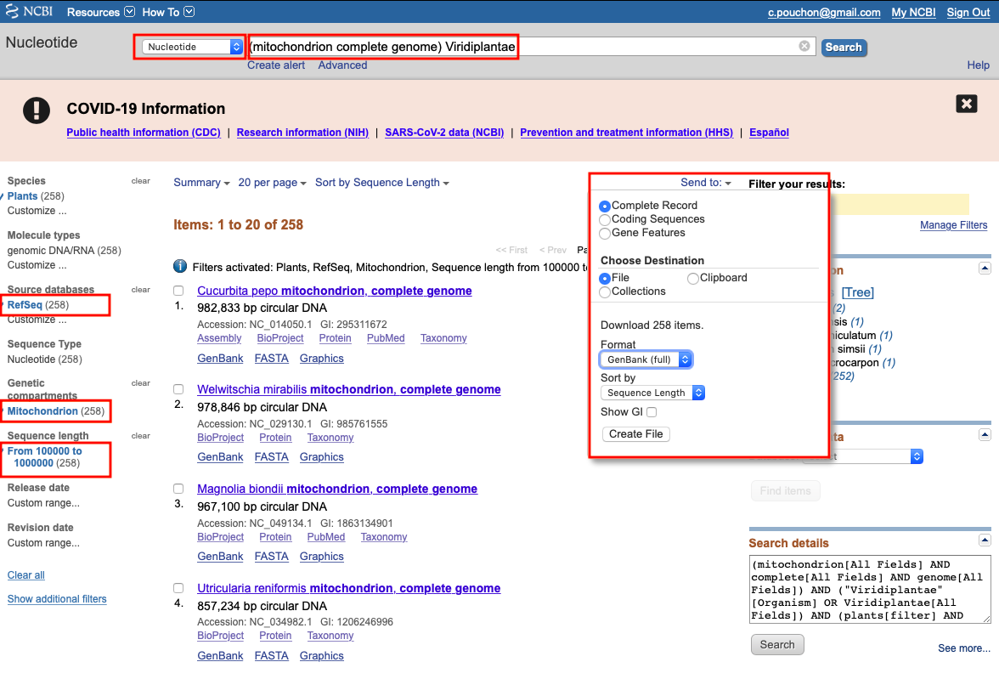
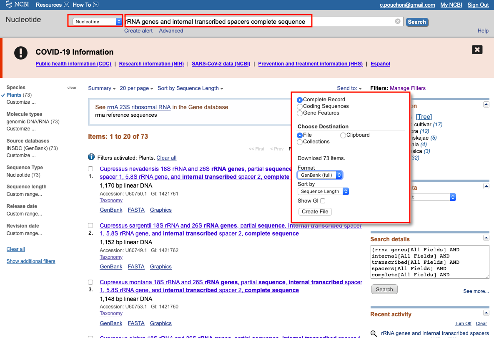
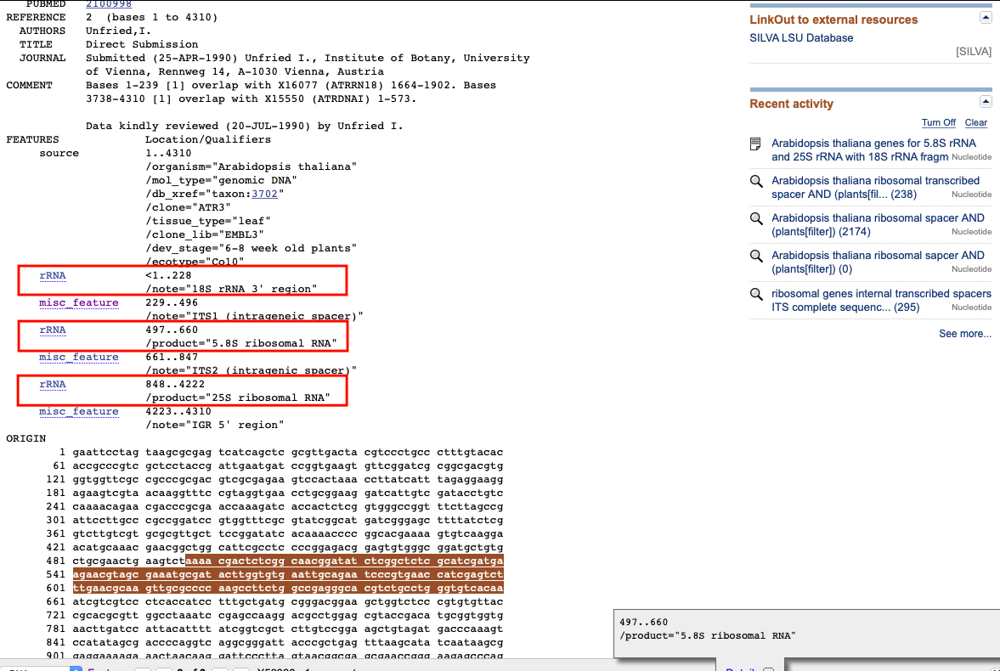

# ORTHOSKIM: *in silico* sequence capture from genomic and transcriptomic libraries

ORTHOSKIM is a pipeline providing different tools to  capture targeted sequences from genomic (*e.g.* genome skimming or hybrid capture libraries) and transcriptomic libraries, and to produce phylogenetic matrices for these sequences.

The sequence capture strategy can be aimed to chloroplast (cpDNA), mitochondrial (mtDNA), ribosomal (rDNA), nuclear (nuDNA) or BUSCO-type markers on any coding or non-coding sequences.

 ORTHOSKIM is a command-line program that needs to be run from a terminal/console, by calling different tasks, called 'modes', along with another parameter corresponding to specific 'targets' (see Figure 1). ORTHOSKIM can be parameterized in order to:
 1. produce the sequence references databases (purple arrows in Figure 1) for cpDNA, mtDNA and rDNA targets
 2. perform the contigs assemblies and cleaning from whole sequencing reads (green arrows)
 3. capture the targeted sequences from mapping of contigs on the closest reference (step 3, blue arrows)
 4. get multiple alignment of these sequences between libraries, suitable for phylogenetic inferences (orange arrows).

<b>ORTHOSKIM flowchart</b>

>**Fig. 1. ORTHOSKIM workflow**. Yellow boxes represent data that needs to be provided by users. To capture any of the chloroplast, ribosomal or mitochondrial sequences, users have to provide each of the three/two annotation genome files if plant/non-plant models are analyzed (see Pipeline description section).


**Citation:**
<br/>Pouchon, C., Boyer, F., Roquet, C., Denoeud, F., Chave, J., Coissac, E., Alsos, I.G., Consortium, T.P., Consortium, T.P., & Lavergne, S. 2022. [ORTHOSKIM](https://doi.org/10.1111/1755-0998.13584): In silico sequence capture from genomic and transcriptomic libraries for phylogenomic and barcoding applications. Molecular Ecology Resources n/a. https://doi.org/10.1111/1755-0998.13584.</font>  


License: GPL https://www.gnu.org/licenses/gpl-3.0.html

## Table of contents

1. [Installation](#1-installation)
2. [Input files](#2-input-files)
3. [How to run ORTHOSKIM](#3-how-to-run-orthoskim)
4. [How to collect annotations](#4-how-to-collect-annotations)
5. [How to collect seed sequences for annotations](#5-how-to-collect-seed-sequences-for-annotations)
6. [Recommendations for hybrid enrichment libraries](#6-recommendations-for-hybrid-enrichment-libraries)
6. [Tutorial](#6-tutorial)
7. [Additional modes for PhyloDB users](#7-additional-modes-for-Phylodb-users)
8. [Funding](#8-funding)  
9. [Support](#9-support)


<!-- toc -->

## 1. Installation

ORTHOSKIM is tested on Unix environment and downloaded from the source code:

```
user$: wget https://github.com/cpouchon/ORTHOSKIM/archive/master.zip
user$: unzip master.zip
```

ORTHOSKIM is packaged with all required dependencies in a [conda](https://conda.io/projects/conda/en/latest/user-guide/install/index.html) environment, which has to be installed (see https://conda.io/projects/conda/en/latest/user-guide/install/index.html).

ORTHOSKIM package is create with the *orthoskim-env.yml* file provided:

```
user$: cd ./ORTHOSKIM-master/
user$: conda env create --prefix /your_path_to_install/orthoskim-env --file orthoskim-env.yml
```

Such package has then to be activated/deactivated when running ORTHOSKIM:

```
user$: conda activate /your_path_to_install/orthoskim-env
user$: (orthoskim-env) ./ORTHOSKIM-master/orthoskim
user$: conda deactivate
```


## 2. Input files

ORTHOSKIM requires a sample file, a parameter file, and references sequences for each targeted sequences.


### 2.1. Parameter (config) file


Users have to modify the *config_orthoskim.txt* file provided before running the pipeline. Default values are set for filtering and assembly steps. Indications about the parameters are given in the section 3.

```
user$: nano config_orthoskim.txt
```
```
# ORTHOSKIM (v.1.0) config file
# Global parameters ---------------------------------------------------------------------------------------------------------------------------------------------------------------------------------------------------------------------------------------------------------------------------------------------------------------------
TOOLS=~/ORTHOSKIM-master/tools.sh                                                    ## [1] file with dependencies aliases
RES=~/run_orthoskim                                                                  ## [2] working directory for all ORTHOSKIM outputs
EVALUE=0.00001                                                                       ## [3] evalue threshold for mapping steps
THREADS=15                                                                           ## [4] number of threads to use for multithreading steps
VERBOSE=0                                                                            ## [5] set verbose to TRUE (1) or FALSE (0)
PLANT_MODEL=yes                                                                      ## [6] plant model analyzed (yes/no)
GENETIC_CODE=1                                                                       ## [7] NCBI genetic code number used for DNA translation (e.g. 1: standard genetic code, 2: Vertebrate Mitochondrial Code...). Codes are available at https://www.ncbi.nlm.nih.gov/Taxonomy/Utils/wprintgc.cgi
SAMPLES=~/ORTHOSKIM-master/resources/listSamples.tab                                 ## [8] samples file. Specific format required:  (1) sample name with Genus_species_(subsp)_taxid_attributes; (2) path to forward reads; (3) path to reverse reads; (4) [additional for phyloskims users] chloroplast annotations

# [assembly] mode ----------------------------------------------------------------------------------------------------------------------------------------------------------------------------------------------------------------------------------------------------------------------------------------------------------------
MEMORY=30                                                                            ## [9] max memory used in assembly
KMER=55                                                                              ## [10] K-mer size used in assembly with single (here 55) or range values (as 21,33,55). Note: less than 128

# [filtering] mode: Filtering for contaminants in assemblies
SIMILARITY_CONTA_THSLD=65                                                            ## [11] similarity threshold (%) used to check contaminants. We recommend keeping a low threshold as sequence are filtered according to their taxId (e.g. 65, meaning that only hits with a least 65% of similarity are used).
MAPPING_CONTA_LENGTH=50                                                              ## [12] minimal mapping length. As for the threshold, we recommend to keep a low value here (e.g. 50).
TAXONOMIC_PHYLUM_EXPECTED=Embryophyta                                                ## [13] taxonomic phylum expected for contigs (e.g. "Embryophyta","Viridiplantae" for plants, otherwise "Eumetazoa","Arthropoda","Annelida","Mollusca" etc); Note: "Animalia" is not allowed. Please check the taxonomy provided in the ~/ORTHOSKIM-master/resources/rRNA_database_taxonomy.txt file.

# [database] mode: sequences of reference -----------------------------------------------------------------------------------------------------------------------------------------------------------------------------------------------------------------------------------------------------------------------------------------------
MITO_ANNOTATIONS=~/ORTHOSKIM-master/data/mitochondrion_viridiplantae.gb              ## [14] input mtDNA Annotations file (in .gb or .embl)
NRDNA_ANNOTATIONS=~/ORTHOSKIM-master/data/nucrdna_viridiplantae.gb                   ## [15] input rDNA annotations file (in .gb or .embl)
CHLORO_ANNOTATIONS=~/ORTHOSKIM-master/data/chloroplast_viridiplantae.gb              ## [16] input cpDNA annotations file (in .gb or .embl)
MITO_DB_FMT=genbank                                                                  ## [17] database format: [genbank,embl]
NRDNA_DB_FMT=genbank                                                                 ## [18] database format: [genbank,embl]
CHLORO_DB_FMT=genbank                                                                ## [19] database format: [genbank,embl]
MITO_SIZE_MIN=200000                                                                 ## [20] minimal size of mtDNA genomes required for the pre-selection of contigs
MITO_SIZE_MAX=1000000                                                                ## [21] maximal size of mtDNA genomes required for the pre-selection of contigs
NRDNA_SIZE_MIN=2000                                                                  ## [22] minimal size of rDNA complex required for the pre-selection of contigs
NRDNA_SIZE_MAX=9000                                                                  ## [23] maximal size of rDNA complex required for the pre-selection of contigs
CHLORO_SIZE_MIN=140000                                                               ## [24] minimal size of cpDNA genomes required for the pre-selection of contigs
CHLORO_SIZE_MAX=200000                                                               ## [25] maximal size of cpDNA genomes required for the pre-selection of contigs
SEEDS_THRESHOLD=0.8                                                                  ## [26] minimal percent of seed coverage to keep genes in references. For example, if rrn28S in seeds is 3375bp longer, only rrn28S genes with length >= 0.8*3375bp will be considered in the final references list.

# [capture] mode: extraction steps from mapping assemblies into a reference ------------------------------------------------------------------------------------------------------------------------------------------------------------------------------------------------------------------------------------------------------------------
MINLENGTH=90                                                                         ## [27] minimal length of captured sequence
REFPCT=0.4                                                                           ## [28] minimal coverage fraction of the reference exon(s) (e.g. 0.4 means that at least 40% of reference exon(s) has to be captured).
COVERAGE=3                                                                           ## [29] minimal contig coverage (in k-mer coverage) allowed for the capture
MINCONTLENGTH=500                                                                    ## [30] minimal contig length allowed for the capture
EXO_SCORE=50                                                                         ## [31] minimal mapping score. We recommend to not set too high values (if the targeted sequence length is short) as a selection is done for the best alignments.
COVCUTOFF=on                                                                         ## [32] coverage cut-off option for organelles (cpDNA, mtDNA): [on/off] - cut-off done according to a standard deviations approach from the mean contig coverage weighted by the reconstructed size of the organelles.
ORFCOV=0.8                                                                           ## [33] minimal fraction of captured sequences covered by the longest open reading frame (ORF). For example, 0.8 means that 80% of the captured sequence has to be covered by an ORF.
MAX_SEQS=2                                                                           ## [34] maximal number of contigs per reference used in BLAST for the pre-selection of contigs in the nucleus and busco modes. To speed up the capture in these modes, only one or two contig(s) can be preselected for each reference.

#---------  [busco] target --------------------------------------------------------------------------------------------------------------------------------------------------------------------------------------------------------------------------------------------------------------------------------------------------------------
BUSCO_REF=~/ORTHOSKIM-master/data/BUSCO_viridiplantae.fa                             ## [35] BUSCO reference sequences FASTA file.
BUSCO_TYPE=exon                                                                      ## [36] region of reference captured: [exon,intron,all]

#---------  [nuclear] target ------------------------------------------------------------------------------------------------------------------------------------------------------------------------------------------------------------------------------------------------------------------------------------------------------------
NUC_NT_REF=~/ORTHOSKIM-master/data/nucleusNT_unaligned.fa                            ## [37] nuclear reference sequences FASTA file (nucleotide sequences required). Please check restrictions for the sequence names.
NUC_AA_REF=~/ORTHOSKIM-master/data/nucleusAA_unaligned.fa                            ## [38] nuclear reference sequences FASTA file (amino-acid sequences required). Please check restrictions for the sequence names.
NUC_TYPE=exon                                                                        ## [39] region of reference captured: [exon,intron,all]

#---------  [mitochondrion] target -------------------------------------------------------------------------------------------------------------------------------------------------------------------------------------------------------------------------------------------------------------------------------------------------------
SEEDS_MITO_CDS=~/ORTHOSKIM-master/resources/mitoCDS.seeds                            ## [40] mtDNA CDS seeds sequences FASTA file (amino-acid sequences required). Please check restrictions for the sequence names.
SEEDS_MITO_rRNA=~/ORTHOSKIM-master/resources/mitorRNA.seeds                          ## [41] mtDNA rRNA seeds sequences FASTA file (nucleotide sequences required). Please check restrictions for the sequence names.
MITO_REF_CDS=~/ORTHOSKIM-master/data/mit_CDS_unaligned.fa                            ## [42] mtDNA CDS reference sequences FASTA file (amino-acid sequences required). Please check restrictions for the sequence names.
MITO_REF_rRNA=~/ORTHOSKIM-master/data/mit_rRNA_unaligned.fa                          ## [43] mtDNA rRNA reference sequences FASTA file (nucleotide sequences required). Please check restrictions for the sequence names.
MITO_REF_NT=~/ORTHOSKIM-master/data/mit_nt_custom.fa                                 ## [44] mtDNA custom reference sequences FASTA file (nucleotide sequences required). Please check restrictions for the sequence names.
MITO_TYPE=exon                                                                       ## [45] region of reference captured: [exon,intron,all]

#--------- [chloroplast] target ----------------------------------------------------------------------------------------------------------------------------------------------------------------------------------------------------------------------------------------------------------------------------------------------------------
SEEDS_CHLORO_CDS=~/ORTHOSKIM-master/resources/chloroCDS.seeds                        ## [46] cpDNA CDS seeds sequences FASTA file (amino-acid sequences required). Please check restrictions for the sequence names.
SEEDS_CHLORO_rRNA=~/ORTHOSKIM-master/resources/chlororRNA.seeds                      ## [47] cpDNA rRNA seeds sequences FASTA file (nucleotide sequences required). Please check restrictions for the sequence names.
SEEDS_CHLORO_tRNA=~/ORTHOSKIM-master/resources/chlorotRNA.seeds                      ## [48] cpDNA tRNA seeds sequences FASTA file (nucleotide sequences required). Please check restrictions for the sequence names, with the anticodon in the name (e.g. trnL-UAA_taxid_genus_species)
CHLORO_REF_CDS=~/ORTHOSKIM-master/data/chloro_CDS_unaligned.fa                       ## [49] cpDNA CDS reference sequences FASTA file (amino-acid sequences required). Please check restrictions for the sequence names.
CHLORO_REF_rRNA=~/ORTHOSKIM-master/data/chloro_rRNA_unaligned.fa                     ## [50] cpDNA rRNA gene reference sequences FASTA file (nucleotide sequences required). Please check restrictions for the sequence names.
CHLORO_REF_tRNA=~/ORTHOSKIM-master/data/chloro_tRNA_unaligned.fa                     ## [51] cpDNA tRNA gene reference sequences FASTA file (nucleotide sequences required). Please check restrictions for the sequence names.
CHLORO_REF_NT=~/ORTHOSKIM-master/data/chloro_nt_custom.fa                            ## [52] cpDNA custom reference sequences FASTA file (nucleotide sequences required). Please check restrictions for the sequence names.
CHLORO_TYPE=exon                                                                     ## [53] region of reference captured: [exon,intron,all]

#--------- [nucrdna] target --------------------------------------------------------------------------------------------------------------------------------------------------------------------------------------------------------------------------------------------------------------------------------------------------------------
SEEDS_NRDNA=~/ORTHOSKIM-master/resources/nucrdna.seeds                               ## [54] rDNA rRNA seeds sequences FASTA file (nucleotide sequences required). Please check restrictions for the sequence names.
NRDNA_REF=~/ORTHOSKIM-master/data/nucrdna_rRNA_unaligned.fa                          ## [55] rDNA rRNA reference sequences FASTA file (nucleotide sequences required). Please check restrictions for the sequence names.
NRDNA_TYPE=exon                                                                      ## [56] region of reference captured: [exon,intron,all]

# [alignment] mode -----------------------------------------------------------------------------------------------------------------------------------------------------------------------------------------------------------------------------------------------------------------------------------------------------------------------
TAXA_ALN=~/ORTHOSKIM-master/resources/selTaxa_Primulaceae.tab                        ## [58] file with selected taxa (file with each line corresponding to one taxon)
TRIMMING=on                                                                          ## [59] alignment trimming option using trimAl: [on/off]
TRIMMODE=automated1                                                                  ## [60] trimming mode of trimAl: [automated1,gappyout,strictplus]. See trimAl documentation.
PARALOG_FILT=on                                                                      ## [61] filtering paralogs mode: [on,off]
CONSENSUS_LEVEL=family                                                               ## [62] Taxonomic level of the consensus for paralog identification: [order, family, genus]
WINDOW_SIZE=20                                                                       ## [63] sliding window size (e.g. 20 nt)
WINDOW_PSITE=5                                                                       ## [64] maximal number of polymorphic sites within the sliding window allowed. All sequences with more than <WINDOW_PSITE> will be removed.
MISSING_RATIO=1.0                                                                    ## [65] maximal threshold of missing data allowed in the final matrix (e.g. 0.5 means that final sequence has fewer than 50% of missing data). Taxa that not passed this threshold are removed.
GENES_TO_CONCAT=~/ORTHOSKIM-master/resources/listGenes_To_Concat.tab                 ## [66] file with selected genes for the alignment (each line corresponds to one gene)

# [checking] mode -----------------------------------------------------------------------------------------------------------------------------------------------------------------------------------------------------------------------------------------------------------------------------------------------------------------------
BARCODES=( matK rbcL )                                                               ## [67] list of sequences used for the taxonomic checking. Users have to respect spaces between sequence names. If only one gene, set BARCODES=( matK ). We recommend to use only genes that are widely represented in the NCBI database (e.g. traditional barcodes).
BARCODES_TYPE=chloroplast_CDS                                                        ## [68] ORTHOSKIM targets including these genes [chloroplast_CDS, chloroplast_rRNA, chloroplast_tRNA, chloroplast_nt, mitochondrion_CDS, mitochondrion_rRNA, mitochondrion_nt,nuleus_aa, nucleus_nt, busco, nucrdna]
DB_LOCAL=off                                                                         ## [65] option to run BLAST locally by using the NCBI nt database, which has previously to be downloaded: [on/off]. Otherwise, NCBI server will be used.
BLAST_NT_DB=~/path_to_ntdb/nt                                                        ## [66] local NCBI nt database files if DB_LOCAL=on
TAXA_CHECK=~/ORTHOSKIM-master/resources/selTaxa_Primulaceae.tab                      ## [68] file with selected taxa for the taxonomic checking (each line corresponding to one taxon)
FAMILIES_LOCAL=off                                                                   ## [69] option to use a local list of taxonomic families, when query taxIDs are not yet included in the NBCI taxonomy: [on/off]. If this option is used, the CORRESPONDING_FAMILIES file needs to be given.
CORRESPONDING_FAMILIES=ecofind_out.tab                                               ## [70] table with query taxID and corresponding family (with space separator)

# only for phyloskims users --------------------------------------------------------------------------------------------------------------------------------------------------------------------------------------------------------------------------------------------------------------------------------------------------------------
CHLORO_GENES=~/ORTHOSKIM-master/resources/listGenes.chloro                           ## [71] list of cpDNA genes. Table format: $1=type (CDS,rRNA,tRNA), $2=genename. This file can be modified by adding/removing specific lines.
MITO_GENES=~/ORTHOSKIM-master/resources/listGenes.mito                               ## [72] list of mtDNA genes. Table format: $1=type (CDS,rRNA,tRNA), $2=genename. This file can be modified by adding/removing specific lines.
NRDNA_GENES=~/ORTHOSKIM-master/resources/listGenes.rdna                              ## [73] list of rDNA genes. Table format: $1=type (rRNA,misc_RNA), $2=genename. This file can be modified by adding/removing specific lines.

```

### 2.2. Dependencies

The path to all dependencies which are required in ORTHOSKIM must be supplied in the *tools.sh* file.

To retrieve dependencies, once the orthoskim-env is activated, please use:

```
user$: conda activate orthoskim-env
user$: (orthoskim-env) which diamond spades.py exonerate makeblastdb blastn mafft trimal tblastn
/home/charles/.conda/envs/orthoskim-env/bin/spades.py
/home/charles/.conda/envs/orthoskim-env/bin/exonerate
/home/charles/.conda/envs/orthoskim-env/bin/makeblastdb
/home/charles/.conda/envs/orthoskim-env/bin/blastn
/home/charles/.conda/envs/orthoskim-env/bin/mafft
/home/charles/.conda/envs/orthoskim-env/bin/trimal
/home/charles/.conda/envs/orthoskim-env/bin/tblastn
```

Paths to dependencies are then filled on the *tools.sh* file using the following command:

```
user$: nano tools.sh
```
```
#!/bin/bash

SPADES=/home/charles/.conda/envs/orthoskim-env/bin/spades.py
EXONERATE=/home/charles/.conda/envs/orthoskim-env/bin/exonerate
BLASTDB=/home/charles/.conda/envs/orthoskim-env/bin/makeblastdb
BLASTN=/home/charles/.conda/envs/orthoskim-env/bin/blastn
MAFFT=/home/charles/.conda/envs/orthoskim-env/bin/mafft
TRIMAL=/home/charles/.conda/envs/orthoskim-env/bin/trimal
TBLASTN=/home/charles/.conda/envs/orthoskim-env/bin/tblastn
```


### 2.3. Sample file


A sample file, indicating the libraries used, must be supplied in the **config** file at line **8**:

```
SAMPLES=~/ORTHOSKIM-master/resources/listSamples.tab                                ## [8] samples file. Specific format required:  (1) sample name with Genus_species_(subsp)_taxid_attributes; (2) path to forward reads; (3) path to reverse reads; (4) [additional for phyloskims users] chloroplast annotations
```

This tab must contain for each library the following columns :
+ the sample name of the library following *Genus_species_taxid_sampleid_otherids* restriction
+ the file-path to forward reads
+ the file-path reverse reads


```
user$: head ~/OrthoSkim/resources/listSamples.tab
Veronica_crassifolia_996476_CAR009639_BGN_NFI   /Users/pouchonc/PhyloAlps/CDS/Veronica_crassifolia:996476/BGN_NFIOSW_4_1_CA559ACXX.IND44_clean.fastq.gz /Users/pouchonc/PhyloAlps/CDS/Veronica_crassifolia:996476/BGN_NFIOSW_4_2_CA559ACXX.IND44_clean.fastq.gz
Androsace_helvetica_199610_CLA000520_BGN_ETA    /Users/pouchonc/PhyloAlps/CDS/Androsace_helvetica:199610/BGN_ETAOSW_2_1_C8MR2ACXX.IND13_clean.fastq.gz  /Users/pouchonc/PhyloAlps/CDS/Androsace_helvetica:199610/BGN_ETAOSW_2_2_C8MR2ACXX.IND13_clean.fastq.gz
```

### 2.4. Reference files (database)

ORTHOSKIM uses a multi-taxa bank of reference sequences to capture targeted markers into assemblies.

The reference input files required for each type of the target sequences are displayed by yellow boxes in the flowchart (Fig.1.) and summarized in this table:

| Targets - types (AA/NT) | capture targets (-t) | input ref. | input seeds | additional files |
|---|---|---|---|---|
| cpDNA - coding CDS (AA)  | chloroplast_CDS | cpDNA annotation file (multiple accessions) | CDS fasta file | mtDNA: annotation file + seeds (CDS, rRNA);  rDNA: annotation file |
| cpDNA - coding rRNA (NT) | chloroplast_rRNA | cpDNA annotation file (multiple accessions) | rRNA fasta file | mtDNA: annotation file + seeds (CDS, rRNA);  rDNA: annotation file |
| cpDNA - trnL-UAA (NT) | chloroplast_tRNA | cpDNA annotation file (multiple accessions) | trnL fasta file | mtDNA: annotation file + seeds (CDS, rRNA);  rDNA: annotation file |
| cpDNA - custom (NT) | chloroplast_nt | custom reference fasta file | NA | mtDNA: annotation file + seeds (CDS, rRNA);  rDNA: annotation file |
| mtDNA - coding CDS (AA) | mitochondrion_CDS | mtDNA annotation file (multiple accessions) | CDS fasta file | cpDNA (only for plants): annotation file + seeds (CDS, rRNA); rDNA: annotation file |
| mtDNA - rRNA (NT) | mitochondrion_rRNA | mtDNA annotation file (multiple accessions) | rRNA fasta file | cpDNA (only for plants): annotation file + seeds (CDS, rRNA); rDNA: annotation file |
| mtDNA - custom (NT) | mitochondrion_nt | custom reference fasta file | NA | cpDNA (only for plants): annotation file + seeds (CDS, rRNA); rDNA: annotation file |
| rDNA - rRNA + ITS (NT) | nucrdna | rDNA annotation file (multiple accessions) | rRNA fasta file | cpDNA (only for plants): annotation file; mtDNA: annotation file |
| nuDNA - coding (AA) | nucleus_aa | custom reference fasta file | NA | NA |
| nuDNA - non-coding/custom (NT) | nucleus_nt | custom reference fasta file | NA | NA |
| BUSCO (AA) | busco | BUSCO fasta file of ancestral variants | NA | NA |


#### 2.4.1. nuDNA targets

User has to provide their own reference sequence database, consisting on a multi-fasta file of the queried regions with amino-acid sequences (AA) for the ‘nucleus_aa’ target of the capture mode (suitable for coding sequences), or nucleotide sequences (NT) for the ‘nucleus_nt’ target (for non-coding sequences).

Sequence names need to be compliant with the ORTHOSKIM nomenclature: `>genename_taxid_Genus_species_other-arguments"` (*e.g.* *>cox1_3702_Arabidopsis_thaliana* for cox1 gene)


**Examples of *nucleus_aa***:
```
>LFY_3317_Thuja_occidentalis
PRSIAAPQVQRGGYEFPLPNTAAILMTNGMNGNNRKELSCLEELFKNYGVRCITLTKMVEMGFTANTLVNLTEQELDDVVRILAEIYSLDLLVGEKYGIKSAIRAERRRLDEAERKKHMELFAIMDGKQRKSDENALDTLSQEGLSVEEPNGDNTMILSQNNTYALNLNTGTDPVLLLQNSGHLSTAVSGLMTLPDNNYCSDQQLKACKKQKRRRSKESGEDGEDRQREHPFIVTEPGELARGKKNGLDYLFDLYEQCGKFLLDVQHIAKERGEKCPTKVTNQVFRHAKHSGAGYINKPKMRHYVHCYALHCLDEQSNRLRRTYKERGENVGAWRQACYYPLVDMAKENGWDIEGVFNK
>LFY_62752_Pinus_sibirica
AAFFKWDQRPPALAPPQMQRTAGLEAQRVFHDFGVPNAAAMAASNNSSSCRKELNCLEELFRNYGVRYITLTKMVDMGFTVNTLVNMTEQELDDLVRTLVEIYRVELLVGEKYGIKSAIRAEKRRLEEAERKRMEQLFVDVDGKRKIDENALDTLSQEGLSVEEPQGDNAIILSQNNTSATFPLNLNAGMDPVLILQNSGHLGTTVSGLIGMPDTNYGSEQTKACKKQKRRRSKDSGEDGEERQREHPFIVTEPGELARGKKNGLDYLFDLYEQCGKFLLDVQHIAKERGEKCPTKVTNQVFRHAKHSGAGYINKPKMRHYVHCYALHCLDVEQSNRLRRAYKERGENVGAWRQACYYPLVAMAKDNGWDIEGVFNKHEKL
>AG_45171_Paeonia_suffruticosa
MKTWDLATGKPTTQFASMELTNDPSREESPQRKNGRGKIEIKRIENTNNRQVTFCKRRNGLLKKAYELSVLCDAEVALIVFSTRGRLFEYANNSVRATIERYKKASADSSGTGSVSEANQYYQQEASKLRSQIRNLQNTNRQMLGETISSMNPRDLKNLEAKIEKGIRNIRSKKNELLFSEIEDMQKREIDLHNNNQYLRARIAENERAQQMNLMPGGTNYELLPSQPFDSRNFFQVDALQPNHNYSRQDQIALQLV
```
**Examples of *nucleus_nt***:

```
>6176_49702_Blandfordia_punicea
TCTTTCCAGGAACTAGAACAAATGAAGGAACGAGCAAAACAGATGCAGCTGCCACCAGTATATACAGGAAAGTGGGCCAGTGCTTCAGATGAAGAAGTTCAGGAAGAGCTGGCAAAGGGTACACCTTATACTTACCGATTTCGTGTACCAAAGGAAGGGAACTTGAAAATTGATGACCTTATTCGTGGTGAAGTAAGATTGTCATTGAATTGTATAAATAAC
>6176_4341_Cyrilla_racemiflora
CTTTTTTTTAATGCAGGTCCTGGTATTGGTGGAGACTATGGTCCGTATCGGCAATCTGAAAGAAATATCTTGTACAAACAATATGCTGAGAAGCTTTTAAAGTCTGGTCATGTTTATCGTTGCTTTTGTTCTAATGAGGAACTGGAAAAAATGAAGGAGATTGCAAAGTTAAAACAACTGCCTCCAGTGTACACTGGGAAGTGGGCCAACGCCACAGATGAGGAAGTGGAAGAAAAACTGGAGGAGGGAACCCCTTACACATACCGATTTCGAGTGCCCAATGAAGGAAGGTTGCAGATTGATGACCTTATTCGGGGAGAGGTTAGTTGGAGCTTGGACACACTTGGGGATTTTGTGATAATGAGAAGCAATGGACAACCCGTTTACAACTTTTGTGTCACCATTGATGATGCTACCATGGCTATCTCGCATGTTATAAGAGCAGAAGAGCATTTACCAAATACACTAAGGCAAGCACTAATATATAAGGCTCTTGGATTCCAAATGCCTTACTTTGCACATGTTTCTTTAATTCTTGCACCTGATCGGAGCAAACTTTCTAAACGGCATGGTGCAACTTCAGTGGGTCAGTTCAGGGAGATGGGATATCTGCCCCAGGCAATGGTGAACTATCTAGCACTGCTGGGTTGGGGTGATGGTACCGAAAATGAGTTCTTTACTCTAGATCAACTGGTTGAAAAGTTTTCAATTGACCGCGTCAACAAGAGTGGAGCCATTTTTGATTCAACCAAATTAAGGTGGATGAATGGTCAGCATTTAAGAGCTCTTTCCTCAGAAGAATTGACCAAGCTTATTGGTCAGCGCTGGAAGAGC
```

Paths to these reference sequences are set in the **config** file at lines **37-38**:

```
NUC_NT_REF=~/ORTHOSKIM-master/data/nucleusNT_unaligned.fa                            ## [37] nuclear reference sequences FASTA file (nucleotide sequences required). Please check restrictions for the sequence names.
NUC_AA_REF=~/ORTHOSKIM-master/data/nucleusAA_unaligned.fa                            ## [38] nuclear reference sequences FASTA file (amino-acid sequences required). Please check restrictions for the sequence names.
```


#### 2.4.2. BUSCO targets

For the *busco* target, ORTHOSKIM uses the [BUSCO](https://busco.ezlab.org) dataset of amino acid ancestral sequences variants, called *ancestral_variants* in the BUSCO sets. The location of the reference busco sequences has to be set in the line **35** of the **config** file.

```
BUSCO_REF=~/ORTHOSKIM-master/data/BUSCO_viridiplantae.fa                             ## [35] BUSCO reference sequences FASTA file.
```

Here, an overview of the busco sequences needed:
```
user$: head ~/OrthoSkim/data/BUSCO_viridiplantae.fa
>10018_0
IASVVSEIGLGSEPAFKVPEYDFRSPVDKLQKATGIPKAVFPVLGGLAVGLIALAYPEVLYWGFENVDILLESRPKGLSADLLLQLVAVKIVATSLCRASGLVGGYYAPSLFIGAATGMAYGKLILAEADPLLHLSILEVASPQAYGLVGMAATLAGVCQVPLTAVLLLFELTQDYRIVLPLLGAVGLSSWITSGQTKKELCKLESSLCLEDILVSEAMRTRYVTVLMSTLLVEAVSLMLAEKQSCALIVDEDNLLIGLLTLEDIQEFSKTVTPDMDLLSAEKIMGLSQLPVVVGLLDRECISL
>10018_1
VASVVSEIGLGSEPAFKVPEYDFRSAVDSLKKTLGLPKAVLPALGGLIVGLIALAYPEVLYWGFENVDILLESRPRGLSAELLLQLVAVKVVATSLCRASGLVGGYYAPSLFIGAATGMAYGKLIIAKADSLFDLEILEVASPQAYGLVGMAATLAGVCQVPLTAVLLLFELTQDYRIVLPLLGAVGLSSWISSKKTSKELCQLESSLCLKDVLVAEAMRTRYVTVLVTTSLAEALSLMLVEKQSLAVIVDEEDSLIGLLTLSDIQEYSKTVTPQLDLTKAEAIMELDRLAVVVGVLDRESIAL
...
```

The different BUSCO datasets can be downloaded at: https://busco-data.ezlab.org/v4/data/lineages/.


#### 2.4.2. cpDNA, mtDNA, rDNA targets

For all cpDNA, mtDNA and rDNA target sequences, the database is built (using the `-m database` mode) from annotated genome files and corresponding ‘seeds’ sequences, which have to be provided by the user. ORTHOSKIM extracts all gene sequences from the annotated genomes and maps them onto the given seed sequences to correctly identify targeted reference genes and to create references sequence files.


> **Note:** It is important to note that each of the three annotation files has to be collected for plant models, or both mtDNA and rDNA annotation files for other organisms, even if a single region is targeted (*e.g.* cpDNA sequences), as such files are also used to assign the genomic assemblies to the cpDNA, mtDNA or rDNA regions.

By default, ORTHOSKIM is supplied with a large enough reference sequence database for the study of green plants (i.e. Viridiplantaeae) genome skimming datasets: the BUSCO plant set (viridiplantaeae_odb10), 353 ultra-conserved elements set designed for angiosperms (UCE, Johnson et al., 2018; McLay et al. 2021), which can be used as ‘nucleus_nt’ references, and a collection of annotations for plant cpDNA, mtDNA and rDNA genomic regions collected from the NCBI. For any other eukaryotic taxa, please to respect the input file formats and requirements.

**Annotation files:**

As a taxonomic selection is done according to the queried taxon, we recommend including as many divergent taxa as possible in the annotation files. These files, in *EMBL* or *GENBANK* format, can be collected directly from the [NCBI](https://www.ncbi.nlm.nih.gov/genbank/). Please see the section [How to collect annotations (cpDNA, mtDNA, rDNA)](#4-how-to-collect-annotations-(cpdna,-mtdna,-rdna).

Annotations files, and their formats, are given in the **config** files at lines **14-19**:
```
MITO_ANNOTATIONS=~/ORTHOSKIM-master/data/mitochondrion_viridiplantae.gb              ## [14] input mtDNA Annotations file (in .gb or .embl)
NRDNA_ANNOTATIONS=~/ORTHOSKIM-master/data/nucrdna_viridiplantae.gb                   ## [15] input rDNA annotations file (in .gb or .embl)
CHLORO_ANNOTATIONS=~/ORTHOSKIM-master/data/chloroplast_viridiplantae.gb              ## [16] input cpDNA annotations file (in .gb or .embl)
MITO_DB_FMT=genbank                                                                  ## [17] database format: [genbank,embl]
NRDNA_DB_FMT=genbank                                                                 ## [18] database format: [genbank,embl]
CHLORO_DB_FMT=genbank                                                                ## [19] database format: [genbank,embl]
```


**Seed files:**

For both cpDNA and mtDNA, seed files are given separately for the targeted coding (CDS) genes, with amino-acid sequences, and for the non-coding RNA genes, with nucleotide sequences. Moreover, the user has to provide a seed sequence file for the chloroplast trnL-UAA gene, a traditional plant barcode, as it is also captured for plant models. Concerning the rDNA, the three rRNA genes sequences (*i.e.* rrn18S, rrn5.8S and rrn26S) have to be included on the corresponding seed file. ORTHOSKIM next designs probes from these rRNA genes for both seeds and references, allowing the identification and the capture of the two internal transcribed spacer regions (ITS1 and ITS2).
Please see the section [How to collect seeds for annotations](#3-pipeline-description).

Seeds are given in config file lines **40-41**,**46-48**,**54**:

```
SEEDS_MITO_CDS=~/ORTHOSKIM-master/resources/mitoCDS.seeds                           ## [40] mtDNA CDS seeds sequences FASTA file (amino-acid sequences required). Please check restrictions for the sequence names.
SEEDS_MITO_rRNA=~/ORTHOSKIM-master/resources/mitorRNA.seeds                         ## [41] mtDNA rRNA seeds sequences FASTA file (nucleotide sequences required). Please check restrictions for the sequence names.
...
SEEDS_CHLORO_CDS=~/ORTHOSKIM-master/resources/chloroCDS.seeds                       ## [46] cpDNA CDS seeds sequences FASTA file (amino-acid sequences required). Please check restrictions for the sequence names.
SEEDS_CHLORO_rRNA=~/ORTHOSKIM-master/resources/chlororRNA.seeds                     ## [47] cpDNA rRNA seeds sequences FASTA file (nucleotide sequences required). Please check restrictions for the sequence names.
SEEDS_CHLORO_tRNA=~/ORTHOSKIM-master/resources/chlorotRNA.seeds                     ## [48] cpDNA tRNA seeds sequences FASTA file (nucleotide sequences required). Please check restrictions for the sequence names, with the anticodon in the name (e.g. trnL-UAA_taxid_genus_species)
...
SEEDS_NRDNA=~/ORTHOSKIM-master/resources/nucrdna.seeds                              ## [54] rDNA rRNA seeds sequences FASTA file (nucleotide sequences required). Please check restrictions for the sequence names.
```


Example of required cpDNA seeds for CDS targets:
```
user$: (orthoskim-env) head chloroCDS.seeds
>infA_4232_Helianthus_annuus
MKEQKWIHEGLITESLPNGMFRVRLDNEDMILGYVSGKIRRSFIRILPGDRVKIEVSRYDSTRGRIIYRLRNKDSKD
>psbA_3702_Arabidopsis_thaliana
MTAILERRESESLWGRFCNWITSTENRLYIGWFGVLMIPTLLTATSVFIIAFIAAPPVDIDGIREPVSGSLLYGNNIISGAIIPTSAAIGLHFYPIWEAASVDEWLYNGGPYELIVLHFLLGVACYMGREWELSFRLGMRPWIAVAYSAPVAAATAVFLIYPIGQGSFSDGMPLGISGTFNFMIVFQAEHNILMHPFHMLGVAGVFGGSLFSAMHGSLVTSSLIRETTENESANEGYRFGQEEETYNIVAAHGYFGRLIFQYASFNNSRSLHFFLAAWPVVGIWFTALGISTMAFNLNGFNFNQSVVDSQGRVINTWADIINRANLGMEVMHERNAHNFPLDLAAVEAPSTNG
>matK_3702_Arabidopsis_thaliana
MCHFRTQENKDFTFSSNRISIQMDKFQGYLEFDGARQQSFLYPLFFREYIYVLAYDHGLNRLNRNRYIFLENADYDKKYSSLITKRLILRMYEQNRLIIPTKDVNQNSFLGHTSLFYYQMISVLFAVIVEIPFSLRLGSSFQGKQLKKSYNLQSIHSIFPFLEDKLGHFNYVLDVLIPYPIHLEILVQTLRYRVKDASSLHFFRFCLYEYCNWKNFYIKKKSILNPRFFLFLYNSHVCEYESIFFFLRKRSSHLRSTSYEVLFERIVFYGKIHHFFKVFVNNFPAILGLLKDPFIHYVRYHGRCILATKDTPLLMNKWKYYFVNLWQCYFSVWFQSQKVNINQLSKDNLEFLGYLSSLRLNPLVVRSQMLENSFLIDNVRIKLDSKIPISSIIGSLAKDKFCNVLGHPISKATWTDSSDSDILNRFVRICRNISHYYSGSSKKKNLYRIKYILRLCCVKTLARKHKSTVRTFLKRLGSGLLEEFLTGEDQVLSLIFPRSYYASKRLYRVRIWYLDILYLNDLVNHE
```

The resulting reference sequence database consists of a multi-FASTA file for each type of gene sequence (*i.e.* CDS, rRNA and tRNA), generated with amino-acid sequences for CDS and nucleotide sequences for rRNA and tRNA genes.

Output files are given in the **config** file at lines :

```
MITO_REF_CDS=~/ORTHOSKIM-master/data/mit_CDS_unaligned.fa                            ## [42] mtDNA CDS reference sequences FASTA file (amino-acid sequences required). Please check restrictions for the sequence names.
MITO_REF_rRNA=~/ORTHOSKIM-master/data/mit_rRNA_unaligned.fa                          ## [43] mtDNA rRNA reference sequences FASTA file (nucleotide sequences required). Please check restrictions for the sequence names.
...
CHLORO_REF_CDS=~/ORTHOSKIM-master/data/chloro_CDS_unaligned.fa                       ## [49] cpDNA CDS reference sequences FASTA file (amino-acid sequences required). Please check restrictions for the sequence names.
CHLORO_REF_rRNA=~/ORTHOSKIM-master/data/chloro_rRNA_unaligned.fa                     ## [50] cpDNA rRNA gene reference sequences FASTA file (nucleotide sequences required). Please check restrictions for the sequence names.
CHLORO_REF_tRNA=~/ORTHOSKIM-master/data/chloro_tRNA_unaligned.fa                     ## [51] cpDNA tRNA gene reference sequences FASTA file (nucleotide sequences required). Please check restrictions for the sequence names.
...
NRDNA_REF=~/ORTHOSKIM-master/data/nucrdna_rRNA_unaligned.fa                          ## [55] rDNA rRNA reference sequences FASTA file (nucleotide sequences required). Please check restrictions for the sequence names.
```

Here, an output example of CDS bank generated from the mitochondrial annotations (*i.e.* using the mode `-m database` and the target `-t mitochondrion`).
```
user$: (orthoskim-env) head ~/OrthoSkim/data/mit_CDS_unaligned.fa
>cox2_103999_Codonopsis_lanceolata
MRELEKKNTHDFILPAPADAAEPWQLGFQDGATPIMQGIIDLHHDIFFFLIMILVLVLWILVRALWLFSSKRNPIPQRIVHGTTIEILRTIFPSIILMFIAIPSFALLYSMDEVVVDPAITIKAIGHQWYWTYEYSDYNSSDEESLTFDSYMIPEDDLELGQLRLLEVDNRVVVPANCHLRLIVTSADVPHSWAVPSLGVKCDAVPGRLNQVSISVLREGVYYGQCSEICGTNHAFMPIVVEAVSMKDYASRVSNQLIPQTGH
>cox2_104537_Roya_obtusa
MILKSLFQVVYCDAAEPWQLGFQDAATPMMQGIIDLHHDIMFFITIIITFVLWMLVRVLWHFHYKKNPIPQRFVHGTTIEIIWTIIPSIILMFIAIPSFALLYSMDEVVDPAITIKAIGHQWYWSYEYSDYSTSDEESLAFDSYMIPEDDLELGQLRLLEVDNRVVVPAKTHLRFIITSADVLHSWAVPSLGVKCDAVPGRLNQTSIFIKREGVYYGQCSEICGTNHAFMPIVVEAVSLDDYVSWVSNKME
>cox1_112509_Hordeum_vulgare_subsp._vulgare
MTNLVRWLFSTNHKDIGTLYFIFGAIAGVMGTCFSVLIRMELARPGDQILGGNHQLYNVLITAHAFLMIFFMVMPAMIGGFGNWFVPILIGAPDMAFPRLNNISFWLLPPSLLLLLSSALVEVGSGTGWTVYPPLSGITSHSGGAVDLAIFSLHLSGISSILGSINFITTIFNMRGPGMTMHRLPLFVWSVLVTAFLLLLSLPVLAGAITMLLTDRNFNTTFFDPAGGGDPILYQHLFWFFGHPEVYILILPGFGIISHIVSTFSRKPVFGYLGMVYAMISIGVLGFLVWAHHMFTVGLDVDTRAYFTAATMIIAVPTGIKIFSWIATMWGGSIQYKTPMLFAVGFIFLFTIGGLTGIVLANSGLDIALHDTYYVVAHFHYVLSMGAVFALFAGFYYWVGKIFGRTYPETLGQIHFWITFFGVNLTFFPMHFLGLSGMPRRIPDYPDAYAGWNALSSFGSYISVVGIRRFFVVVAITSSSGKNKKCAESPWAVEQNPTTLEWLVQSPPAFHTFGELPAVKETKNLS
>nad1_119543_Anomodon_attenuatus
MRLYIIGILAKILGIIIPLLLGVAFLVLAERKIMASMQRRKGPNVVGLFGLLQPLADGLKLMIKEPILPSSANLFIFLMAPVMTFMLSLVAWAVIPFDYGMVLSDLNVGILYLFAISSLGVYGIITAGWSSNSKYAFLGALRSAAQMVSYEVSIGLIIITVLICVGSRNFSEIVIAQKQIWFAAPLFPVFIMFFISCLAETNRAPFDLPEAEAESVAGYNVEYSSMGFALFFLGEYANMILMSSLCTLLFLGGWLPILDIPIFYVIPGSIRFSIKVLFFLFVYIWVRAAFPRYRYDQLMRLGWKVFLPLSLAWVVFVSGVLVAFDWLP
```

> **Note:** User may also supply their own reference FASTA files for each type of sequences (CDS, rRNA and tRNA) in the config file without running the *database* function, but needs to collect annotations for cpDNA, mtDNA and rDNA for the contig selection step.

**Custom modes:**

Two free capture modes, working with any reference sequences, were also implemented for cpDNA and mtDNA (`-t chloroplast_nt` and `-t mitochondrion_nt` capture targets) that can be easily used to capture intergenic regions. For this purpose, a custom reference database has to be supplied in the **config** file for each of two modes (lines **44** and **52**), consisting of a multi-taxon FASTA file with nucleotide sequences of targeting regions and sequence names compliant with the ORTHOSKIM nomenclature.

```
MITO_REF_NT=~/ORTHOSKIM-master/data/mit_nt_custom.fa                                 ## [44] mtDNA custom reference sequences FASTA file (nucleotide sequences required). Please check restrictions for the sequence names.
...
CHLORO_REF_NT=~/ORTHOSKIM-master/data/chloro_nt_custom.fa                            ## [52] cpDNA custom reference sequences FASTA file (nucleotide sequences required). Please check restrictions for the sequence names.
```


## 3. How to run ORTHOSKIM

ORTHOSKIM uses a command line interface (CLI) that can be accessed through a terminal. Please use the -help (-h) flag to see a description of the main arguments.

```
user$: (orthoskim-env) ./orthoskim -h
```


After editing the *tools.sh* and *config_orthoskim.txt* files (with all required files and formats), ORTHOSKIM is called step by step within the conda environment with a `-m mode`, `-c config_file.txt` and specific `-t targets`.

We provide detail instructions through the description of arguments and the tutorials below.

`>` **general parameter used**
```
TOOLS=~/ORTHOSKIM-master/tools.sh                                                    ## [1] file with dependencies aliases
RES=~/run_orthoskim                                                                  ## [2] working directory for all ORTHOSKIM outputs
EVALUE=0.00001                                                                       ## [3] evalue threshold for mapping steps
THREADS=15                                                                           ## [4] number of threads to use for multithreading steps
VERBOSE=0                                                                            ## [5] set verbose to TRUE (1) or FALSE (0)
PLANT_MODEL=yes                                                                      ## [6] plant model analyzed (yes/no)
GENETIC_CODE=1                                                                       ## [7] NCBI genetic code number used for DNA translation (eg. 1: standard genetic code, 2: Vertebrate Mitochondrial Code...). Codes are available at https://www.ncbi.nlm.nih.gov/Taxonomy/Utils/wprintgc.cgi
SAMPLES=~/ORTHOSKIM-master/resources/listSamples.tab                                ## [8] samples table. Specific format required:  (1) sample name with Genus_species_(subsp)_taxid_attributes; (2) path to forward reads; (3) path to reverse reads; (4) [additional for phyloskims users] chloroplast annotations
```

> **NOTE**: The NCBI genetic code number, which is used during the capture to find ORF, has to be set according to study model and the target sequence. By default the standard genetic code is used (here GENETIC_CODE=1). But for vertebrates, if mitochondrial sequences are targeted please set GENETIC_CODE=2. All code numbers are available [here](https://www.ncbi.nlm.nih.gov/Taxonomy/Utils/wprintgc.cgi).

> **NOTE**: A *mode_done.log* file is created during the pipeline containing the list of sample libraries that were correctly processed, whereas unprocessed libraries were added into *mode_error.log* file. This file could be used to remove processed libraries from the initial sample file if the script has to be re-run. Command lines are also print if users want to re-run specific commands on some libraries.


### 3.1. Database construction for cpDNA, mtDNA and rDNA targets (optional)

ORTHOSKIM provides a mode to create the gene reference database for the cpDNA, mtDNA and rDNA regions with `-m database` mode and the `-t mitochondrion`, `-t chloroplast`,`-t nucrdna` targets (purple arrows in Fig. 1).

For such purpose, annotations of genomic compartments has to be collected for different taxa in a single file (file location set into the config file). Only genes given in the seeds will be included on the reference sequences.

`>` **list of commands**

```
user$: (orthoskim-env) ./orthoskim -m database -t chloroplast -c config_orthoskim.txt
user$: (orthoskim-env) ./orthoskim -m database -t mitochondrion -c config_orthoskim.txt
user$: (orthoskim-env) ./orthoskim -m database -t nucrdna -c config_orthoskim.txt
```

`>` **parameters used**
+ annotation files and respective formats
```
MITO_ANNOTATIONS=~/ORTHOSKIM-master/data/mitochondrion_viridiplantae.gb              ## [14] input mtDNA Annotations file (in .gb or .embl)
NRDNA_ANNOTATIONS=~/ORTHOSKIM-master/data/nucrdna_viridiplantae.gb                   ## [15] input rDNA annotations file (in .gb or .embl)
CHLORO_ANNOTATIONS=~/ORTHOSKIM-master/data/chloroplast_viridiplantae.gb              ## [16] input cpDNA annotations file (in .gb or .embl)
MITO_DB_FMT=genbank                                                                  ## [17] database format: [genbank,embl]
NRDNA_DB_FMT=genbank                                                                 ## [18] database format: [genbank,embl]
CHLORO_DB_FMT=genbank                                                                ## [19] database format: [genbank,embl]
```
+ minimal coverage to the seed sequences to extract target sequences from the annotations
```
SEEDS_THRESHOLD=0.8                                                                  ## [26] minimal percent of seed coverage to keep genes in references. For example, if rrn28S in seeds is 3375bp longer, only rrn28S genes with length >= 0.8*3375bp will be considered in the final references list.
```
+ respective output files
```
MITO_REF_CDS=~/ORTHOSKIM-master/data/mit_CDS_unaligned.fa                            ## [42] mtDNA CDS reference sequences FASTA file (amino-acid sequences required). Please check restrictions for the sequence names.
MITO_REF_rRNA=~/ORTHOSKIM-master/data/mit_rRNA_unaligned.fa                          ## [43] mtDNA rRNA reference sequences FASTA file (nucleotide sequences required). Please check restrictions for the sequence names.
...
CHLORO_REF_CDS=~/ORTHOSKIM-master/data/chloro_CDS_unaligned.fa                       ## [49] cpDNA CDS reference sequences FASTA file (amino-acid sequences required). Please check restrictions for the sequence names.
CHLORO_REF_rRNA=~/ORTHOSKIM-master/data/chloro_rRNA_unaligned.fa                     ## [50] cpDNA rRNA gene reference sequences FASTA file (nucleotide sequences required). Please check restrictions for the sequence names.
CHLORO_REF_tRNA=~/ORTHOSKIM-master/data/chloro_tRNA_unaligned.fa                     ## [51] cpDNA tRNA gene reference sequences FASTA file (nucleotide sequences required). Please check restrictions for the sequence names.
...
NRDNA_REF=~/ORTHOSKIM-master/data/nucrdna_rRNA_unaligned.fa                          ## [55] rDNA rRNA reference sequences FASTA file (nucleotide sequences required). Please check restrictions for the sequence names.
```

`>` **output files**

Database mode generates references files for cpDNA, mtDNA and rDNA sequences separately according to the type of sequence: CDS, rRNA and tRNA.


**NOTE:** We also supplied with ORTHOSKIM two python functions *SortDB_family.py* and *SortDB_lineages.py*
+ ***SortDB_family.py*** allows selecting a subset of lineages by family in sequence or annotations databases. This allows to reduce the computational time of capture steps by reducing the number of sequences by families and keeping a taxonomic diversity within the database.
+ ***SortDB_lineages.py*** allows extracting within the reference sequences databases all sequences corresponding to the queried phylum. These function can be run directly on outputs as indicated:
```
SortDB_family.py -i chloroplast_CDS.fa -f fasta -l 3 -o selected_chloroplast_CDS.fa -m gene
SortDB_family.py -i chloroplast_ncbi.gb -f genbank -l 5 -o selected_chloroplast_CDS.embl -m genome
SortDB_lineages.py -i chloroplast_CDS.fa --phylum Ericales --rank order
```
with -i input genes/genomes file; -l number of queried lineages by family; -f input file format (embl/ genbank/fasta); -o output name (format fasta for genes or embl for genomes); -m mode (gene/genome)


### 3.2. Global assemblies and cleaning

#### 3.2.1. Genomic/transcriptomic assembly

Global assemblies are performed for each library given in the sample file (l.7) by using [SPAdes](http://cab.spbu.ru/software/spades/). The user has to use the `-m assembly -t spades` or `-m assembly -t rnaspades` commands to run the assemblies according to the type of library (green arrows in Fig. 1). After [SPAdes](http://cab.spbu.ru/software/spades/) runs, ORTHOSKIM has to preprocess scaffolding contigs by formatting the output files according to the library names provided in sample file. For such purpose, the user has to run the `-m format` mode with `-t spades` or `-t rnaspades` targets according to the type of library that were processed.


`>` **list of commands**
+ for genomic libraries

```
user$: (orthoskim-env) ./orthoskim -m assembly -t spades -c config_orthoskim.txt
user$: (orthoskim-env) ./orthoskim -m format -t spades -c config_orthoskim.txt
```
+ for transcriptomic libraries

```
user$: (orthoskim-env) ./orthoskim -m assembly -t rnaspades -c config_orthoskim.txt
user$: (orthoskim-env) ./orthoskim -m format -t rnaspades -c config_orthoskim.txt
```


`>` **parameters used**

+ [SPAdes](http://cab.spbu.ru/software/spades/) is run by using different assembly options

```
THREADS=15                                                                           ## [4] number of threads to use for multithreading steps
...
MEMORY=30                                                                            ## [9] max memory used in assembly
KMER=55                                                                              ## [10] K-mer size used in assembly with single (here 55) or range values (as 21,33,55). Note: less than 128
```

`>` **output files**

ORTHOSKIM creates an `/Working_directory/Assembly/` directory including two subdirectories:
+ `/Working_directory/Assembly/SPADES/` or `/Working_directory/Assembly/RNASPADES/` directory with all assemblies produced by SPAdes ordered by libraries (with the given sample names)
+ `/Working_directory/Assembly/Samples/` directory with formatted unfiltered assemblies


#### 3.2.2. Assemblies cleaning

Before the capture of target sequences, all assemblies are cleaned using the `-m cleaning` mode. This step identifies and removes  potential contaminant contigs in the final assemblies by mapping the assemblies on different databases including RNA, cpDNA, mtDNA and rDNA sequences for a wide range of taxa.  


The taxonomic level of the best hit is next identified for each contig of each library, and compared onto an expected taxonomy, defined by the user.


`>` **list of commands**

```
user$: (orthoskim-env) ./orthoskim -m cleaning -c config_orthoskim.txt
```


`>` **parameters used**


```
SIMILARITY_CONTA_THSLD=65                                                            ## [11] similarity threshold (%) used to check contaminants. We recommend to keep a low threshold as sequence are filtered according to their taxId (e.g. 65, meaning that only hits with a least 65% of similarity are used).
MAPPING_CONTA_LENGTH=50                                                              ## [12] minimal mapping length. As for the threshold, we recommend to keep a low value here (e.g. 50).
TAXONOMIC_PHYLUM_EXPECTED=Embryophyta                                                ## [13] taxonomic phylum expected for contigs (e.g. "Embryophyta","Viridiplantae" for plants, otherwise "Eumetazoa","Arthropoda","Annelida","Mollusca" etc); Note: "Animalia" is not allowed. Please check the taxonomy provided in the ~/ORTHOSKIM-master/resources/rRNA_database_taxonomy.txt file.
```
> **NOTE:** Please check the taxonomy provided in the ~/ORTHOSKIM-master/resources/rRNA_database_taxonomy.txt file to set a correct phylum (*e.g.* "Embryophyta", "Eumetazoa","Arthropoda","Annelida" etc).

`>` **output files**

Cleaned assemblies are generated within the `/Working_directory/Assembly/Samples/filtered/` subdirectory. Contaminant contigs which were filtered out are listed in the `Assembly/Samples/log/` subdirectory


### 3.3. Sequence capture

The capture of targeted sequence is achieved with the `-m capture` mode by following different steps:
1. selection of the closest reference from the database according to the NCBI taxonomy.
>**Note:** For BUSCO targets, this step is skipped as ancestral variants sequences are used as references.  
2. pre-selection of contigs with a first mapping of assemblies
> **Note:** For cpDNA, mtDNA and rDNA targets, this step is done by mapping the contigs onto the three annotation files provided for the database mode for plant models, or both mtDNA and rDNA annotation files for other models. This step is crucial to take into account transfers of genetic materials between these regions. Users have thus to collect all of these annotation files even if a single region is targeted (*e.g.* only the cpDNA CDS). For other targets, contigs are mapped directly on the closest references.
3. exon/intron prediction and extraction of target sequences from a secondary mapping between the pre-selected contigs and the closest selected references
> **Note:** Concerning plant models, a second control is performed during the capture to ensure the correct origin of reconstructed organelle genes. To do so, the extracted sequences are aligned against the cpDNA and mtDNA seeds. All cpDNA and mtDNA seeds have consequently to be collected by users even if only chloroplast genes will be captured.     


`>` **list of commands**

The capture mode is running with specific targets according to the queried targeted sequences:

```
user$: (orthoskim-env) ./orthoskim -m capture -t chloroplast_CDS -c config_orthoskim.txt
user$: (orthoskim-env) ./orthoskim -m capture -t chloroplast_rRNA -c config_orthoskim.txt
user$: (orthoskim-env) ./orthoskim -m capture -t chloroplast_tRNA -c config_orthoskim.txt
user$: (orthoskim-env) ./orthoskim -m capture -t chloroplast_nt -c config_orthoskim.txt
user$: (orthoskim-env) ./orthoskim -m capture -t mitochondrion_CDS -c config_orthoskim.txt
user$: (orthoskim-env) ./orthoskim -m capture -t mitochondrion_rRNA -c config_orthoskim.txt
user$: (orthoskim-env) ./orthoskim -m capture -t mitochondrion_nt-c config_orthoskim.txt
user$: (orthoskim-env) ./orthoskim -m capture -t nucrdna -c config_orthoskim.txt
user$: (orthoskim-env) ./orthoskim -m capture -t busco -c config_orthoskim.txt
user$: (orthoskim-env) ./orthoskim -m capture -t nucleus_aa -c config_orthoskim.txt
user$: (orthoskim-env) ./orthoskim -m capture -t nucleus_nt -c config_orthoskim.txt
```

`>` **parameters used**

+ for the pre-selection of contigs for cpDNA, mtDNA and rDNA targets
```
MITO_ANNOTATIONS=~/ORTHOSKIM-master/data/mitochondrion_viridiplantae.gb              ## [14] input mtDNA Annotations file (in .gb or .embl)
NRDNA_ANNOTATIONS=~/ORTHOSKIM-master/data/nucrdna_viridiplantae.gb                   ## [15] input rDNA annotations file (in .gb or .embl)
CHLORO_ANNOTATIONS=~/ORTHOSKIM-master/data/chloroplast_viridiplantae.gb              ## [16] input cpDNA annotations file (in .gb or .embl)
MITO_DB_FMT=genbank                                                                  ## [17] database format: [genbank,embl]
NRDNA_DB_FMT=genbank                                                                 ## [18] database format: [genbank,embl]
CHLORO_DB_FMT=genbank                                                                ## [19] database format: [genbank,embl]
MITO_SIZE_MIN=200000                                                                 ## [20] minimal size of mtDNA genomes required for the pre-selection of contigs
MITO_SIZE_MAX=1000000                                                                ## [21] maximal size of mtDNA genomes required for the pre-selection of contigs
NRDNA_SIZE_MIN=2000                                                                  ## [22] minimal size of rDNA complex required for the pre-selection of contigs
NRDNA_SIZE_MAX=9000                                                                  ## [23] maximal size of rDNA complex required for the pre-selection of contigs
CHLORO_SIZE_MIN=140000                                                               ## [24] minimal size of cpDNA genomes required for the pre-selection of contigs
CHLORO_SIZE_MAX=200000                                                               ## [25] maximal size of cpDNA genomes required for the pre-selection of contigs
SEEDS_THRESHOLD=0.8                                                                  ## [26] minimal percent of seed coverage to keep genes in references. For example, if rrn28S in seeds is 3375bp longer, only rrn28S genes with length >= 0.8*3375bp will be considered in the final references list.
```
+ for the pre-selection of nuclear contigs (nucleus and busco targets)
```
MAX_SEQS=2                                                                           ## [34] maximal number of contigs per reference used in BLAST for the pre-selection of contigs in the nucleus and busco modes. To speed up the capture in these modes, only one or two contig(s) can be preselected for each reference.
```
>**Note:** This parameter can be set to 1 or 2 to keep only 1 or 2 contig(s) for each reference, which can greatly reduce the capture time.
+ global parameters
```
GENETIC_CODE=1                                                                       ## [7] NCBI genetic code number used for DNA translation (eg. 1: standard genetic code, 2: Vertebrate Mitochondrial Code...). Codes are available at https://www.ncbi.nlm.nih.gov/Taxonomy/Utils/wprintgc.cgi
MINLENGTH=90                                                                         ## [27] minimal length of captured sequence
REFPCT=0.4                                                                           ## [28] minimal coverage fraction of the reference exon(s) (e.g. 0.4 means that at least 40% of reference exon(s) has to be captured).
COVERAGE=3                                                                           ## [29] minimal contig coverage (in k-mer coverage) allowed for the capture
MINCONTLENGTH=500                                                                    ## [30] minimal contig length allowed for the capture
EXO_SCORE=50                                                                         ## [31] minimal mapping score. We recommend to not set too high values (if the targeted sequence length is short) as a selection is done for the best alignments.
COVCUTOFF=on                                                                         ## [32] coverage cut-off option for organelles (cpDNA, mtDNA): [on/off] - cut-off done according to a standard deviations approach from the mean contig coverage weighted by the reconstructed size of the organelles.
ORFCOV=0.8                                                                           ## [33] minimal fraction of captured sequences covered by the longest open reading frame (ORF). For example, 0.8 means that 80% of the captured sequence has to be covered by an ORF.
```
>**Note:** For vertebrates, if mitochondrial sequences are targeted please set GENETIC_CODE=2. All code numbers are available [here](https://www.ncbi.nlm.nih.gov/Taxonomy/Utils/wprintgc.cgi).
>**Note:** Filtering on ORF size can be set to 0.0 when the filtering option for paralogs is chosen during the alignment mode.

+ references used, and specific regions of the target sequences to capture (TYPE=exon/intron/both)
  + busco
  ```
  BUSCO_REF=~/ORTHOSKIM-master/data/BUSCO_viridiplantae.fa                             ## [35] BUSCO reference sequences FASTA file.
  BUSCO_TYPE=exon                                                                      ## [36] region of reference captured: [exon,intron,all]
  ```
  + nucleus targets
  ```
  NUC_NT_REF=~/ORTHOSKIM-master/data/nucleusNT_unaligned.fa                            ## [37] nuclear reference sequences FASTA file (nucleotide sequences required). Please check restrictions for the sequence names.
  NUC_AA_REF=~/ORTHOSKIM-master/data/nucleusAA_unaligned.fa                            ## [38] nuclear reference sequences FASTA file (amino-acid sequences required). Please check restrictions for the sequence names.
  NUC_TYPE=exon                                                                        ## [39] region of reference captured: [exon,intron,all]
  ```
  + mtDNA targets
  ```
  SEEDS_MITO_CDS=~/ORTHOSKIM-master/resources/mitoCDS.seeds                           ## [40] mtDNA CDS seeds sequences FASTA file (amino-acid sequences required). Please check restrictions for the sequence names.
  SEEDS_MITO_rRNA=~/ORTHOSKIM-master/resources/mitorRNA.seeds                         ## [41] mtDNA rRNA seeds sequences FASTA file (nucleotide sequences required). Please check restrictions for the sequence names.
  MITO_REF_CDS=~/ORTHOSKIM-master/data/mit_CDS_unaligned.fa                            ## [42] mtDNA CDS reference sequences FASTA file (amino-acid sequences required). Please check restrictions for the sequence names.
  MITO_REF_rRNA=~/ORTHOSKIM-master/data/mit_rRNA_unaligned.fa                          ## [43] mtDNA rRNA reference sequences FASTA file (nucleotide sequences required). Please check restrictions for the sequence names.
  MITO_REF_NT=~/ORTHOSKIM-master/data/mit_nt_custom.fa                                 ## [44] mtDNA custom reference sequences FASTA file (nucleotide sequences required). Please check restrictions for the sequence names.
  MITO_TYPE=exon                                                                       ## [45] region of reference captured: [exon,intron,all]
  ```
  >**Note:** for plant models, cpDNA seeds needs also to be supplied
  + cpDNA targets
  ```
  SEEDS_CHLORO_CDS=~/ORTHOSKIM-master/resources/chloroCDS.seeds                       ## [46] cpDNA CDS seeds sequences FASTA file (amino-acid sequences required). Please check restrictions for the sequence names.
  SEEDS_CHLORO_rRNA=~/ORTHOSKIM-master/resources/chlororRNA.seeds                     ## [47] cpDNA rRNA seeds sequences FASTA file (nucleotide sequences required). Please check restrictions for the sequence names.
  SEEDS_CHLORO_tRNA=~/ORTHOSKIM-master/resources/chlorotRNA.seeds                     ## [48] cpDNA tRNA seeds sequences FASTA file (nucleotide sequences required). Please check restrictions for the sequence names, with the anticodon in the name (e.g. trnL-UAA_taxid_genus_species)
  CHLORO_REF_CDS=~/ORTHOSKIM-master/data/chloro_CDS_unaligned.fa                       ## [49] cpDNA CDS reference sequences FASTA file (amino-acid sequences required). Please check restrictions for the sequence names.
  CHLORO_REF_rRNA=~/ORTHOSKIM-master/data/chloro_rRNA_unaligned.fa                     ## [50] cpDNA rRNA gene reference sequences FASTA file (nucleotide sequences required). Please check restrictions for the sequence names.
  CHLORO_REF_tRNA=~/ORTHOSKIM-master/data/chloro_tRNA_unaligned.fa                     ## [51] cpDNA tRNA gene reference sequences FASTA file (nucleotide sequences required). Please check restrictions for the sequence names.
  CHLORO_REF_NT=~/ORTHOSKIM-master/data/chloro_nt_custom.fa                            ## [52] cpDNA custom reference sequences FASTA file (nucleotide sequences required). Please check restrictions for the sequence names.
  CHLORO_TYPE=exon                                                                     ## [53] region of reference captured: [exon,intron,all]
  ```
  >**Note:** mtDNA seeds needs also to be supplied
  + rDNA targets
  ```
  SEEDS_NRDNA=~/ORTHOSKIM-master/resources/nucrdna.seeds                              ## [54] rDNA rRNA seeds sequences FASTA file (nucleotide sequences required). Please check restrictions for the sequence names.
  NRDNA_REF=~/ORTHOSKIM-master/data/nucrdna_rRNA_unaligned.fa                          ## [55] rDNA rRNA reference sequences FASTA file (nucleotide sequences required). Please check restrictions for the sequence names.
  NRDNA_TYPE=exon                                                                      ## [56] region of reference captured: [exon,intron,all]
  ```


`>` **output files**

Captured sequences are generated in multi-FASTA files within the `/Working_directory/Extraction/` subdirectory and ordered by the targets used (*e.g.* `/Working_directory/Extraction/chloroplast_CDS/` subdirectory). One FASTA file is produced per targeted sequence (*e.g.* ycf1.fa). For CDS targets using amino-acid reference sequences, a control is performed by checking that the longest open reading frame (ORF) from the extracted exons of each targeted sequences covers at least a minimal fraction of the capture sequence set by users (*e.g.* ORFCOV=0.8). This step allows taking into account for variations or errors in gene predictions like alternative start codon in protein sequence of the reference. If such condition is not filled (*e.g.* due to pseudogenes or prediction errors), the sequence is tagged as a gene-like sequence (*e.g.* ycf1-like), and stored apart (*e.g.* ycf1-like.fa file).

Here is an example of the produced sequences:

```
user$: (orthoskim-env) ls -l /Working_directory/Extraction/chloroplast_CDS/
-rw-r--r--  1 pouchonc  staff  1663 24 fév  2021 accD.fa
-rw-r--r--  1 pouchonc  staff  1680 24 fév  2021 atpA.fa
-rw-r--r--  1 pouchonc  staff  1653 24 fév  2021 atpB.fa
-rw-r--r--  1 pouchonc  staff   558 24 fév  2021 atpE.fa
-rw-r--r--  1 pouchonc  staff   790 24 fév  2021 atpF-like.fa
-rw-r--r--  1 pouchonc  staff   401 24 fév  2021 atpH.fa
-rw-r--r--  1 pouchonc  staff   896 24 fév  2021 atpI.fa
-rw-r--r--  1 pouchonc  staff  1136 24 fév  2021 ccsA.fa
-rw-r--r--  1 pouchonc  staff   836 24 fév  2021 cemA.fa
-rw-r--r--  1 pouchonc  staff   801 24 fév  2021 clpP.fa
-rw-r--r--  1 pouchonc  staff   395 24 fév  2021 infA-like.fa
-rw-r--r--  1 pouchonc  staff  1681 24 fév  2021 matK.fa
-rw-r--r--  1 pouchonc  staff  1260 24 fév  2021 ndhA.fa
-rw-r--r--  1 pouchonc  staff  1689 24 fév  2021 ndhB.fa
```

FASTA sequences are ordered per library with the given library name:

```
user$: (orthoskim-env) head /Working_directory/Extraction/chloroplast_CDS/accD.fa
>Anagallis_minima_306292_PHA000451_BGN_IRD; gene=accD; info=exon; type=chloroplast_CDS; length=1503; match_contigs=1; ref_percent=0.96; n_exons=1; n_introns=0
AATAGGGGGCAAGAAAACTCTATGGAAAAATGGCAGTTCAATTCGATATTGTCTAATAAGGAGTTAGAACACAGGTGTGAATTAAGTAAATCAATGGGCAATCTTGGTCCTATTGATGAAAATATCAGTGAAGATCCGAATCGAAATGATACGGCTCATCATAGTTGGAGTTATAGTGACAGTTCCACTTACAGTAATATTGATCCTTTATTTGACGTCAAGGACATTTTGAATTTCATCTCTGATGACACTTTTCTAGTTAGGGATAGGAATGGGGACAGCTATTCCATATATTTTGATATTGAAAATAATCTTTTTGAGATTCAAAATGATCATTCTTTTCTGAGTGAACTCGAAAGCCCTTTTTCTAGTTATCTGAAGTCTGGTTATCTGACTAATAGATCTAATAGTGACGATCCTTACTATGATCGTTACATGTATGATACTCAATATAGTTGGAATAATCACATTAATAGTTGCATTGACAGTTATCTTGATTCTCAACTCCGCATTAATGCTTACATTGTAAATAGTAGTGACAATTATAGTGAAAGTTACCTTTTTCGTTCCATTTATGGTGAAAGTCGAAATAGTATTGAAAGTGAAAGTTCTCGTATAAGGACTATGGGTGATTTAACTCTAAGAGAAAGTTCTAATAATCTAGATGTAACTCAAAAATACAGACATTTGTGGGTTCAATGCGAAAAGTGTTATGGATTAAATTATAAGAAAATTTTGAAGTCAAAAATGAATATTTGTGAACAATGCGGATATTATTTGAAAATGAATAGTTCAGATAGAATAGAACTTTTGATTGATCCAGGCACTTGGGATCCTATGGATGAAGACATGGTCTCCCTGGATCCCATTGAATTTCATTCGGAGGAGGAGCCTTATAAAGATCGTATTGATTCGTATCAAAGAAAGACAGGGTTAACTGAGGCTGTTCAAACAGGCATAGGACAATTAAACGGTATTCCCGTAGCAATTGGGGTTATGGATTTTCAATTTATGGGGGGTAGTATGGGATCTGTAGTTGGTGAAAAAATTACCCGTTTGATCGAGTATGCTACCAAAAATTTTCTACCTCTTATTCTAGTGTGTGCTTCTGGGGGTGCACGTATGCAAGAAGGAAGTTTGAGCTTGATGCAAATGGCTAAAATATCTTCTGCTTTATACGATTATCAATCAAATAAAAAACTCTTTTATGTACCAATTCTTACATCTCCGACTACGGGTGGGGTGACAGCTAGTTTCGGTATGTTGGGAGATATTATTATTGCCGAACCAAATGCCTACATTGCATTTGCGGGTAAAAGAGTAATTGAACAAACATTAAATAAAACAGTACCCGAAGGGTCACAAGCGGCCGAATATTTATTCCAGAAAGGCTTATTAGATCTAATCGTACCACGTAATCTTTTAAGAAGCGTTCTGAGTGAATTATTTCAACTCCACGCTTTCTTTCCTTTGAATCAAAATTCAAAGAGTATTAAGTTTAAT
```
> **Note:** Each sequence header includes: the gene name (gene=accD), the captured region of the target (info=exon), the target of the capture mode (type=chloroplast_CDS), the length of the sequence (length=1503), the number of contigs mapping on the reference of the target sequence (match_contigs=1), the part of the reference sequence covered by the captured sequence (ref_percent=0.96) and the number of exons/introns found (n_exons=1; n_introns=0).

ORTHOSKIM generates also a `/Working_directory/Mapping/` subdirectory, including the *gff* output tables for each library used for the capture but also the list of contigs for which targeted sequences were captured in case the user prefers to use the contig sequences directly (*e.g.* *Mapping/mitochondrion/library_name.cont_mtdna.log*).


### 3.4. Alignment of taxa

ORTHOSKIM provides a mode to align each captured sequences across the libraries by using the `-m alignment` mode and by choosing which sequences and taxa to align. Alignments can be filtered using [TRIMAL](http://TRIMAL.cgenomics.org/) if the option is chosen by users (*on/off* at line 58 of the config file). In addition, users has to choose which libraries will be aligned (list of libraries stated in l. 58 of the config file).

We also developed an optional mode to identify and remove putative paralogous sequences using a sliding window approach (*on/off* at line 61 of the config file). To do this, for each gene, a simple consensus sequence is first created according to the specified taxonomic level (*e.g.* at the genus or family, args l. 62). Each sequence from the same taxonomic rank is next compared to this consensus within the sliding window and removed if the amount of polymorphic sites exceeds the given level. The sliding window length and the maximum number of variable sites within this window can be modified (l.63-64 of the config file).


`>` **list of commands**

```
user$: (orthoskim-env) ./orthoskim -m alignment -t chloroplast_CDS -t chloroplast_rRNA -t chloroplast_tRNA -c config_orthoskim.txt
```
>**Note:** Here, we used multiple targets with the `-t option` to align CDS, rRNA and tRNA sequences in a single run.

`>` **parameters used**

```
TAXA_ALN=~/ORTHOSKIM-master/resources/selTaxa_Primulaceae.tab                        ## [58] file with selected taxa (file with each line corresponding to one taxon)
TRIMMING=on                                                                          ## [59] alignment trimming option using trimAl: [on/off]
TRIMMODE=automated1                                                                  ## [60] trimming mode of trimAl: [automated1,gappyout,strictplus]. See trimAl documentation.
PARALOG_FILT=on                                                                      ## [61] filtering paralogs mode: [on,off]
CONSENSUS_LEVEL=family                                                               ## [62] Taxonomic level of the consensus for paralog identification: [order, family, genus]
WINDOW_SIZE=20                                                                       ## [63] sliding window size (e.g. 20 nt)
WINDOW_PSITE=5                                                                       ## [64] maximal number of polymorphic sites within the sliding window allowed. All sequences with more than <WINDOW_PSITE> will be removed.
MISSING_RATIO=1.0                                                                    ## [65] maximal threshold of missing data allowed in the final matrix (e.g. 0.5 means that final sequence has fewer than 50% of missing data). Taxa that not passed this threshold are removed.
GENES_TO_CONCAT=~/ORTHOSKIM-master/resources/listGenes_To_Concat.tab                 ## [66] file with selected genes for the alignment (each line corresponds to one gene)
```

`>` **output files**

ORTHOSKIM produces a concatenated alignment of sequences along with a partition file under a RAxML-style format suitable for phylogenetic inferences within the `/Working_directory/Alignment/` subdirectory. For such needs, users have to choose which sequences will be concatenated from a given list (list stated in l. 66 of the config file). A file with information about gappy or missing data is also produced by library.

```
user$: (orthoskim-env) ls -l /Working_directory/Alignment/
-rw-r--r--    1 pouchonc  staff        1341  5 mai 10:41 concatenated.fa
-rw-r--r--    1 pouchonc  staff          21  5 mai 10:41 concatenated.info
-rw-r--r--    1 pouchonc  staff         101  5 mai 10:41 concatenated.missingdata
-rw-r--r--    1 pouchonc  staff          19  5 mai 10:41 concatenated.partitions
```

Here are some examples of these files:
```
head /Working_directory/Alignment/concatenated.fa
>Carex_elongata_240685_PHA001842_BGN_MAS
CTTACTATAAATTTCATTGTTGTCGATATTGACATGTAGAAT-GGACTCTCTCTTTATTCTCGTTTGATTTATCA-TCATTTTTTCAATCTAACAAACTCTAAAATGAATAAAATAAATAGAATAAATGGATTATTCAAAATTGAGTTTTTTCTCATTAAATTTCATATTTAAATCAATTCACCAAAAATAATTCATAATTTATGGAATTCATCGAAATTCCTGAATTTGCTATTCCATAATCATTATTAATTTATTTATTGACATGAATAAT-ATGATTTGATTGTTATTATGATTAATAATTTAATCAATTATTATATATACGTACGTCTTTGTTTGGTATAAAGCGCTATCCTTTCTCTTATTTCGATAGAGAAATTTTAGTATTGCAACATAATAAATTCTATTCGTTAGAAAAGCTTCCATCGAGTCTCTGCACCTATCTTTAATATTAGATAAGAAATATTATTCTTTCTTATCTGAAATAAGAAATATTTTCTATATTTCTTTTTCTCAAAAAGAAGATTTGGCTCAGGATTGCCCATTT---TTAATTCCAGGGTTTCTCTGAATTTGGAAGTTAACACTTAGCAAGTTTCCATACCAAGGCTCAATCCAATGCAAG
>Dipsacus_fullonum_183561_TROM_V_159792_CDM_BFO
CTTACTAAAAATTTCATTGTTGCCGGTATTGACATGTAGAATGGGACTCTATCTTTATTCTCGTCCGATTAATCAGTTCTTCAAAAGATCTATCAGACTATGGAGT--------------GAATGATTTGATCAATGAGTATTCGATTCTTTC---------TTCAATATAGAATCACTTCACAA---------------------------------------------CCATTCTCCCATTTTGATATATATCAATATAGATTCGGGTCGTCATTAATCATTTGGTAGAGTATATAGTATTTCAATACCTATCTCTATGGTTATAGGTTTATCCTT--------------TCTTTTCTGAAGTTTCTATAGAAGGATTCT-TTCTACCAACACAGTCAACCCCATTTGTTAGAACAGCTTCCATTGAGTCTCTGCACCTATCCTTTTTTTTGA--------------TTTTAGCTTTCTGAA---------------CCCTTGTTTGTTTTCGGAAAACTGGATTTGGCTCAGGATTGCCCGTTTTTATTAATTCCGGGGTTTCTCTGAATTTGAAAGTTCTCACTTAGTAGGTTTCCATACCAAGGCTCAATCCAAT-TAAG
```
```
head /Working_directory/Alignment/concatenated.partition
DNA, part1 = 1-625
```
```
head /Working_directory/Alignment/concatenated.info
1	625	trnL-UAA	part1
```
```
head /Working_directory/Alignment/concatenated.missingdata
Carex_elongata_240685_PHA001842_BGN_MAS	0.0096
Dipsacus_fullonum_183561_TROM_V_159792_CDM_BFO	0.1808
```


### 3.5. Additional modes

#### 3.5.1. get summary statistics over assemblies

ORTHOSKIM allows outputting summary statistic over assemblies by using the `-m statistic_assembly` mode once contigs were cleaned.

`>` **list of commands**

```
user$: (orthoskim-env) ./orthoskim -m statistic_assembly -c config_orthoskim.txt
```

`>` **output files**

The output *assemblies_statistics.txt* file is generated in `/Working_directory/Statistics/` folder, including:
+ the library name
+ the number of cleaned contigs
+ the total reconstructed size
+ the N50 (*i.e.* the sequence length of the shortest contig at 50% of the total genome length)
+ the L50 (*i.e.* the smallest number of contigs whose length sum makes up half of genome size)
+ the GC content

```
user$: (orthoskim-env) head /Working_directory/Statistics/assemblies_statistics.txt
Actinidia_sp_1927898_FAM000131_BGN_MGF  14691   4768612 600.0   14691   38.05
Adenophora_liliifolia_361368_PHA000132_BGN_NR   106586  17274304        231.0   106586  41.05
Agrostis_canina_218142_TROM_V_92449_BXA_ASB     672     197898  2941.0  672     44.07
Agrostis_vinealis_247443_TROM_V_47532_BXA_ARG   24475   6458884 278.0   24475   36.29
```

Moreover, statistics over contaminants in assemblies are generated in the *contaminant_full_statistics.txt* file, with the name of the library, the database name used, the total reconstructed size of the corresponding contaminant contigs removed and the taxonomy for these contaminant contigs.

```
user$: (orthoskim-env) head /Working_directory/Statistics/contaminant_full_statistics.txt
Anagallis_arvensis_4337_PHA000447_BGN_NS	SILVA	232	root,eukaryota,fungi,ascomycota
Anagallis_arvensis_4337_PHA000447_BGN_NS	SILVA	208	root,eukaryota,eumetazoa,arthropoda
Anagallis_arvensis_4337_PHA000447_BGN_NS	DBFAM_chloroplast	1603	root,eukaryota,chlorophyta,hydrodictyaceae
Anagallis_arvensis_4337_PHA000447_BGN_NS	DBFAM_chloroplast	546	root,eukaryota,rhodophyta,ceramiales
Anagallis_arvensis_4337_PHA000447_BGN_NS	DBFAM_mitochondrion	1294	root,eukaryota,oomycetes,peronosporales
Anagallis_arvensis_4337_PHA000447_BGN_NS	DBFAM_mitochondrion	786	root,eukaryota,oomycetes,peronosporales
Anagallis_arvensis_4337_PHA000447_BGN_NS	DBFAM_mitochondrion	227	root,eukaryota,fungi,ascomycota
```

#### 3.5.2. get summary statistics over capture

ORTHOSKIM allows getting statistic from the sequence captured by using the `-m statistic_capture` mode for the different targets.


`>` **list of commands**

```
user$: (orthoskim-env) ./orthoskim -m statistic_capture -t chloroplast_CDS -c config_orthoskim.txt
```
>**Note:** multiple targets can be supplied, *e.g.* `-t chloroplast_CDS -t chloroplast_rRNA`.

`>` **output files**

The pipeline generates a table (*report.tab*) within the `/Working_directory/Statistics/` folder, containing:
+ the targeted sequence name (gene_name)
+ the number of library having the targeted sequence (taxa)
+ the mean length of the sequence (mean)
+ the minimal length of sequence found across libraries (minlen)
+ the maximal length of sequence found across libraries (maxlen)
+ the standard deviation (std)
+ the 25th percentil (pct25)
+ the 50th percentil (pct50)
+ the 75th percentil (pct75)

```
user$: (orthoskim-env) head /Working_directory/Statistics/chloroplast_CDS_report.log
gene	taxa  mean  min   max   std   pct25   pct50   pct75
rpoC2	7	3316  1831  4152  880   2743	3561	4093
rps19	7	280   273   309   11	276     276     276
ycf1	 6	2026  378   5607  1769  820     1346	2462
rpoC1	7	1842  945   2121  413   1795	2058	2092
psbA	 7	1059  1059  1059  0     1059	1059	1059
atpI	 7	741   741   744   1     741     741     741
rpl2	 7	763   483   828   115   792     801     825
ndhH	 7	1179  1179  1179  0     1179	1179	1179
rbcL	 7	1425  1425  1425  0     1425	1425	1425
```
<br>

> **Note**: The full summary statistics of sequence capture, as shown in our paper, can be obtained by using the *FullStat.py* function provided in the src/ directory as following:
```
user$: (orthoskim-env) ~/ORTHOSKIM-master/src/FullStat.py -pfind -p /Working_directory/Extraction/chloroplast_CDS/ -t chloroplast_CDS_done.log > stat_cp.txt
```  
with -p: path where genes are extracted and -t: list of taxa to compute statistics (here all the libraries for which the capture was successfully done)

<br>


Moreover, when analyzing genome skimming libraries (*i.e.* by targeting chloroplast, mitochondrion or ribosomal sequences in the genomic libraries), we also strongly recommend investigating the summary statistics of the contigs for which sequences were captured once the capture is done, by using the function *StatContigs.py* as indicated:

```
user$: (orthoskim-env) ~/ORTHOSKIM-master/src/StatContigs.py --path /Working_directory/Mapping/ --taxa taxalist --mode [all,chloroplast,mitochondrion,nucrdna] > statistics_captured_contigs.log
```

This function generates a table with, for each library and each genomic compartment (according to the `--mode`), the number of contigs assembled, along with the total reconstructed size and the mean coverage. By using the `--mode all`, the first three columns of the output table correspond to the chloroplast, the next three to the mitochondrion and the last three to the nucrdna.

Here is an example of such table generating with `--mode chloroplast`:

```
head statistics_captured_contigs.log
Primula_acaulis_175104_PHA007169_RSZ_RSZAXPI000864-106	26	141628	614.67
Primula_integrifolia_175074_PHA007216_BGN_LG	6	125017	125.8
Primula_kitaibeliana_184184_CLA007221_BGN_MQI	6	126871	309.78
Primula_kitaibeliana_184184_CLA007222_BGN_NND	5	126339	117.18
Primula_latifolia_152139_PHA007223_BGN_LS	5	125006	139.46
Primula_magellanica_175079_CLA010550_GWM_1236	5	126155	172.52
Primula_marginata_175080_PHA007227_BGN_ID	5	124986	192.91
```

This can provide an indication about contaminant that can not be identified during the assembly cleaning (*e.g.* plant-plant contaminants, host-parasite DNA contaminant, chimeric contigs). For a 150kb chloroplast genome, we expect to have a reconstructed size over 125Kb (*i.e.* with only one inverted repeat). In the above example, `Primula_acaulis_175104_PHA007169_RSZ_RSZAXPI000864-106` is doubtful as it shows a higher reconstructed size and number of chloroplast contigs thant expected. In such case, user can check all genes captured for this sample before to include it on the alignment procedure if chloroplast sequences from another organism were captured, or if it can correspond to a chimeric contig. Users can choose the *COVCUTOFF* option during the capture.


#### 3.5.3. checking of captured sequences

Once sequence were captured, users can use the `-m checking` mode on some sequences to check the family rank found for each library. A BLAST is processed on NCBI database, and a taxonomic comparison is made according to the given taxID of the library.

`>` **list of commands**

```
user$: (orthoskim-env) ./orthoskim -m checking -c config_orthoskim.txt
```

`>` **parameters used**
```
# [checking] mode -----------------------------------------------------------------------------------------------------------------------------------------------------------------------------------------------------------------------------------------------------------------------------------------------------------------------
BARCODES=( matK rbcL )                                                               ## [67] list of sequences used for the taxonomic checking. Users have to respect spaces between sequence names. If only one gene, set BARCODES=( matK ). We recommend to use only genes that are widely represented in the NCBI database (e.g. traditional barcodes).
BARCODES_TYPE=chloroplast_CDS                                                        ## [68] ORTHOSKIM targets including these genes [chloroplast_CDS, chloroplast_rRNA, chloroplast_tRNA, chloroplast_nt, mitochondrion_CDS, mitochondrion_rRNA, mitochondrion_nt,nuleus_aa, nucleus_nt, busco, nucrdna]
DB_LOCAL=off                                                                         ## [65] option to run BLAST locally by using the NCBI nt database, which has previously to be downloaded: [on/off]. Otherwise, NCBI server will be used.
BLAST_NT_DB=~/path_to_ntdb/nt                                                        ## [66] local NCBI nt database files if DB_LOCAL=on
TAXA_CHECK=~/ORTHOSKIM-master/resources/selTaxa_Primulaceae.tab                      ## [68] file with selected taxa for the taxonomic checking (each line corresponding to one taxon)
FAMILIES_LOCAL=off                                                                   ## [69] option to use a local list of taxonomic families, when query taxIDs are not yet included in the NBCI taxonomy: [on/off]. If this option is used, the CORRESPONDING_FAMILIES file needs to be given.
CORRESPONDING_FAMILIES=ecofind_out.tab                                               ## [70] table with query taxID and corresponding family (with space separator)
```

`>` **output files**

ORTHOSKIM generates a `/Working_directory/Errors/` subdirectory with a *ValidationSamples.out* file. This file gives for each library and for each sequence analyzed (*e.g.* matK and rbcL genes) if the taxonomic checking is TRUE, FALSE or NA (*i.e.* missing), as following:
```
Abies_alba_45372_PHA000002_RSZ_RSZAXPI000687-79	TRUE	TRUE
Abies_balsamea_90345_TROM_V_43901_CDM_AOZ	TRUE	TRUE
Abies_sibirica_97169_TROM_V_97238_CDM_AVE	TRUE	TRUE
```
> If users want to combine chloroplast_tRNA (*e.g.* trnL-UAA) and CDS genes (*e.g.* matK and rbcL), a new directory must be created in the `/Working_directory/Extraction/` folder including all the queried sequences for the checking step; users have next to set the name of this directory in the config file.

We also recommend investigating the reconstructed size and the number of contigs for which targeted sequences were captured to identify spurious taxa (see following section 3.5.2.).


## 4. How to collect annotations

### 4.1 Using the NCBI
1. Go to the [NCBI](https://www.ncbi.nlm.nih.gov/genbank/).
2. Select `Nucleotide` database in the search bar
3. Search for `mitochondrion complete genome`,`chloroplast complete genome` or `ribosomal RNA genes and internal transcribed spacers complete sequence ` with specific taxa e.g. `Viridiplantae`:
 + Select RefSeq (for cpDNA and mtDNA)
 + Select a sequence length
 + Select the right genomic compartment (for cpDNA and mtDNA)
4. Download complete record in GenBank format

Example for mtDNA annotations



Example for rDNA annotations



> **Note:** Please check that the three rRNA genes are included in the FEATURES



### 4.2 Using entrez-direct utilities (for cpDNA and mtDNA)

1. Install the Entrez-direct utilities

```
conda -c bioconda entrez-direct
```

2. Download all mtDNA or cpDNA genomes associated with your taxa (*e.g.* here Viridiplantae):

```
taxa=Viridiplantae; esearch -db nuccore -query "\"chloroplast\"[All Fields] AND (\"${taxa}\"[Organism]) AND (refseq[filter] AND chloroplast[filter] AND (\"120000\"[SLEN] : \"800000\"[SLEN]))" | efetch -format gbwithparts > plastid.genomic.gb
```


### 4.3 Using local NCBI database (for cpDNA and mtDNA)

1. Download the `plastid` or `mitochondrion` NCBI database:
```
wget -m -np -nd 'ftp://ftp.ncbi.nlm.nih.gov/refseq/release/plastid/' -A.genomic.gbff.gz
gunzip *.genomic.gbff.gz
cat *.genomic.gbff >> plastid.genomic.gb
rm *.genomic.gbff
```
2. Extract queried taxa from the database using the *AnnotFilter.py* python script supplied with ORTHOSKIM to filter annotations according to a queried taxonomy (*e.g.* viridiplantae)
```
user$: (orthoskim-env) ~/ORTHOSKIM-master/src/AnnotFilter.py -i plastid.genomic.gb -f genbank -l viridiplantae -o ~/ORTHOSKIM-master/data/chloroplast_plants.gb
Filtering annotations on taxonomy
1 level(s) of taxonomy set: viridiplantae
 	 parsing annotations [............................................................] 100 %
4869 / 5201 annotations selected on taxonomy
```
>**NOTE:** the output (given with **-o**) has to be the same which is set in the config file (line 16: <font size="2">**CHLORO_ANNOTATIONS**</font>). Morevover, multiple taxonomic levels can be given in -l with a coma separator (*e.g.* -l asteraceae,helianthae).


## 5. How to collect seed sequences for annotations

1. Download the annotations as shown above for multiple taxa or a single taxon associated with your taxon
2. For mtDNA or cpDNA targets, use the python script provided in ORTHOSKIM */src/AnoRef_extraction.py*:
```
user$: (orthoskim-env) ~/ORTHOSKIM-master/src/AnoRef_extraction.py --single -in your_annotation_file -o output_directory -m [chloroplast,mitochondrion] -fmt [genbank,embl] --codon ~/ORTHOSKIM-master/resources/tRNA_codons.tab
```
3. For rDNA targets, use the python script */src/AnoRef_nucrdna.py*:
```
user$: (orthoskim-env) ~/ORTHOSKIM-master/src/AnoRef_nucrdna.py --single -in your_rdna_annotation_file -o output_directory -m nucrdna -fmt [genbank,embl]
```
4. In the output directory set on the functions, a single FASTA file is generated per taxon of the annotations and per type of sequences (CDS in amino-acid sequences, rRNA or tRNA in nucleotide). The user can choose each file to use as seed sequences. Please to rename these files.


## 6. Recommendations for hybrid enrichment libraries

When lots of nuclear genes are targeted, as expected on hybrid enrichment libraries, we recommend users to reduce the maximal number of contigs allowed by reference during the preselection step, which can greatly speed up the *in silico* capture (l. 34 of the config file).

```
MAX_SEQS=2                                                                           ## [34] maximal number of contigs per reference used in BLAST for the pre-selection of contigs in the nucleus and busco modes. To speed up the capture in these modes, only one or two contig(s) can be preselected for each reference.
```

For the references, we supplied by default in ORTHOSKIM the last set of Angiosperms353 enriched with 560 new taxa (McLay et al. 2021).


## 7. Tutorial

In this section, we provide a short tutorial to run ORTHOSKIM on the four RNAseq libraries used in the original paper to capture chloroplast, mitochondrial and ribosomal genes. This tutorial assumes that users have created the sample file, edited the config and the tools files and collect annotations files for the targeted compartments. By default, subsets of genomic annotations are given for Viridiplantae with ORTHOSKIM to quickly run the software. Here we use these annotations and keep the standard genetic code (GENETIC_CODE=1) in the config file, as this tutorial is focussed on plant model.


### 7.1 Load environment, download sequences

We set the ORTHOSKIM environment

```
conda activate orthoskim-env
```
and we download reads of each four taxa (*Lysimachia nummularia*, *Primula vulgaris*, *Pyrola americana* and *Vaccinium corymbosum*)

```
wget ftp://ftp.sra.ebi.ac.uk/vol1/fastq/SRR643/004/SRR6434984/SRR6434984_*.fastq.gz
wget ftp://ftp.sra.ebi.ac.uk/vol1/fastq/SRR157/005/SRR1578145/SRR1578145_*.fastq.gz
wget ftp://ftp.sra.ebi.ac.uk/vol1/fastq/SRR119/023/SRR11994223/SRR11994223_*.fastq.gz
wget ftp://ftp.sra.ebi.ac.uk/vol1/fastq/SRR647/004/SRR6472974/SRR6472974_*.fastq.gz
```

here an example of the sample file required with sample names following the ORTHOSKIM's nomenclature:

```
Lysimachia_nummularia_175113_SRR6434984_leaf    /path/to/download/SRA_reads/SRR6434984_1.fastq.gz /path/to/download/SRA_reads/SRR6434984_2.fastq.gz
Primula_vulgaris_175104_SRR1578145_pin_leaf     /path/to/download/SRA_reads/SRR1578145_1.fastq.gz /path/to/download/SRA_reads/SRR1578145_2.fastq.gz
Pyrola_americana_93820_SRR11994223      /path/to/download/SRA_reads/SRR11994223_1.fastq.gz        /path/to/download/SRA_reads/SRR11994223_2.fastq.gz
Vaccinium_corymbosum_69266_SRR6472974_cv-Arlen_leaf     /path/to/download/SRA_reads/SRR6472974_1.fastq.gz /path/to/download/SRA_reads/SRR6472974_2.fastq.gz
```

### 7.2 Database creation from annotations

Once all reads have been downloaded and all config, tools files completed, we compute the database from the annotations and seed files giving in ORTHOSKIM. Reference sequences for CDS, rRNA and tRNA will be output according to the given path-files of the config file.

```
(orthoskim-env) ./orthoskim -m database -t chloroplast -c config_orthoskim.txt
(orthoskim-env) ./orthoskim -m database -t mitochondrion -c config_orthoskim.txt
(orthoskim-env) ./orthoskim -m database -t nucrdna -c config_orthoskim.txt
```

### 7.3 contig assembly and cleaning

We next perform global assemblies of our samples and formate the outputs. After that, assemblies were cleaned by removing all potential contaminants.

```
(orthoskim-env) ./orthoskim -m assembly -t rnaspades -c config_orthoskim.txt
(orthoskim-env) ./orthoskim -m format -t rnaspades -c config_orthoskim.txt
(orthoskim-env) ./orthoskim -m cleaning -c config_orthoskim.txt
```

> **Note:** Here, -t rnaspades is set according to type of the library produced. For the cleaning step, we set the expected phyllum at "Embryophyta"

If you want to get summary statistics of assemblies, users can run the following command:

```
(orthoskim-env) ./orthoskim -m statistic_assembly -c config_orthoskim.txt
```

### 7.4 sequences capture

The next step consists on capture all targeted sequences into these assemblies. To do this, we run the `capture` mode with our different targets.

```
(orthoskim-env) ./orthoskim -m capture -t chloroplast_CDS -c config_orthoskim.txt
(orthoskim-env) ./orthoskim -m capture -t chloroplast_rRNA -c config_orthoskim.txt
(orthoskim-env) ./orthoskim -m capture -t chloroplast_tRNA -c config_orthoskim.txt
(orthoskim-env) ./orthoskim -m capture -t mitochondrion_CDS -c config_orthoskim.txt
(orthoskim-env) ./orthoskim -m capture -t mitochondrion_rRNA -c config_orthoskim.txt
(orthoskim-env) ./orthoskim -m capture -t nucrdna -c config_orthoskim.txt
```

>**Note**: in this example for the chloroplast tRNA, we change the CHLORO_TYPE from "exon" to "intron" before to run the command in order to capture the intron of the trnL-UAA.

Summary statistics about the capture can be obtained by using the following mode:

```
(orthoskim-env) ./orthoskim -m statistic_capture -t chloroplast_CDS -t chloroplast_rRNA -t chloroplast_tRNA -t mitochondrion_CDS -t mitochondrion_rRNA -t nucrdna -c config_orthoskim.txt
```
> **NOTE:** Here, multiple targets (-t) are given in the command same line.


Finally, we compute a supermatrix by aligning captured sequences (here chloroplast CDS and rRNA sequences).

```
(orthoskim-env) ./orthoskim -m alignment -t chloroplast_CDS -t chloroplast_rRNA -c config_orthoskim
```


## 8. Additional modes for PhyloDB users

Additional modes were implemented for PhyloDB users (*i.e.* for PHA, PHN, PHC member project) to use ORTHOSKIM along with annotations performed under these projects with [Org.Asm](https://git.metabarcoding.org/org-asm/org-asm) assembler. Users can easily use all modes supplied in ORTHOSKIM in complement.

### 8.1. get a sample file

Sample file can be created directly from libraries available on the [GriCAD](https://gricad-doc.univ-grenoble-alpes.fr/hpc/description/) infrastructures on the */bettik/LECA/phyloskims/release/* folder. This sample file is produced by the `-m phyloskim_indexing` mode, by screening each library available in the given `-p path/to/seek/files/` path. Unwanted libraries can be removed from the generated list before processing other modes.

```
user$: (orthoskim-env) ./orthoskim -m indexing -c config_orthoskim.txt -p /bettik/LECA/phyloskims/release/
```

### 8.2. List of genes files

The extraction of orthologous regions and the creation of databases from annotations are based on a given list of genes. The lists are supplied in the *config* file:

```
CHLORO_GENES=~/ORTHOSKIM-master/resources/listGenes.chloro                          ## [70] list of cpDNA genes. Table format: $1=type (CDS,rRNA,tRNA), $2=genename. This file can be modified by adding/removing specific lines.
MITO_GENES=~/ORTHOSKIM-master/resources/listGenes.mito                              ## [71] list of mtDNA genes. Table format: $1=type (CDS,rRNA,tRNA), $2=genename. This file can be modified by adding/removing specific lines.
NRDNA_GENES=~/ORTHOSKIM-master/resources/listGenes.rdna                             ## [72] list of rDNA genes. Table format: $1=type (rRNA,misc_RNA), $2=genename. This file can be modified by adding/removing specific lines.
```
and must contain:
+ the type of gene (*e.g.* CDS,rRNA,tRNA,misc_RNA)
+ the gene name

```
head ~/OrthoSkim/resources/listGenes.chloro
tRNA    trnV
tRNA    trnA
tRNA    trnN
rRNA    rrn16S
rRNA    rrn23S
rRNA    rrn4.5S
rRNA    rrn5S
CDS     psbA
CDS     matK
...
```

By default, ORTHOSKIM provides a list for tRNA, rRNA and CDS genes in chloroplast. For the ribosomal complex, the gene type correspond to rRNA (*i.e.* for rrn18S, 5.8S rRNA, rrn28S) and the internal transcribed spacers (*i.e.* ITS1 and ITS2) to misc_RNA; as annotated in Org.Asm assembler.


### 8.3. phyloDB database of references

ORTHOSKIM provides a mode to create a database from the all annotations performed within the project by using the `-m phyloskim_database` mode. For such purpose, all genes found in these annotations files are extracted following the ORTHOSKIM nomenclature. Output files are created according to the path-files set in the **config** file:
```
CHLORO_REF_CDS=~/ORTHOSKIM-master/data/chloro_CDS_unaligned.fa                       ## [48] cpDNA CDS reference sequences FASTA file (amino-acid sequences required). Please check restrictions for the sequence names.
CHLORO_REF_rRNA=~/ORTHOSKIM-master/data/chloro_rRNA_unaligned.fa                     ## [49] cpDNA rRNA gene reference sequences FASTA file (nucleotide sequences required). Please check restrictions for the sequence names.
CHLORO_REF_tRNA=~/ORTHOSKIM-master/data/chloro_tRNA_unaligned.fa                     ## [50] cpDNA tRNA gene reference sequences FASTA file (nucleotide sequences required). Please check restrictions for the sequence names.
...
NRDNA_REF=~/ORTHOSKIM-master/data/nucrdna_rRNA_unaligned.fa                          ## [54] rDNA rRNA reference sequences FASTA file (nucleotide sequences required). Please check restrictions for the sequence names.
```

>**Note:** For chloroplast annotations, only genes found in single and circular contig will be extracted to avoid the capture of mitochondrial contigs that can be annotated as chloroplast one.   

### 8.4. phyloDB extraction from annotations

For each library of the sample file, ORTHOSKIM will perform genes extraction directly from annotation with `-m phyloskim_extraction_targeted` mode, according to a list of genes for `-t [chloroplast, nucrdna]` targets.

Muli-FASTA files are generated per gene in the `/Working_directory/Extraction/` directory for each compartment and gene type.

## 9. Funding

The PhyloAlps data collection was largely funded from the European Research Council under the European Community’s Seventh Framework Programme FP7/2007-2013 grant agreement 281422 (TEEMBIO), the Sixth European Framework Programme (GOCE-CT-2007-036866), the Swiss SNF (Grant 31003A_149508/1), the ANR DIVERSITALP Project (ANR-07-BDIV-014), ANR project Origin-Alps (ANR-16-CE93-0004), France Génomique (ANR-10-INBS-09-08) and the NextBarcode project (Institut Français de Bioinformatique).

## 10. Support
For questions and comments, please contact: [contact@orthoskim.org](mailto:contact@orthoskim.org?subject=[GitHub]%20Support)
